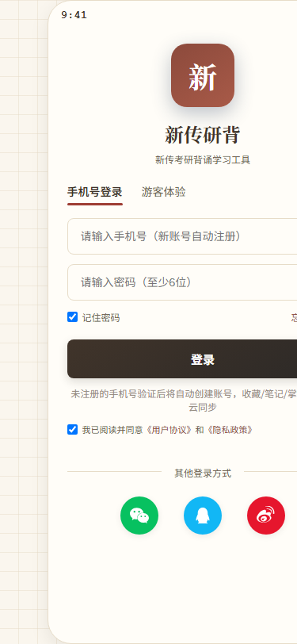
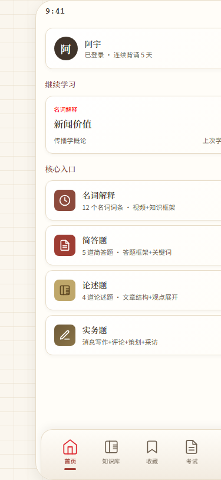
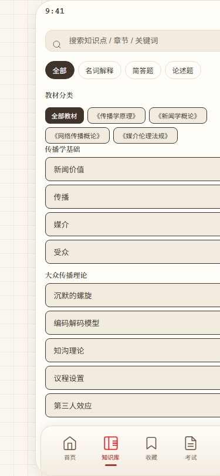
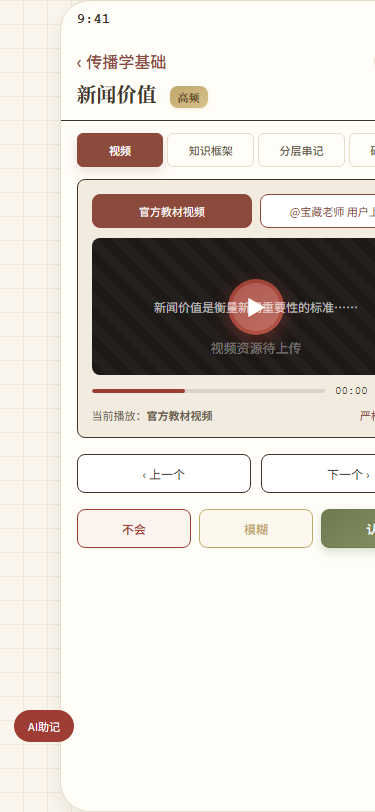
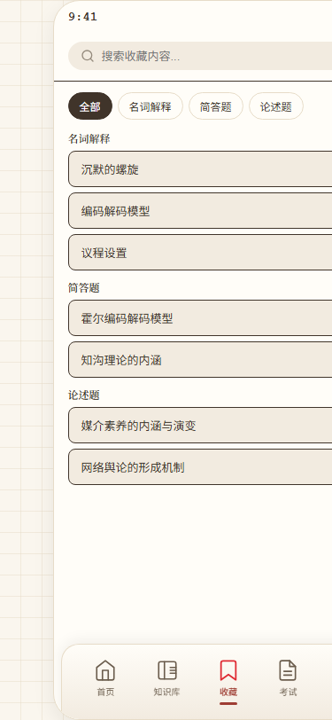

# 新传研背 · 新传考研背诵学习工具

> 一款面向新传考研学子的 **AI 辅助背诵 + 考试训练 App**，支持 **Windows / 手机（iOS、安卓）/ 网页** 三端使用，注册登录、数据云同步，换设备不丢进度。

---

## 🌐 在线体验（无需安装，点开即用）

| 入口 | 地址 | 说明 |
|---|---|---|
| 📱 **学生端（手机/电脑浏览器直接打开）** | **[https://app-three-orpin-61.vercel.app](https://app-three-orpin-61.vercel.app)** | 注册一个账号即可使用全部功能，收藏/笔记/掌握度云同步 |
| 🛠️ **管理后台（网页版）** | **[https://admin-web-ruby-nu.vercel.app](https://admin-web-ruby-nu.vercel.app)** | 题库管理 / 用户管理 / 数据统计（演示账号请向作者索取） |

> 💡 学生端注册一个账号即可使用全部功能；后端 API：`https://server-lilac-nu.vercel.app/api`（JWT 鉴权 + Turso 云数据库）。

---

## 🚀 直接下载（点击即可下载安装）

| 平台 | 下载 | 说明 |
|---|---|---|
| 🪟 Windows | **[⬇️ 下载 Windows 安装包](https://github.com/zyangpm/xinchuanyanbei-/releases/latest)** | 双击安装，桌面出图标，约 75 MB |
| 📱 安卓 | **[⬇️ 下载安卓 APK](https://github.com/zyangpm/xinchuanyanbei-/releases/latest)** | 下载后直接安装（需允许"未知来源"） |
| 🍎 iPhone | **[📖 iOS 使用教程](docs/IOS.md)** | 苹果限制，无法直接装安装包；按教程两步搞定，体验与 App 一致 |

> 💡 下载页面打不开时，点右上角"Releases"，第一个版本里的安装文件就是。

---

## ✨ 这个软件是做什么的

**新传考研人的"背 + 练 + 考"一站式工具**，把零散的笔记变成可记忆、可检测的知识体系：

- 📚 **知识库**：名词解释、简答题、论述题、实务题全题型内容，按教材与专题组织
- 🧠 **分层串记**：知识点拆成"定义 / 特征 / 延伸"逐层记忆，配合 AI 助记
- ⭐ **收藏与笔记**：随时收藏易忘考点、写自己的理解，云端自动同步
- 📈 **掌握度追踪**：给每个考点标记"不会 / 模糊 / 认识"，自动统计熟练度
- 📝 **考试模拟**：真题演练、模拟考试、成绩与错题回顾
- 👨‍💻 **管理后台**：内容运营、题库管理、用户数据统计（运营者用）

## 📱 界面预览

| 登录页 | 首页 | 知识库 |
|---|---|---|
|  |  |  |

| 背诵详情 | 收藏 |
|---|---|
|  |  |

---

## 🛠️ Tech Stack

- **Electron 28** — Windows 桌面端（asar 打包，NSIS 安装包）
- **PWA** — 手机端，iOS 用 Safari「添加到主屏幕」即原生体验，无需 App Store
- **纯静态前端** — 原生 HTML/CSS/JS，无框架、无构建链，直接部署
- **Node.js 后端** — 原生 http（无 Express），路由 / 鉴权 / 数据访问分层
- **Turso** — 云端 SQLite；本地用 `node:sqlite`，同一套 SQL 零改动切换
- **JWT + scrypt** — 登录鉴权，密码哈希加盐存储
- **云同步** — 收藏 / 笔记 / 掌握度 / 考试历史，增量拉取 + 后写覆盖
- **Vercel** — 三端托管（学生端 / 管理端 / 后端 Serverless）
- **Turbo** — Monorepo 管理

> 开发环境：Windows + Node 22。管理后台的「AI 内容生成」为**演示模式**（未接真实模型，仅生成示例草稿），其余功能均为真实链路。

## 📱 iOS 怎么用

iPhone 不能直接装安装包，用 PWA 方式，30 秒搞定，体验和原生 App 一样（桌面图标 / 全屏 / 云同步）：

1. iPhone 自带 **Safari** 打开学生端网址
2. 点底部**分享按钮** → **添加到主屏幕** → **添加**
3. 桌面出现「新传研背」图标，点开即用

详见 [iOS 使用教程](docs/IOS.md)。

## 🧩 产品文档

- [产品需求文档 PRD](docs/PRD.md) —— 产品定位、目标用户、功能需求、页面流程

## 🔧 本地开发（开发者）

```bash
npm install          # 安装依赖
node apps/server/src/server.js   # 启动后端（默认 3000 端口）
npm -w apps/mobile run start     # 启动学生端
# 管理后台：npm -w apps/admin run start
```

仓库结构：`apps/mobile` 学生端 ｜ `apps/admin` 管理后台 ｜ `apps/server` 后端 ｜ `packages/content` 题库数据源
