# V1.0 初始版本（学生端 APP 实机截图）

V1.0 是新传研背第一个可运行版本，奠定了「首页 → 词条详情 → 多模式记忆 → 自评」的核心背诵闭环：
名词解释、简答题两大模块，配合官方教材视频、知识框架、分层串记、AI 助记与考生口诀社区，
并支持 AI 模型自选（DeepSeek / ChatGPT）、学习偏好与收藏管理。

> 截图说明：以下 13 张均为 V1.0 学生端 APP 在手机上的**真实运行截图**（2026-09-10 实拍），
> 已按用户实际操作路径（首页 → 个人中心 → 名词解释「新闻价值」→ 简答题「霍尔编码解码模型」）排列。
> 此前仓库里由其他工具上传的大量重复过程截图（`_boot*.png`、`_state*.png` 等）已全部删除替换。

---

## 一、首页与个人中心

### 1. 学习首页
登录后默认页。顶部用户卡显示「阿宇 · 已登录 · 连续背诵 5 天」；「继续学习」直达上次词条（名词解释 · 新闻价值）；
下方四大核心入口：名词解释（328 词条 · 视频+知识框架）、简答题（142 道 · 答题框架+关键词）、
论述题（96 道 · 文章结构+观点展开）、实务题训练（消息写作+评论+策划+采访）。底部为首页 / 知识库 / 收藏三栏导航。

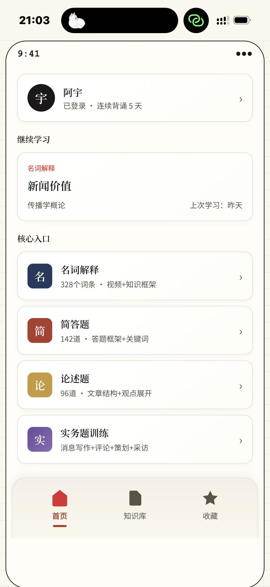

### 2. 个人中心 · 账号与学习数据
点击首页用户卡进入。展示头像、昵称、连续背诵 5 天、累计背诵 842 词条；
「账号管理」可修改头像/昵称、查看登录状态、退出登录；「学习偏好设置」含背诵提醒、记忆难度筛选（自动）、自动播放视频开关。

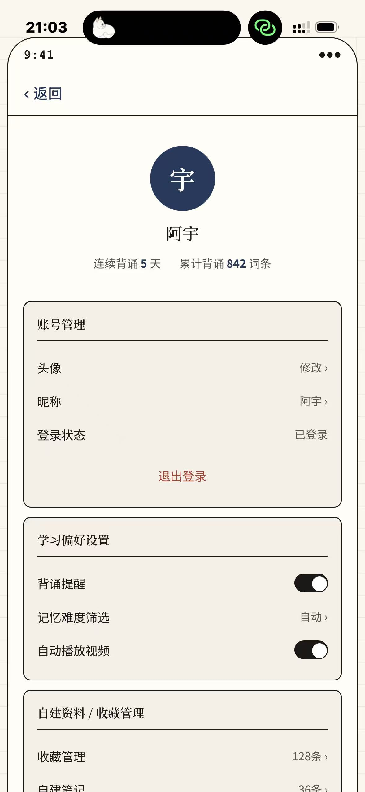

### 3. 个人中心 · 收藏 / AI / 系统设置（页内下滚）
个人中心下半部分：自建资料与收藏管理（收藏 128 条、自建笔记 36 条、上传资料库 4 份）；
AI 模型自定义管理（默认模型 DeepSeek、API 密钥 2 个已配置、生成画质与文字详细程度均为标准）；
系统通用设置（字体大小、深色模式、清除缓存 12MB、版本反馈、关于我们）。

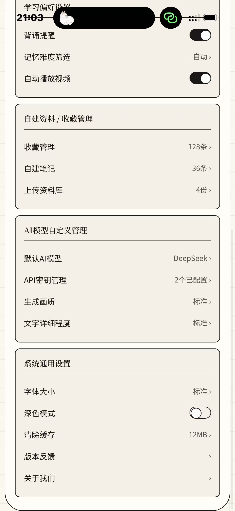

---

## 二、名词解释模块（以高频词条「新闻价值」为例）

### 4. 词条详情 · 视频模式
从知识库点进词条后的默认视图。顶部返回章节「‹ 传播学基础」、词条名「新闻价值」+ 金色「高频」标签，右上角可收藏、编辑；
内容区四个标签：**视频 / 知识框架 / 分层串记 / AI 助记**。视频源分「官方教材视频」与「@宝藏老师 用户上传」两路，
带进度条（00:00/00:05）与「严格按教材」承诺；底部「‹ 上一个 / 下一个 ›」翻词条，
以及三级掌握度自评按钮「不会 / 模糊 / 认识」；右下悬浮「切换 AI 模型」。

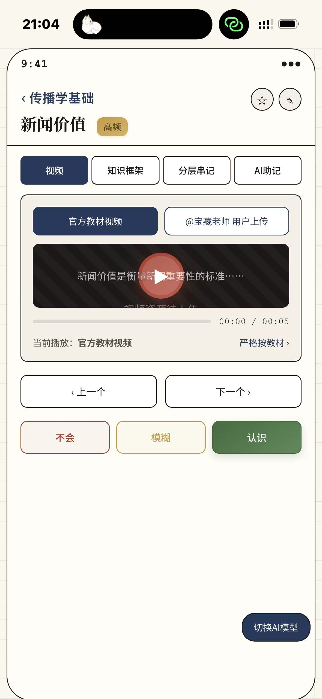

### 5. AI 模型设置弹窗
点右下「切换 AI 模型」弹出的底部抽屉。可在 DeepSeek（当前勾选）/ ChatGPT 间选择，
填写仅保存在本地、不上传服务器的 API 密钥，并设置生成画质（标准）与文字详细程度（简洁），保存后即时生效。

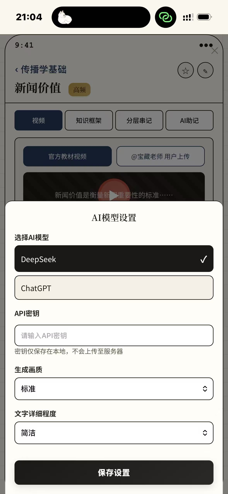

### 6. 词条详情 · 知识框架（上半屏）
切到「知识框架」标签后，AI 把词条结构化为五块卡片：① 定义块（概念名称、提出信息、所属学科场景、生成诱因、核心表现）、
② 范畴块（理论来源/诞生背景、适用范围）、③ 特征块（内在属性规律：时新性/重要性/显著性/接近性/趣味性、相似概念区分）。

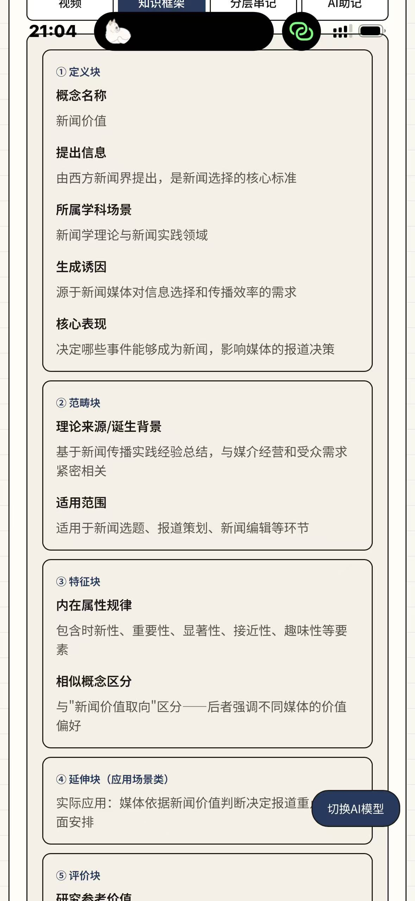

### 7. 词条详情 · 知识框架（下半屏）
框架下半屏：④ 延伸块（应用场景：媒体依据新闻价值判断报道重点与版面安排）、
⑤ 评价块（研究参考价值、行业/平台化解对策）；看完后同样可翻上一个/下一个，并按「不会/模糊/认识」自评。

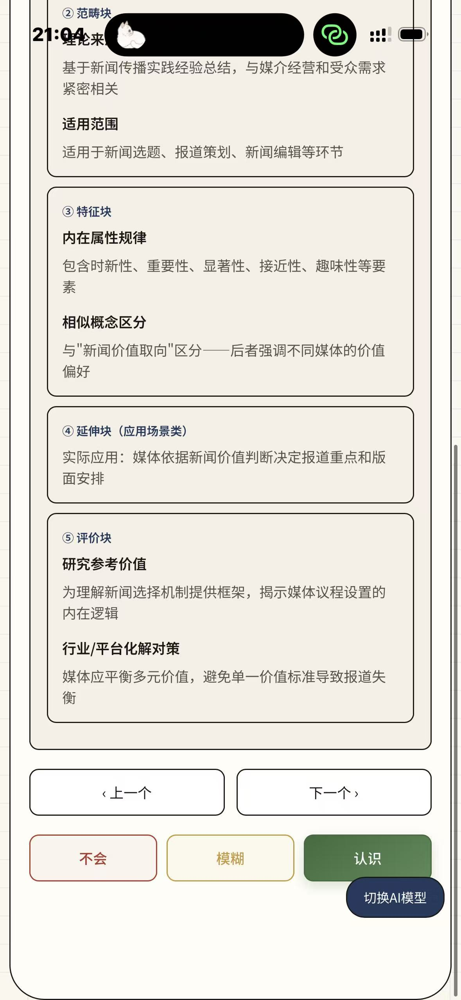

### 8. 词条详情 · 分层串记
「分层串记」标签用颜色分级压缩记忆量：1 级核心定义（衡量新闻重要性的标准）→
2 级关键词（时新性/重要性/显著性）与关联概念（新闻选择/议程设置）→ 3 级真题应用（新媒体环境下新闻价值的变化）与反例。

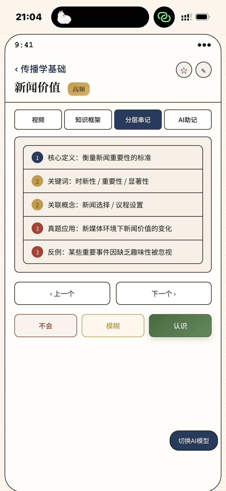

### 9. 词条详情 · AI 助记（考生口诀社区）
「AI 助记」标签汇聚考生 UGC 记忆法：如「新闻学子」的口诀「新闻价值 = 新 + 重要 + 有名 + 近 + 有趣」（24 赞 2 评论）、
「记忆达人」的五要素总结（18 赞），底部虚线框「分享你的背诵技巧」可发布自己的口诀，形成互助记忆社区。

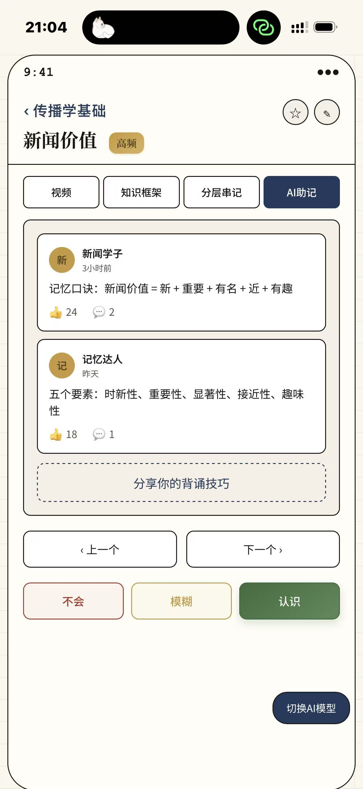

---

## 三、简答题模块（以「霍尔编码解码模型」为例，20分·800字）

### 10. 简答详情 · 答题框架
四个标签：**答题框架 / 真题设问变式 / 答案内容 / 辅助记忆**。答题框架按阅卷逻辑拆成
「总（编码解码定义+受众观前提）→ 分点一 偏好式解读 → 分点二 妥协式解读 → 分点三 对抗式解读 → 总结（本质与评价·文化领导权之争）」。

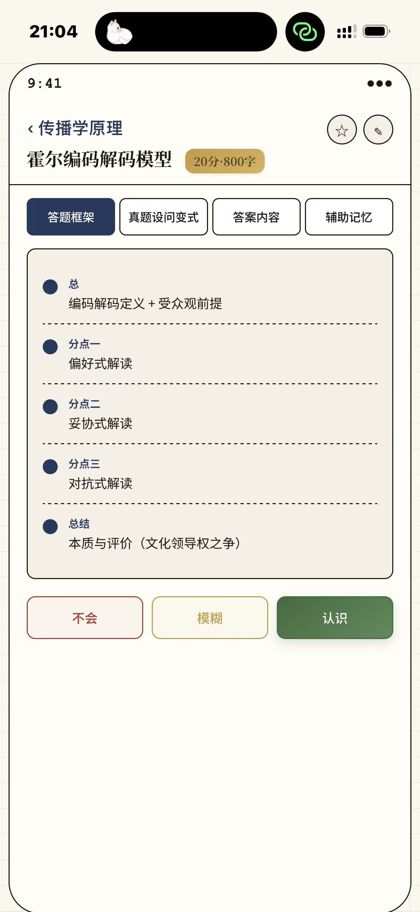

### 11. 简答详情 · 真题设问变式
由一道母题派生 4 种考法：原题「简述霍尔的编码解码理论」、变式一「分析三种解读立场」、
变式二「论述对受众研究的意义」、变式三「结合实例说明三种解码方式的现实表现」、变式四「文化领导权指什么」，练一题覆盖一类题。

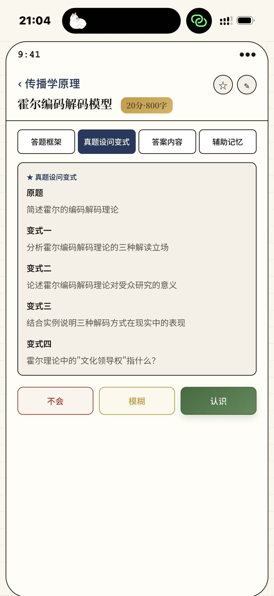

### 12. 简答详情 · 答案内容
可直接背诵的标准作答区：前提（受众主动但受结构制约）→ 模型（传者编码、受众解码、主导意识形态渗入文本）→
三种解码（偏好式完全认同 / 妥协式部分认同+保留立场 / 对抗式理解但反着解读）。

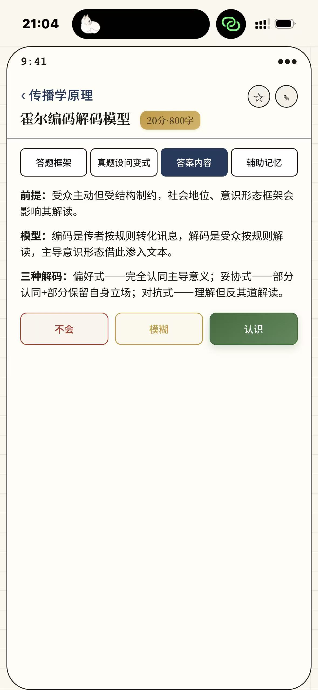

### 13. 简答详情 · 辅助记忆与互动自测
最丰富的记忆模式集合：联想记法（发短信/读短信、完全信/打个折信/反着信）；
五种自测模式切换「拖拽还原 / 填空记忆 / 框架默写 / 红膜背书 / 闪卡模式」，图中为拖拽还原——把三种解读按认同程度从高到低排序后「完成自测」；
下方还有朗读播放条与「考生记忆分享」区（官方记忆思路置顶，128 赞 12 评论）。

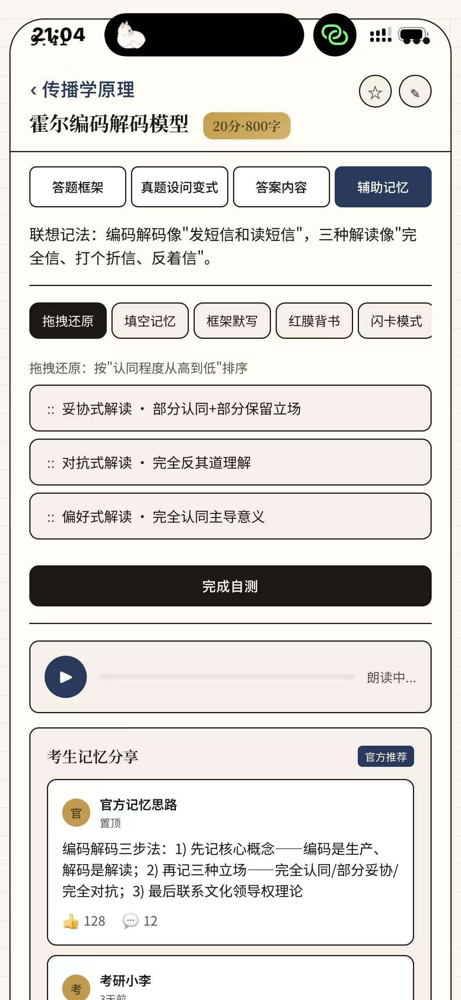

---

## 版本小结

- **学习闭环**：视频输入 → 结构化框架 → 分层压缩 → 社区口诀 → 不会/模糊/认识自评 → 错题重点复现；
- **AI 能力**：V1.0 即支持 DeepSeek / ChatGPT 自选、本地密钥、画质与详略可调；
- **互动记忆**：拖拽排序、填空、默写、红膜、闪卡五种自测 + 考生 UGC 口诀社区；
- **界面风格**：米白纸感底色 + 藏青/砖红/赭金/紫四色模块卡，Apple 式极简圆角，奠定后续版本视觉基调。
