# V2.0 功能增强（管理后台 + 学生端 APP 实机截图）

V2.0 在 V1.0「首页 → 词条详情 → 多模式记忆 → 自评」背诵闭环的基础上，补齐了两块关键能力：

- **管理后台首次上线**：管理员可以上传教材/真题资料（PDF/Word），由 AI 自动生成考研内容草稿，经审核后一键发布到学生端 APP，形成「资料 → AI 生成 → 审核 → 发布」完整内容流水线；
- **学生端内容补全**：论述题从入口卡片变为完整的答题框架/范文/变式体系，V1.0 尚处于「待开发」状态的**实务题训练**在本版本落地为完整题库（消息写作、新闻评论等 6 大分类），并新增头像自定义、词条笔记、收藏反馈等交互。

> 截图说明：以下共 **49 张**，均为 2026-09-11 对 V2.0 真实运行界面的手工截图，无重复过程图。
> 管理后台 14 张位于 `screenshots/admin/`；学生端 APP 35 张位于 `screenshots/app/`。
> 后台登录页自标版本号为 **v1.0.0**（即后台的首个版本，随 V2.0 整体发布）；V1.0 没有管理后台，因此 V1.0 相册中无对应截图。

---

# 第一部分：管理后台（14 张）

后台为 PC 端网页，左侧固定导航共 7 个模块：数据概览、资料管理、AI 生成、内容审核、题库管理、发布管理、数据统计；右上角显示当前管理员 admin 与退出入口。

## 一、登录与数据概览

### 1. 管理员登录页

藏青渐变背景 + 白色登录卡。账号 admin，底部直接标注默认账号密码（admin / admin123），提供「记住账号」和「忘记密码？」；页脚写明「新传研背管理后台 v1.0.0 · 仅供管理员使用 · 学生端请使用APP」，学生端与后台入口完全分离。

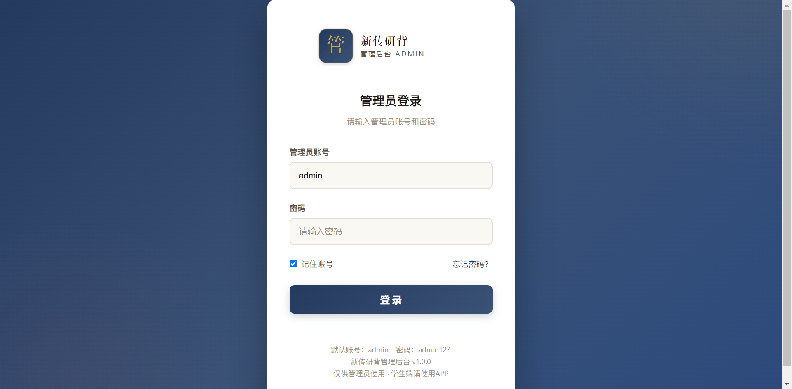

### 2. 数据概览

登录后首页。四张统计卡按题型展示存量：名词解释 7（本周新增 12 条）、简答题 1（本周新增 3 道）、论述题 1（本周无新增）、实务题 0（标注「待开发」）；下方「待审核内容」表当前为空（暂无待审核内容），可点「查看全部」跳转审核模块。

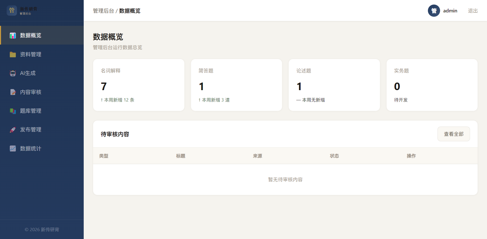

## 二、资料管理（内容流水线起点）

### 3. 资料库管理列表

已入库 3 份资料：①《2025新传考研真题汇总》（真题 / Word / 1.2 万字 / 共 6 套真题 / 已解析）；②《新闻学概论（李良荣）》（教材 / PDF / 28.0 万字 / 共 12 章 / 已解析）；③《网络传播概论（彭兰）》（教材 / PDF / 24.0 万字 / 共 10 章 / 解析中）。列表含来源筛选、名称搜索，每行可查看或删除。

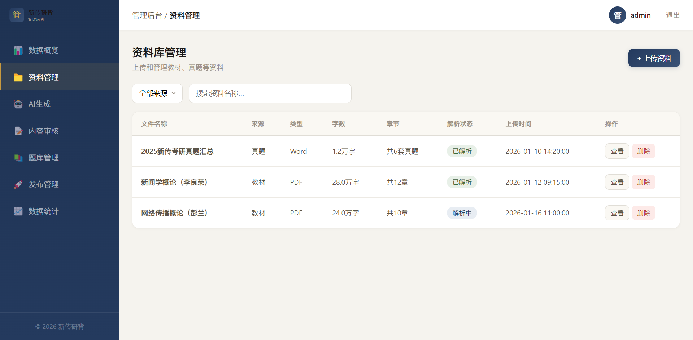

### 4. 上传资料弹窗

点右上「+ 上传资料」打开。需填写资料名称、来源类型（教材/真题/公开资料/自整理）、文件类型（PDF/Word）、章节信息（如「共15章」），并在底部虚线拖拽区上传文件。

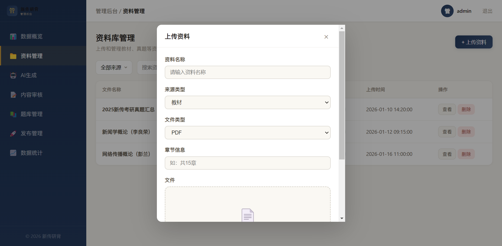

### 5. 资料详情「查看」提示

点列表「查看」弹出资料详情卡，以纯文本展示该资料的完整元数据：文件名称、来源类型、文件类型、字数（12,000 字）、章节信息、解析状态、上传时间。

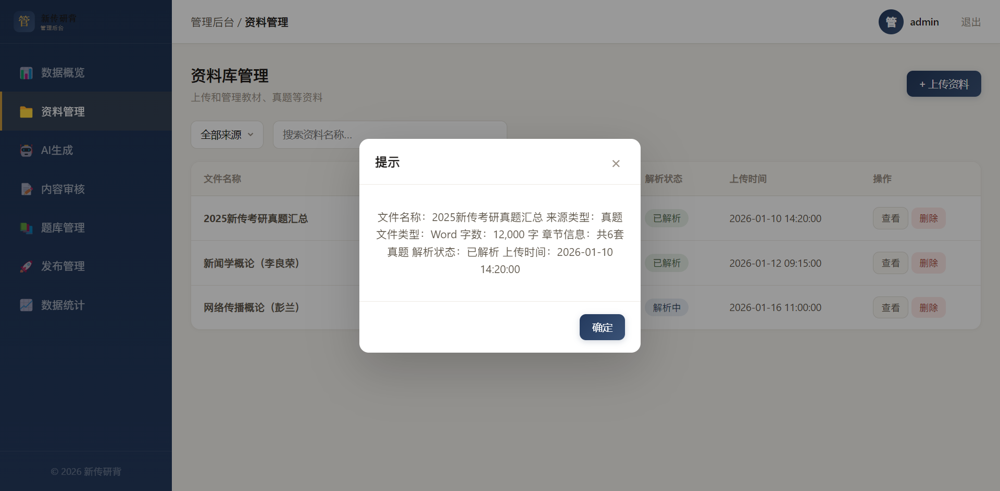

### 6. 按来源筛选资料

「全部来源」下拉展开四个选项：教材、真题、公开资料、自整理，可配合搜索框快速定位资料。

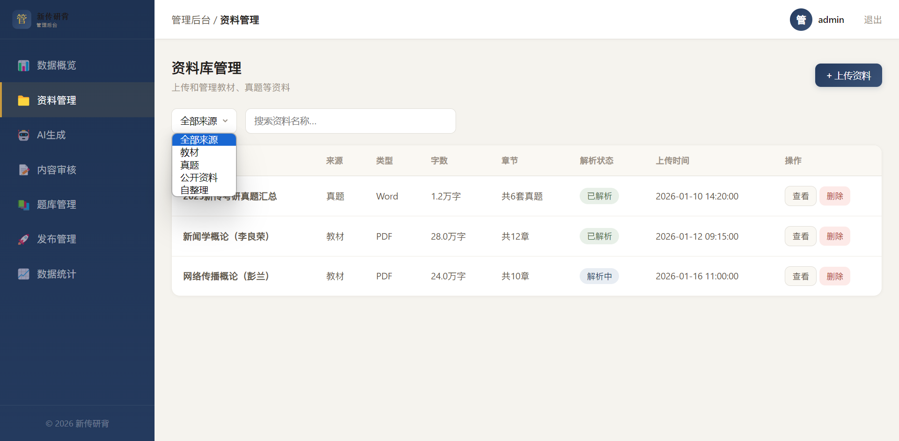

## 三、AI 生成与内容审核

### 7. AI 内容生成 · 生成配置

基于已上传资料自动出题。配置项：选择资料、生成题型（名词解释/简答题/论述题/实务题）、生成数量（图中为 5）、AI 模型（DeepSeek）；下方明示 4 条生成规则：严格依据上传资料生成、保留教材核心观点、符合新传考研答题要求、生成后支持人工修改。

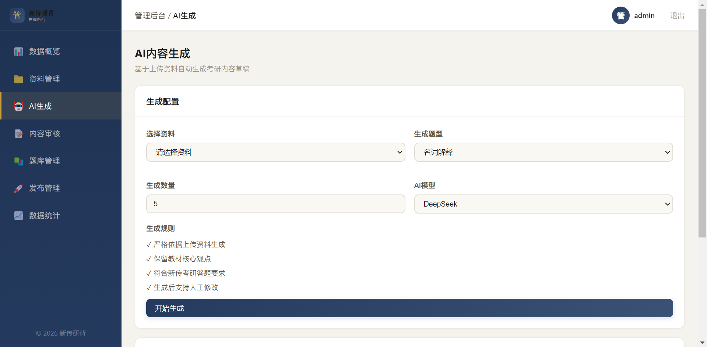

### 8. 已生成内容列表

生成配置下方的成果表，记录题型、标题、来源资料、AI 模型、状态与生成时间。图中 3 条均为 DeepSeek 生成且「已通过」：名词解释「议程设置」、名词解释「沉默的螺旋」（来源标注《2025新传考研真题汇总》）、简答题「沉默的螺旋理论」。

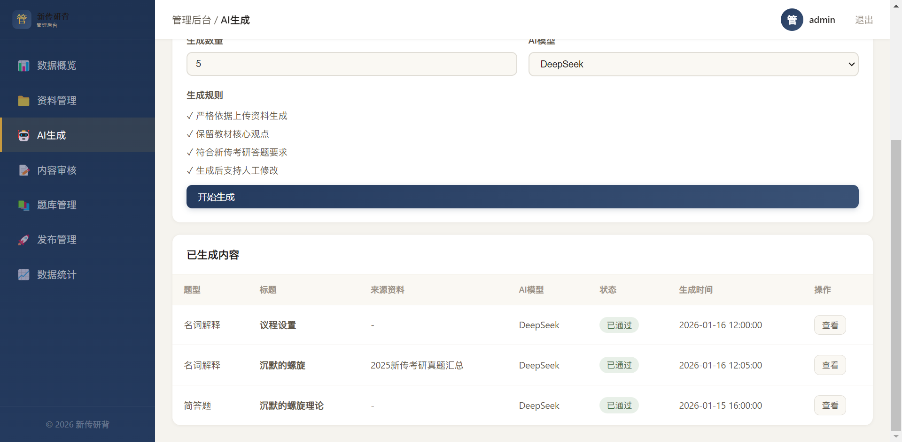

### 9. 内容审核（空状态）

审核模块副标题「审核AI生成的草稿内容，通过后可发布」。当前没有待审稿件，居中显示空状态插图与「暂无待审核内容」。

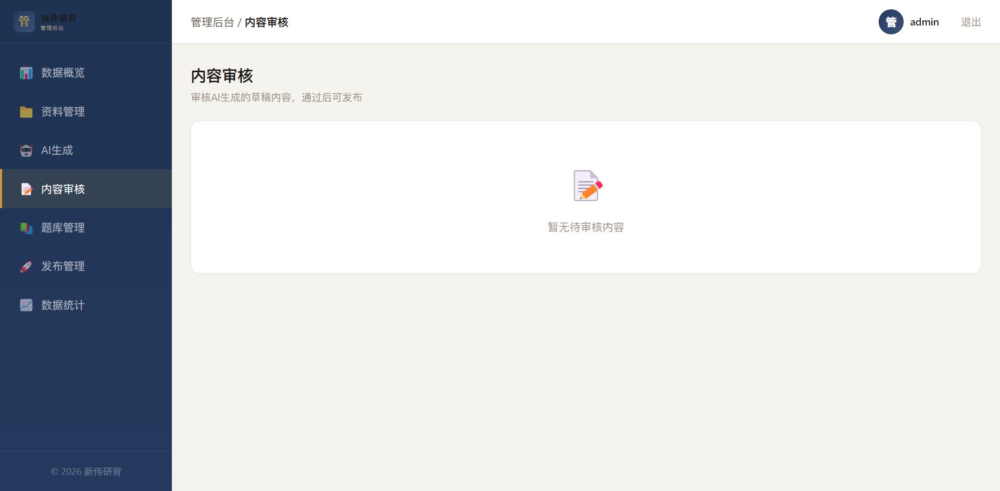

## 四、题库管理

### 10. 题库列表与题型筛选

题库汇总四类题型，支持题型下拉（全部题型/名词解释/简答题/论述题/实务题）与关键词搜索，右上「+ 新增题目」可手工建题。列表展示分类、标签（高频 / AI生成 / 20分等）、状态、发布时间，每行提供编辑、下架/发布、删除操作；图中可见「沉默的螺旋」「议程设置」「新闻价值」「编码解码模型」「霍尔编码解码模型」等已发布题目，其中两条新生成题目标记为「待分类 · AI生成」。

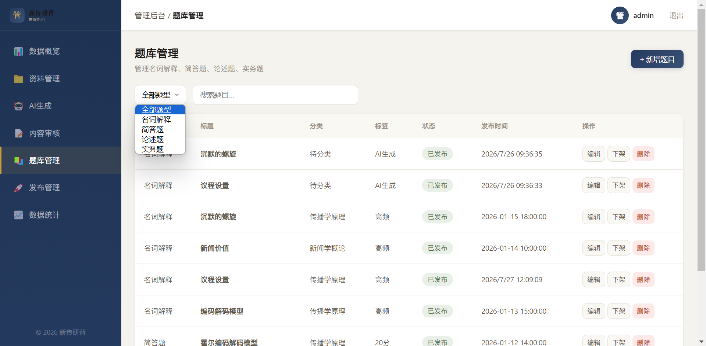

### 11. 编辑题目弹窗

点「编辑」打开。可修改题型、标题、分类（如图中的「待分类」）、标签（AI生成）与题目内容正文，保存即更新题库。

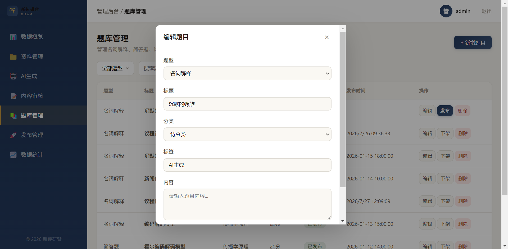

## 五、发布管理与数据统计

### 12. 发布管理 · 待发布列表

副标题「将审核通过的内容发布到学生端APP」。待发布内容表支持复选框多选 +「批量发布」，也可单条点「发布」；图中一条「沉默的螺旋」处于「已下架」状态，可重新发布。下方即发布历史，注明「发布后内容将同步到学生端APP」。

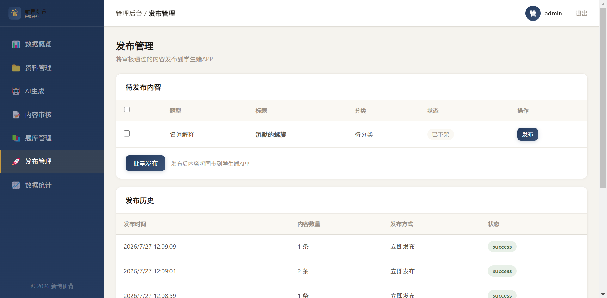

### 13. 发布历史

完整发布流水：发布时间、内容数量、发布方式（均为立即发布）、状态。图中 9 条记录状态全部为 success，时间从 2026-01-13 至 2026/7/27，全部发布动作均成功同步。

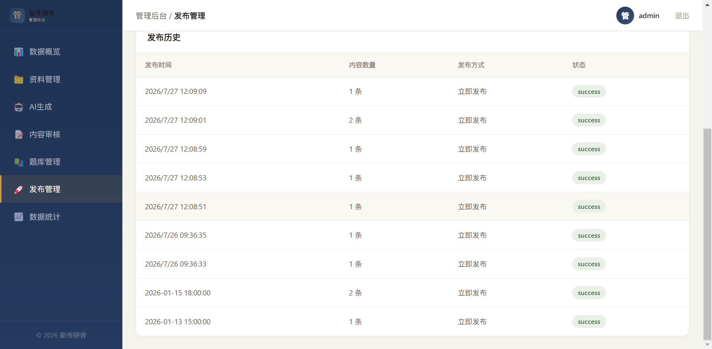

### 14. 数据统计

从内容生命周期维度汇总：已发布内容 8、草稿内容 0、待审核 0、已下架 1，与题库/发布页面的数据互相对应。

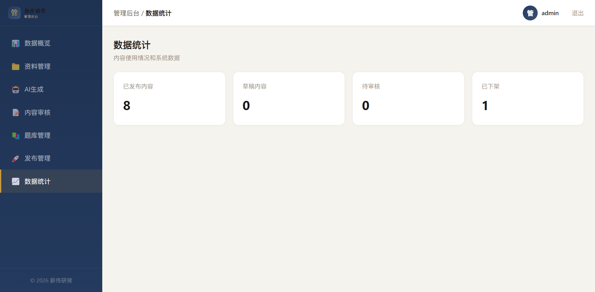

---

# 第二部分：学生端 APP（35 张）

## 一、首页与个人设置（图 1–6）

### 1. 学习首页（上半屏）

登录用户为「张扬 · 已登录 · 连续背诵 5 天」；「继续学习」卡片直达上次词条——名词解释「新闻价值」（传播学概论，上次学习：昨天）；核心入口四卡：名词解释 328 个词条、简答题 142 道、论述题 96 道、实务题训练（消息写作+评论+策划+采访）。

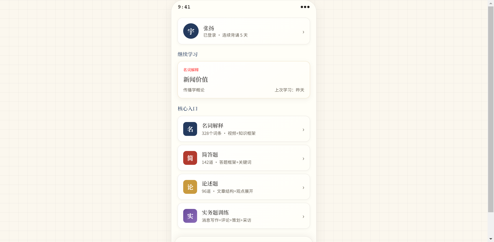

### 2. 首页底部三栏导航

首页底部为首页 / 知识库 / 收藏三栏导航，当前停留在首页（红色房子图标高亮）。

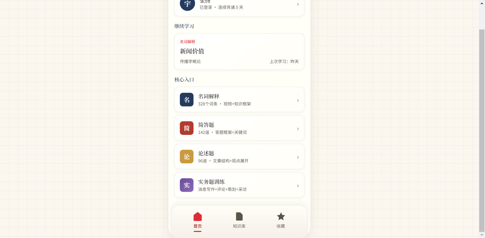

### 3. 个人中心 · 设置头像弹窗（V2.0 新增）

个人中心页显示连续背诵 5 天、累计背诵 842 词条。点头像后弹出「设置头像」：既可「从本地图库选择」上传自定义头像，也可在 8 个纯色圆形头像（藏青/砖红/赭金/墨绿/紫/玫红/橙/青）中直接挑选——V1.0 只有固定文字头像，无此功能。

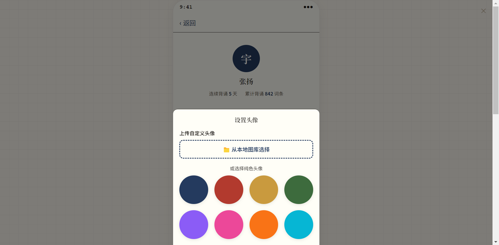

### 4. API 密钥管理（开发中提示）

个人中心仍保留收藏管理 128 条、自建笔记 36 条、上传资料库 4 份等数据。点「API密钥管理」弹出说明：独立密钥管理界面正在开发中，当前仍需在名词解释详情页点「切换AI模型」配置密钥。

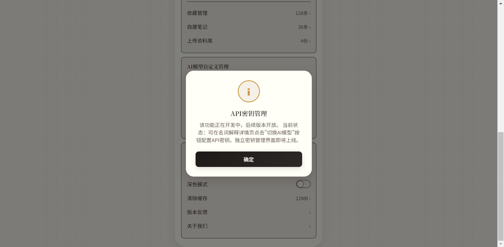

### 5. 清除缓存（二次确认）

点「清除缓存（12MB）」弹出警告框，提示「当前缓存大小：12MB……清除后不影响您的学习数据」，需在取消/确定间二次确认，避免误触。

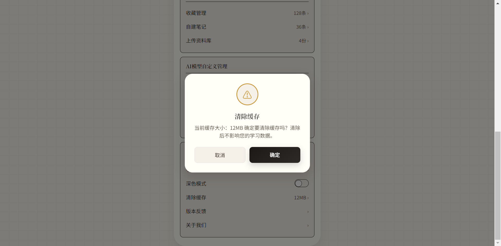

### 6. 版本反馈（清缓存后）

执行清理后列表数值变为 0MB。点「版本反馈」弹出开发中说明，给出两条反馈渠道：发送邮件至 support@xinchuan.app、加入官方 QQ 群。

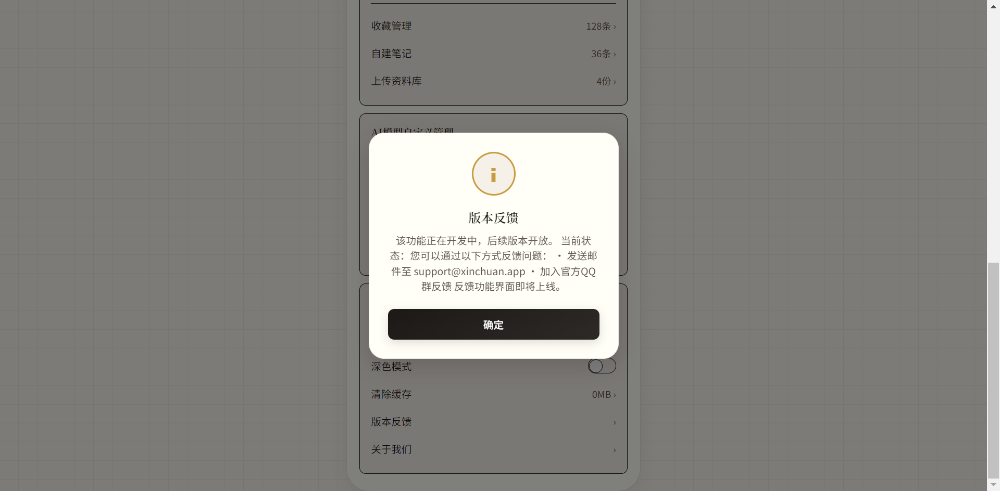

## 二、名词解释模块（以高频词条「新闻价值」为例，图 7–15）

### 7. 词条详情 · 视频模式

‹ 传播学基础 / 新闻价值（金色「高频」标），右上为收藏星标与记笔记按钮。内容区四标签：视频、知识框架、分层串记、AI助记；视频区双来源按钮「官方教材视频 / @宝藏老师 用户上传」，播放器字幕为「新闻价值是衡量新闻重要性的标准……」（00:00/00:05），底部有上一个/下一个翻词条与「不会/模糊/认识」三级自评，右下悬浮「切换AI模型」。

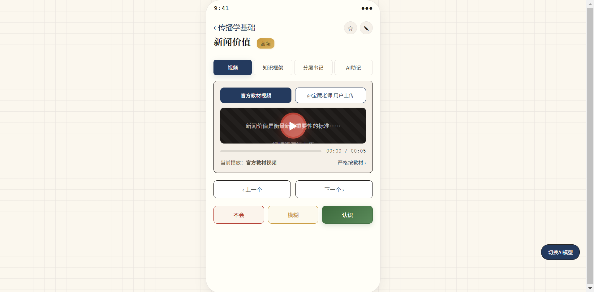

### 8. AI 模型弹窗 · 生成画质三档（V2.0 增强）

点「切换AI模型」弹出底部抽屉：DeepSeek（当前勾选）/ ChatGPT 二选一，API 密钥仅保存在本地；「生成画质」下拉展开标准/高清/超清三档可选。

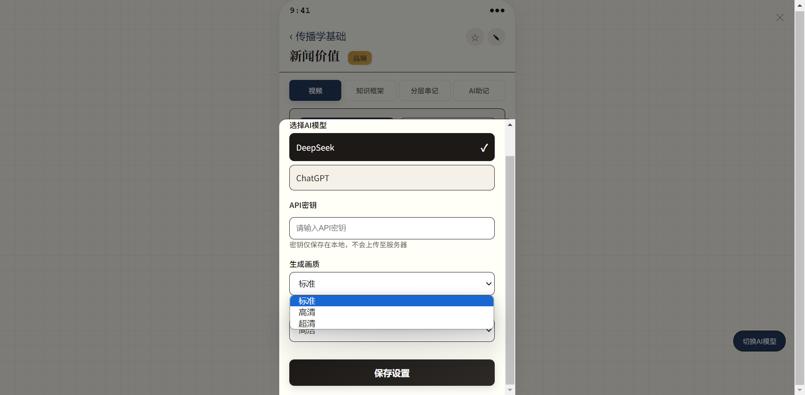

### 9. AI 模型弹窗 · 文字详略三档（V2.0 增强）

同一弹窗中「文字详细程度」下拉展开简洁/标准/详细三档，与画质各自独立设置，保存后即时生效。

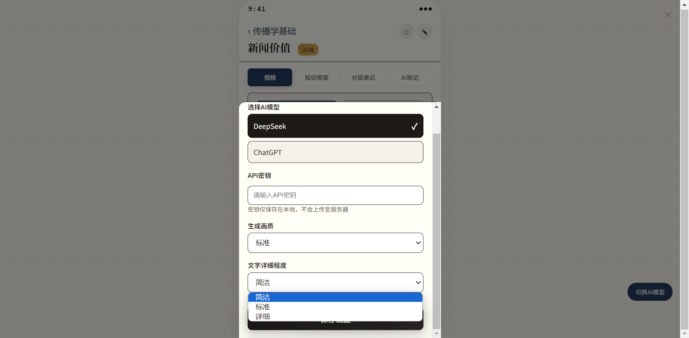

### 10. 视频来源选择（V2.0 新增）

在视频页切换用户上传来源时，弹出「视频来源」底部弹窗，列出 3 位考研 UP 主：@宝藏老师、@传播学小王子、@新传考研君，可任选其一的讲解视频（V1.0 仅能在官方教材与@宝藏老师两路间切换）。

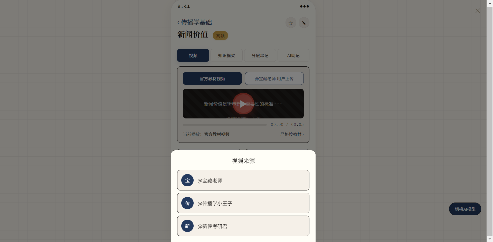

### 11. 知识框架

AI 把词条结构化为多块卡片。① 定义块：概念名称、提出信息（由西方新闻界提出，是新闻选择的核心标准）、所属学科场景、生成诱因、核心表现；② 范畴块：理论来源/诞生背景、适用范围（新闻选题、报道策划、新闻编辑等环节）；③ 特征块：时新性、重要性、显著性、接近性、趣味性等要素。

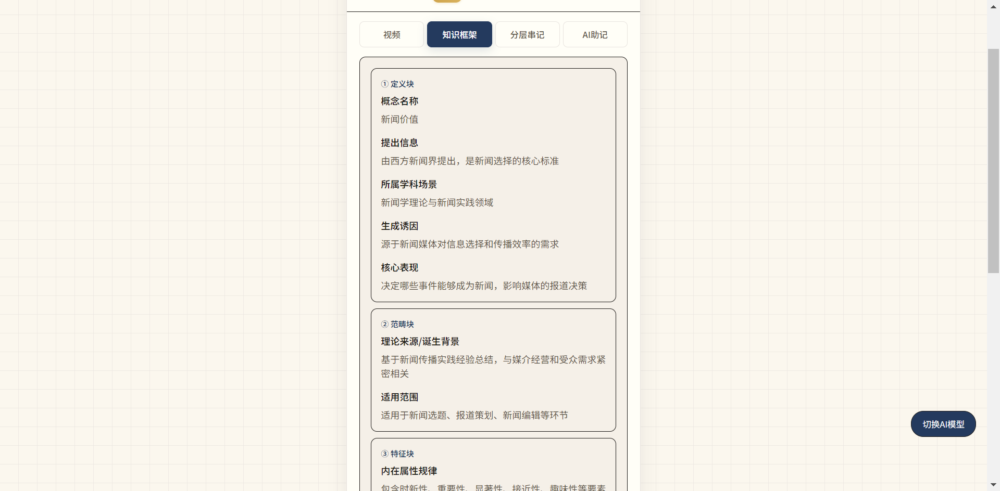

### 12. 分层串记

整屏一屏呈现分层记忆卡：1 级核心定义（衡量新闻重要性的标准）→ 2 级关键词（时新性/重要性/显著性）与关联概念（新闻选择/议程设置）→ 3 级真题应用（新媒体环境下新闻价值的变化）与反例（某些重要事件因缺乏趣味性被忽视）。

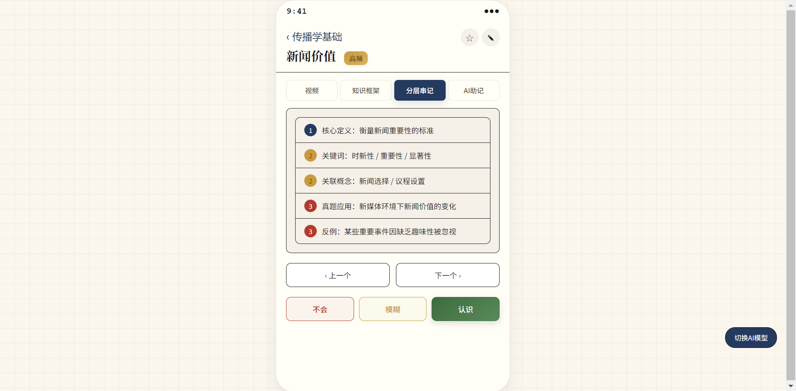

### 13. AI 助记 · 考生口诀社区

考生 UGC 记忆流：「新闻学子」的口诀「新闻价值 = 新 + 重要 + 有名 + 近 + 有趣」（24 赞 2 评论）、「记忆达人」的五要素总结（18 赞 1 评论）；下方两条是当前账号「我」刚刚发布的测试帖（「住豪宅」「收到v」，均 0 赞 0 评论），证明发帖功能真实可用；底部虚线框「分享你的背诵技巧」。

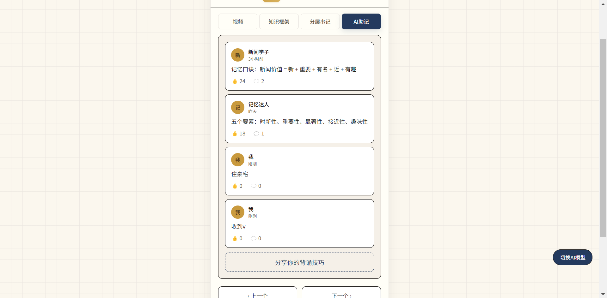

### 14. 收藏成功提示（V2.0 新增反馈）

点右上星标后，星星变为金色，并弹出绿色对勾弹窗「收藏 · 已收藏该内容」，给予明确操作反馈（V1.0 仅星标变色、无弹窗）。

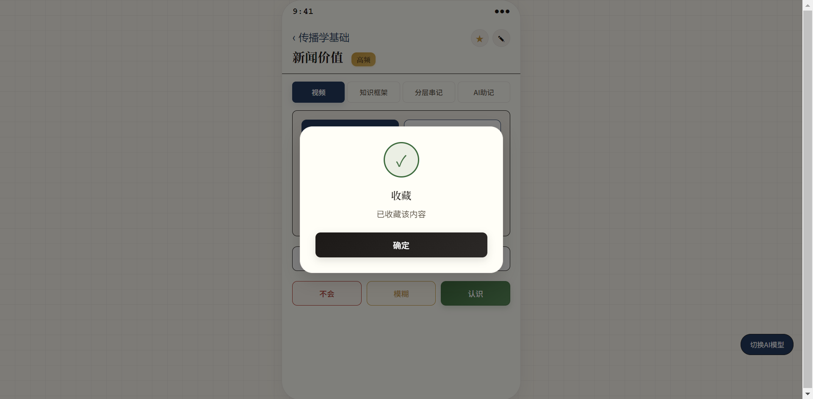

### 15. 记笔记弹窗（V2.0 新增）

点星标旁的笔形按钮，从页面底部弹出「记笔记」抽屉，可在不离开词条的情况下记录学习笔记并保存，笔记与词条绑定。

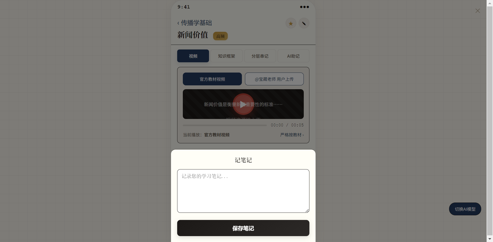

## 三、简答题模块（图 16）

### 16. 简答详情 · 答题框架加载态

‹ 传播学原理 / 霍尔编码解码模型（20分·800字），四标签（答题框架/真题设问变式/答案内容/辅助记忆）与 V1.0 一致。此截图捕捉到框架数据尚在加载的瞬间——内容区仅有一条骨架占位条。该题完整的框架与辅助记忆形态可参见 V1.0 相册第 10、13 张，以及本版本论述题部分（图 17–26）。

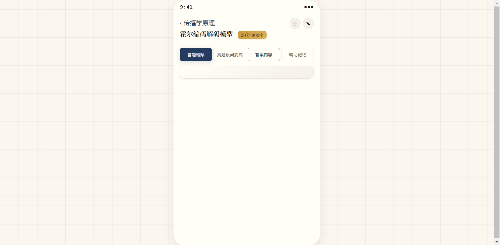

## 四、论述题模块（以「媒介素养的内涵与演变」为例，30分·1200字，图 17–20）

### 17. 答题框架（上半屏）

‹ 新媒体概论 / 媒介素养的内涵与演变（30分·1200字），四个标签：答题框架、真题设问变式、答案内容、辅助记忆。框架按阅卷文章结构组织：开头·引言式（背景引入：数字素养上升为国家战略）带「范文」按钮；正文三个分论点卡——① 媒介素养的定义与内涵、② 研究三阶段、③ 新媒体时代三维度——均可展开并附「范文」按钮。

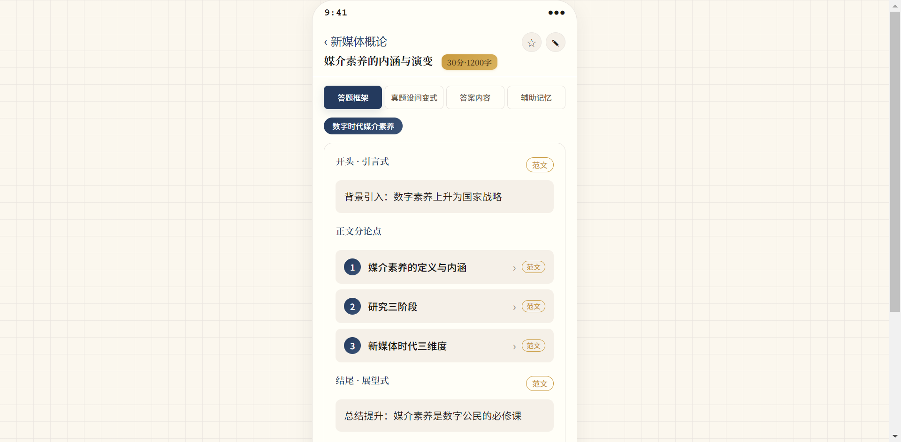

### 18. 答题框架（下半屏）

结尾·展望式：「总结提升：媒介素养是数字公民的必修课」；框架卡之下另设两个入口：「答题框架模板库」与「完整范文」，论述题的模板化积累在 V2.0 成型。

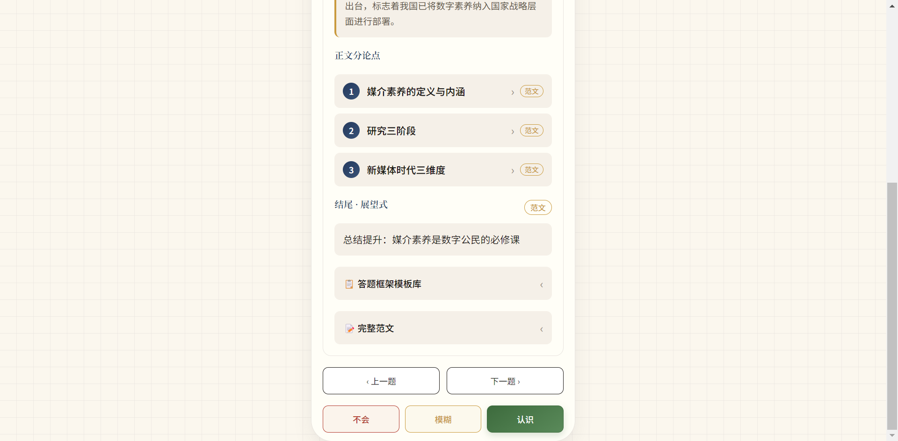

### 19. 真题设问变式

由母题派生 4 种考法：原题「论述媒介素养的内涵与演变」；变式一「谈谈你对新媒体时代媒介素养内涵的理解」、变式二「结合案例分析媒介素养研究的三个阶段」、变式三「论述智媒时代公众应具备哪些媒介素养」、变式四「媒介素养教育的必要性与路径分析」。

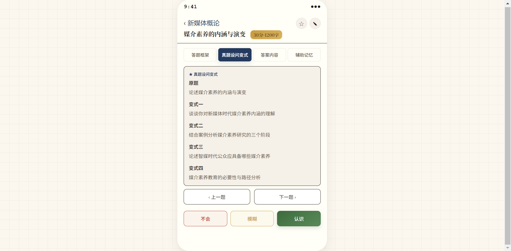

### 20. 答案内容（含一处真实瑕疵）

可背诵的完整长文答案：从 20 世纪 30 年代英国学者利维斯的保护初衷、1992 年美国媒介素养研究中心的定义、英国「四能力」模型，讲到三阶段演变（保护主义/辨识能力/能动赋权）与新媒体三维度。**注意：段首的 `<b></b>` 与 ` ` 等 HTML 标签被原样显示为文字，未被渲染成加粗/换行**——这是 V2.0 答案区真实存在的富文本渲染缺陷，截图如实保留。

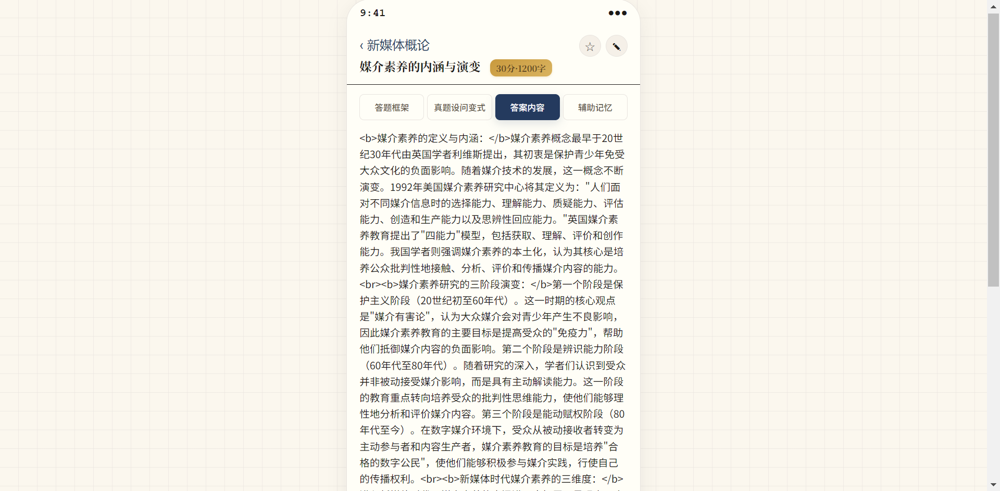

## 五、论述题 · 辅助记忆五模式与考生社区（图 21–26）

V1.0 相册只展示了五种自测模式中的「拖拽还原」，V2.0 把五种模式全部做成可实际操作的交互。

### 21. 模式一 · 拖拽还原（双排序）

顶部一句助记主线「三阶段像'保护自己→识别真假→主动参与'」。本题包含两组拖拽：三阶段按时间先后排序（辨识能力阶段 60s–80s / 能动赋权阶段 80s至今 / 保护主义阶段 20世纪初–60s）、三维度按环节排序（内容生产：跨媒介叙事、版权意识 / 媒介使用：人机协同、戒断素养 / 信息获取：辟谣、算法素养），拖完点「完成自测」。

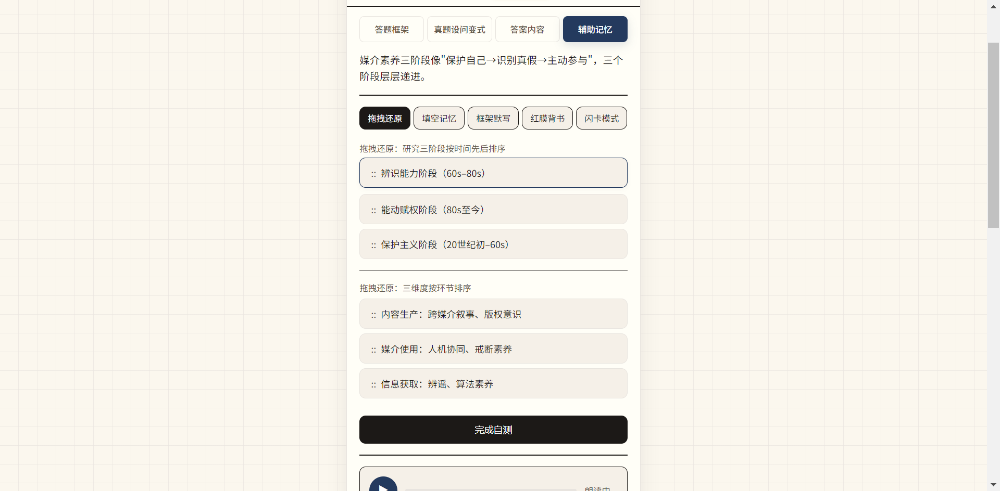

### 22. 模式二 · 填空记忆

「点击空白处填入正确答案」：在成段文字中挖空（如「媒介素养指公众＿＿媒介讯息的能力」「研究第一阶段：＿＿（提高免疫力）」等），填写后完成自测；下方带朗读播放条与考生记忆分享区。

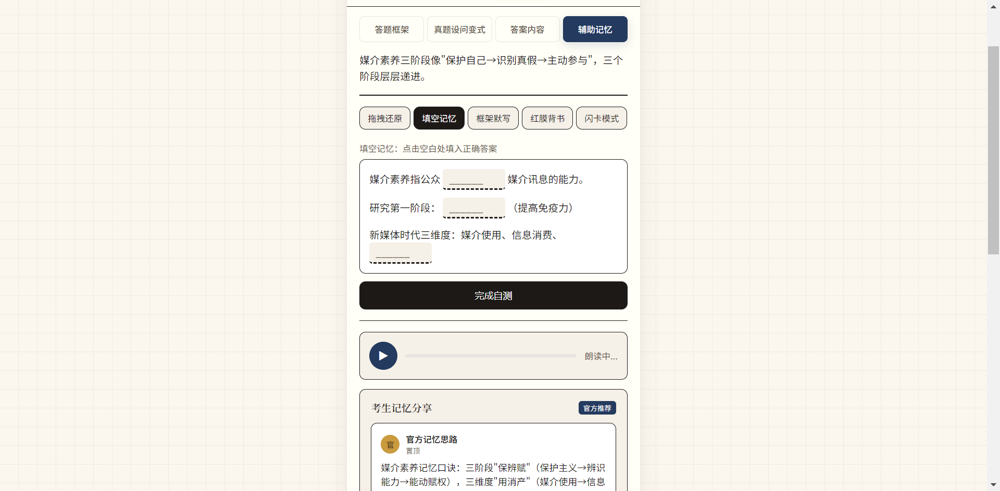

### 23. 模式三 · 框架默写

「手动复现总分结构」：提供大文本框让考生凭记忆默写整题框架，写完可点「调出标准答案」对照，再完成自测。

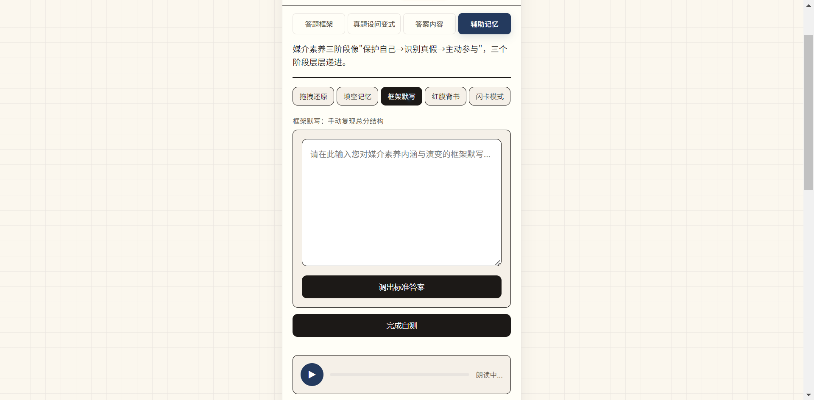

### 24. 模式四 · 红膜背书

红底虚线块遮住所有关键词（媒介素养、保护主义、辨识能力、能动赋权、媒介使用与人机协同、信息消费与内容批判、内容生产与跨媒介叙事），其余句子完整可见，「点击空白位置显示内容」逐块揭示，适合脱稿回想。

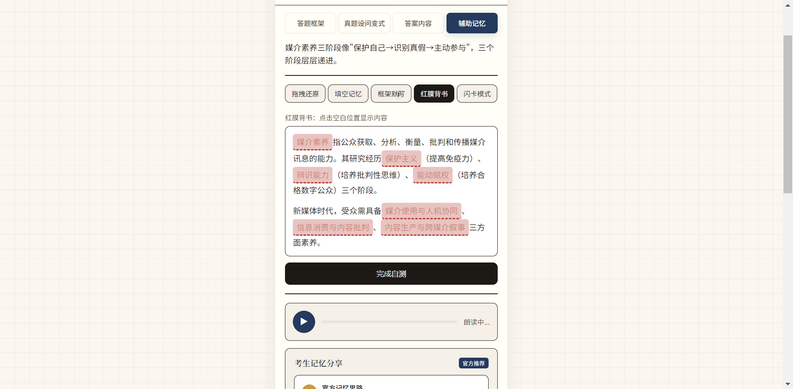

### 25. 模式五 · 闪卡模式

藏青卡片显示题面「论述媒介素养的内涵与演变」，黑色按钮「点击查看答案」翻面，并有「切换答案显示」控制正反面，完成自测收尾。

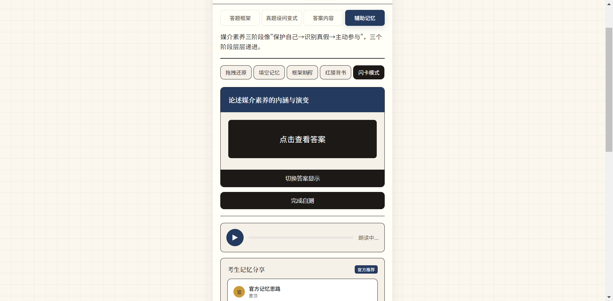

### 26. 考生记忆分享

辅助记忆页底部的 UGC 区：官方记忆思路置顶（口诀「三阶段'保辨赋'、三维度'用消产'」，结合李普曼拟态环境理论，156 赞 18 评论）；「案例大王」分享短视频算法推荐/信息茧房案例法（67 赞）、「辩证达人」提醒加入数字鸿沟的辩证视角（89 赞）、「开头结尾王」传授开头结尾写法。

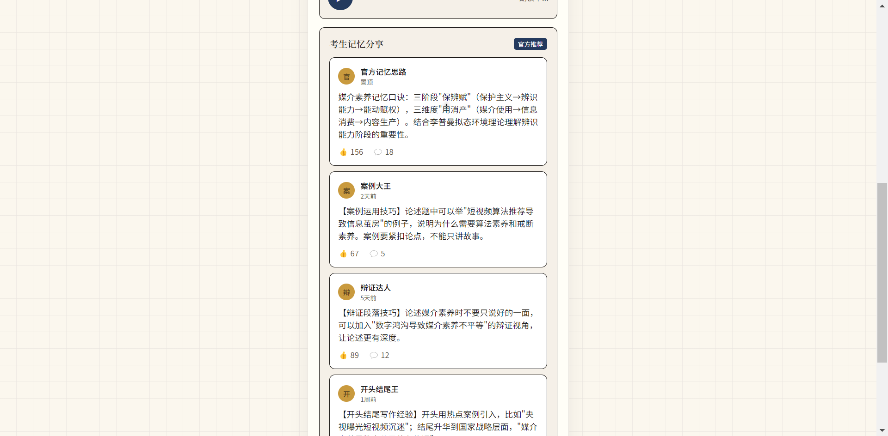

## 六、实务题训练（V2.0 从「待开发」变为完整题库，图 27–34）

### 27. 实务题列表

顶部搜索框「搜索实务题 / 题型 / 关键词」，下方 6 个分类标签：全部、消息写作、新闻评论、新闻策划、通讯、采访分析。题卡带题型色标与属性标签：消息写作[高频]「某地突发暴雨灾害」（30分·800字）、新闻评论[热点]「高校毕业生就业难现象」（35分·1000字）、新闻策划[重点]「城市马拉松赛事策划」（40分·1200字）、通讯[深度]「乡村教师坚守山区二十年」（35分·1000字）。

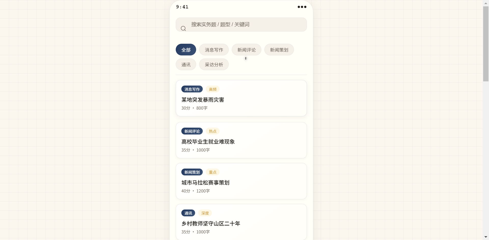

### 28. 消息写作 · 写作框架（上半屏）

进入「某地突发暴雨灾害」，详情页三标签：写作框架、答案内容、社群笔记。开头给出写作材料（暴雨内涝、交通瘫痪、停水停电、政府启动应急预案），框架按消息文体拆卡：标题（概括核心事件，突出时效性和重要性）、导语（五要素齐全：何时、何地、何事、何人、如何）、主体（按倒金字塔结构展开，先重后轻）、背景，每张卡均带「范例」按钮。

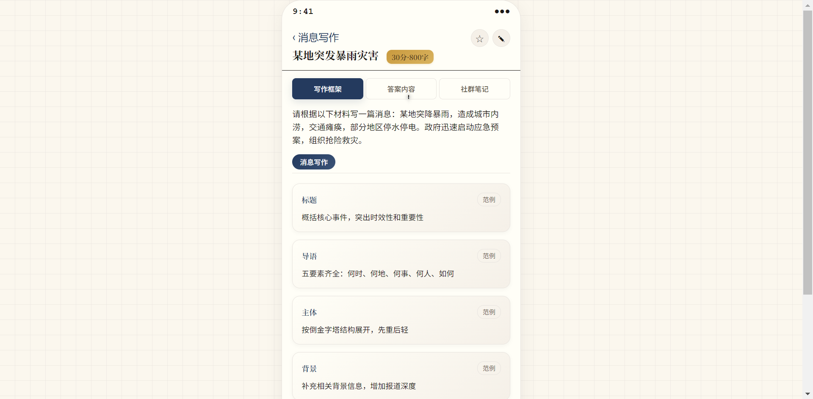

### 29. 消息写作 · 写作框架（下半屏）

最后一张结构卡「结尾：总结救援进展，展望未来」；底部同样保留上一题/下一题与不会/模糊/认识自评。

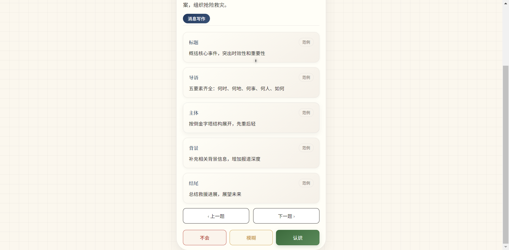

### 30. 消息写作 · 答案内容（可编辑范文）

「答案内容」标签内是一篇可直接改写的完整消息范文（标题「某地突降暴雨致城市内涝 政府紧急启动应急预案」，正文含降雨量、积水路段、地铁闭站等细节，以 XX 占位符代替具体地名/时间）。答案区本身是**可编辑文本框**，下方金色「保存修改」按钮允许考生在范文基础上改成自己的模板。

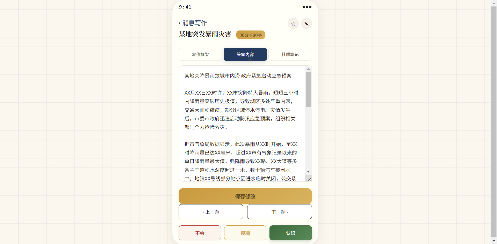

### 31. 消息写作 · 社群笔记

「社群笔记」标签汇聚实务经验帖：实务达人讲导语五要素、考研小李强调倒金字塔结构必掌握、写作高手提醒背景部分要简洁；底部虚线框「分享您的实务背诵心得…」+「发布笔记」，考生可发布自己的经验。

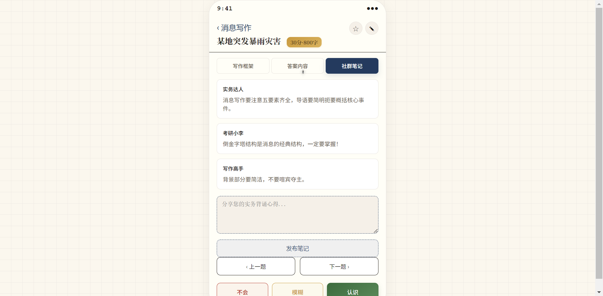

### 32. 新闻评论 · 写作框架

第二篇实务题「高校毕业生就业难现象」（35分·1000字）。评论框架按评论文体组织：标题、引论、本论一（原因分析）、本论二（对策建议）等卡片，同样逐卡配「范例」。

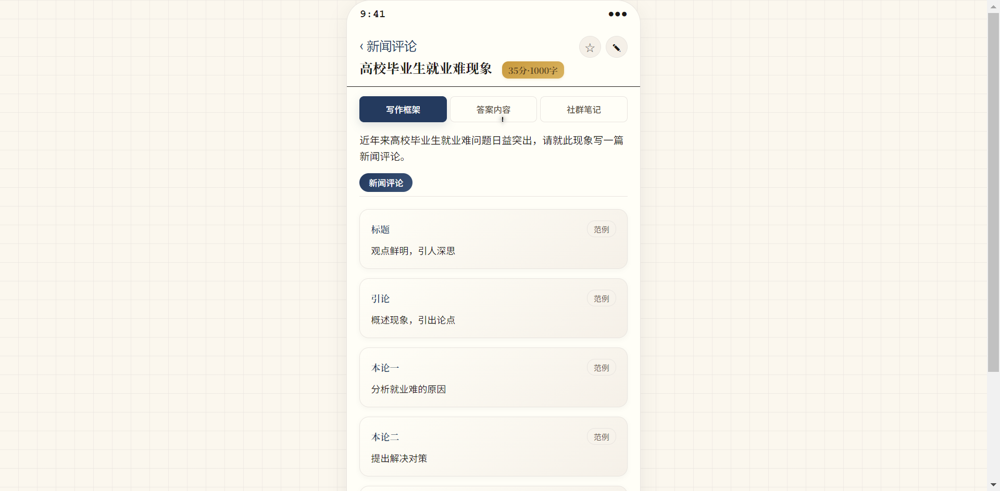

### 33. 新闻评论 · 答案内容（可编辑范文）

评论范文「破解高校毕业生就业难需多方发力」：以 2023 年 1179 万毕业生数据开篇，分析宏观经济与教育供需脱节双重原因。与消息写作一致，答案为可编辑文本框 +「保存修改」+ 上一题/下一题 + 三级自评。

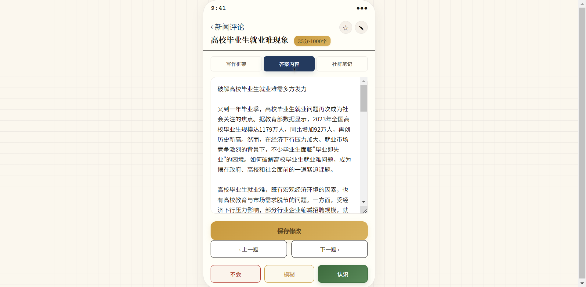

### 34. 新闻评论 · 社群笔记

本题的社群笔记：评论高手讲「论点、论据、论证，逻辑要清晰」、考研达人讲引论要抓住读者注意力、写作名师讲本论要层层递进、分论点要有论据支撑；同样可发布自己的背诵心得。

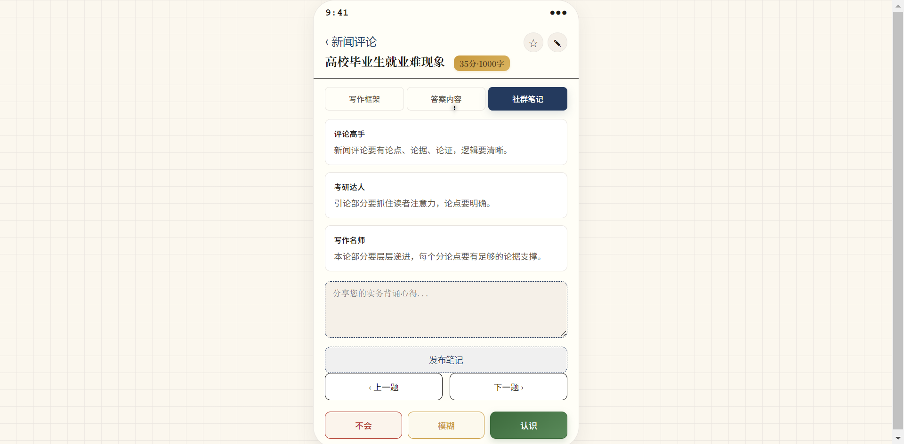

## 七、收藏（图 35）

### 35. 收藏页 · 按题型分组

底部导航进入「收藏」（红色星标高亮）。顶部可按全部/名词解释/简答题/论述题筛选；收藏内容按题型分组展示并保留属性标签：名词解释「沉默的螺旋」（高频）、「编码解码模型」（高频）、「议程设置」（重点）；简答题「霍尔编码解码模型」（20分）、「知沟理论的内涵」（15分）；论述题「媒介素养的内涵与演变」（30分）、「网络舆论的形成机制」（25分）。

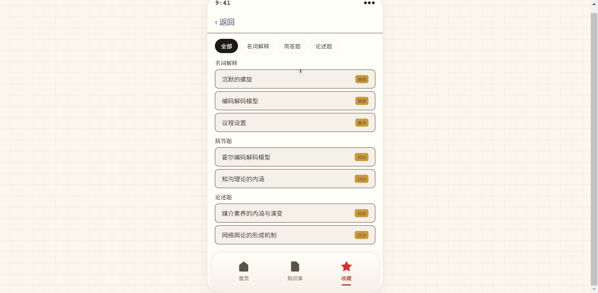

---

# V2.0 与 V1.0 的区别

## 1. 管理后台：从「没有」到「完整内容流水线」（最大区别）

- **V1.0 没有管理后台**，学生端内容只能随版本内置；
- **V2.0 首次上线管理后台 v1.0.0**，管理员（admin/admin123）登录后可走完全流程：
  上传教材/真题资料（PDF、Word，自动解析字数与章节）→ 选资料 + 题型 + 数量，用 DeepSeek **AI 批量生成**题目草稿（4 条生成规则约束）→ 内容审核 → 题库管理（新增、编辑、上下架、删除）→ 单条/批量**发布到学生端 APP** → 查看发布历史（全部 success）与数据统计（已发布 8 / 草稿 0 / 待审核 0 / 已下架 1）。

## 2. 学生端 APP 的新增与增强

| 方面 | V1.0 | V2.0 |
|---|---|---|
| 论述题 | 首页仅显示 96 道入口，无详情截图 | 完整落地：引言/三分论点/结尾框架卡、逐卡「范文」、模板库、完整范文入口、4 道变式、长文答案 |
| 实务题 | 首页有入口，模块内基本是「待开发」空壳 | **完整题库**：6 大分类、搜索、高频/热点/重点/深度标签；消息写作、新闻评论均有「写作框架（材料+结构卡+范例）+ 可编辑答案（保存修改）+ 社群笔记（可发帖）」三段式 |
| 五种自测模式 | 仅「拖拽还原」在截图中出现 | 拖拽还原（双排序）、填空记忆、框架默写（调出标准答案）、红膜背书、闪卡翻面**五种全部可交互**，每题还带朗读条 |
| 头像 | 固定文字头像 | 新增头像设置：本地图库上传 + 8 个纯色头像 |
| 笔记 | 个人中心仅有「自建笔记」数量 | 词条详情页新增「记笔记」笔形按钮，随词条记笔记 |
| 收藏反馈 | 点星标仅图标变色 | 星标变金 +「已收藏该内容」弹窗；收藏页按题型分组并带筛选 |
| AI 参数 | 画质/详略各一档基础设置 | 画质标准/高清/超清三档、详略简洁/标准/详细三档 |
| 视频来源 | 官方教材 + @宝藏老师 两路 | 新增「视频来源」弹窗，可选 @宝藏老师 / @传播学小王子 / @新传考研君 3 位 UP 主 |
| 设置交互 | 个人中心页内平铺 | API 密钥、清除缓存、版本反馈改为弹窗交互，清缓存需二次确认，反馈给出 support@xinchuan.app 与官方 QQ 群 |
| UGC 社区 | 考生口诀可浏览/发布 | 名词 AI 助记、论述考生记忆分享（156 赞官方帖）、实务社群笔记三处均可发帖，截图中含本人测试帖 |

## 3. V2.0 如实保留的已知瑕疵

- 论述题「答案内容」中 `<b></b>`、` ` 等 HTML 标签以明文显示，未渲染为加粗与换行（见图 20）；
- 简答题框架页存在加载空白瞬间（见图 16）；
- 数据概览中实务题统计仍为 0/「待开发」，与学生端实务题库已上线的实际进度存在口径差；
- API 密钥独立管理界面、版本反馈界面仍标注「开发中」；
- 管理后台登录页直接展示默认账号密码，正式上线前应改为强制改密。

## 4. 延续不变的部分

米白纸感底色 + 藏青/砖红/赭金/紫四色模块卡、Apple 式大留白圆角风格、「不会/模糊/认识」三级自评、上一题/下一题翻题、DeepSeek/ChatGPT 自选且密钥仅存本地、视频+知识框架+分层串记+AI助记的名词学习四标签，均与 V1.0 保持一致。
