# V3.0 考试训练版（学生端 APP 实机截图）

V3.0 在 V2.0「背诵闭环 + 管理后台内容流水线」的基础上，把产品明确拆成**背诵学习**与**考试训练**两条独立主线：
首页新增第 5 个核心入口「考试训练」，内置实务题 / 理论题 / 模拟考试三个标签，按考场题型分阶段专项训练；
同时补齐了 V1.0、V2.0 相册中从未出现过的**登录 / 注册体系**（密码登录、验证码登录、三方登录），
个人中心新增昵称修改、学习模式切换、资料库下载管理，API 密钥、深色模式、版本反馈等在 V2.0 标注「开发中」的功能本版本全部落地。

> 截图说明：以下共 **51 张**，均为 2026-09-11 对 V3.0 学生端 APP 真实运行界面的手工截图，无重复过程图，
> 已按用户实际操作路径（首页 → 登录与个人中心 → 名词解释「新闻价值」→ 简答题「霍尔编码解码模型」→
> 论述题模板库 → 实务题训练 → 考试训练全流程）排列，平铺于 `screenshots/`。
> 本版本无新的管理后台截图，后台沿用 V2.0；每张图的说明中直接注明与 V1.0 / V2.0 的异同，不再另设区别专节。

---

## 一、首页、登录与模式切换（图 1–7）

### 1. 学习首页 · 五大核心入口

登录后默认页。当前用户为「猪猪侠 · 连续背诵 5 天」——V1.0 首页用户是「阿宇」、V2.0 是「张扬」，三版昵称各不相同；「继续学习」仍直达名词解释「新闻价值」，与 V1.0/V2.0 一致。**最大变化是核心入口由 4 个增至 5 个**：名词解释 328、简答题 142、论述题 96 三个数量沿用旧版，第 4 个「实务题训练」保留，新增的第 5 个金色卡片「考试训练」直接标注内含「实务题 · 理论题 · 模拟考试」，是 V3.0 的主线新模块；底部首页 / 知识库 / 收藏三栏导航与旧版相同。

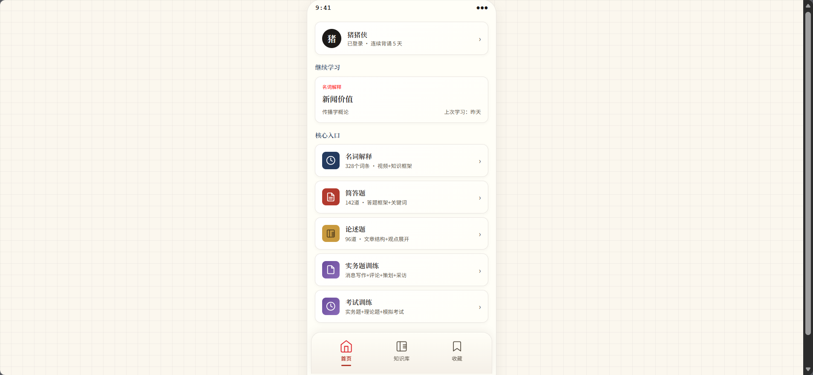

### 2. 设置头像弹窗

点头像弹出「设置头像」：本地图库上传 + 8 个纯色圆形头像，与 V2.0 相册第 3 张完全一致；V1.0 只有固定文字头像、无此弹窗，本版无变化。

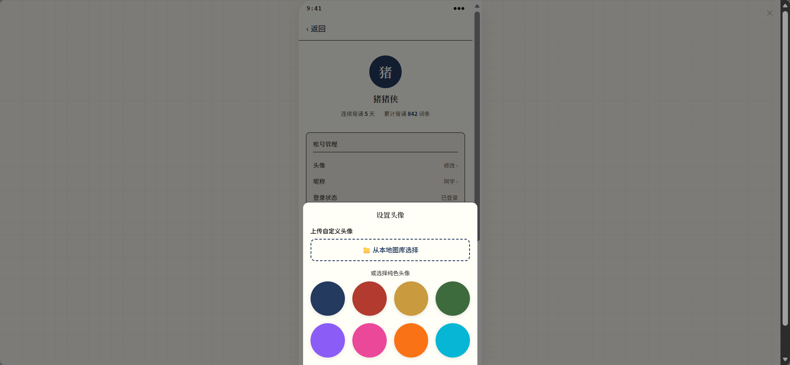

### 3. 修改昵称弹窗（V3.0 新增）

V2.0 只能换头像、不能改名，V3.0 新增「修改昵称」弹窗（输入框中当前昵称为「阿宇」）。背景个人中心可见头像修改、昵称、退出登录，以及「学习偏好」区：学习模式（背诵学习）、背诵提醒开关。

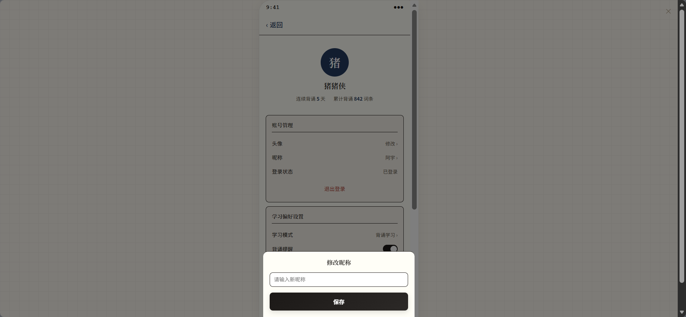

### 4. 登录页 · 密码登录（V1.0/V2.0 相册均无）

V1.0、V2.0 的截图全部从登录后的首页开始，V3.0 相册首次出现独立登录页：手机号 + 密码登录、「记住密码」、用户协议勾选（未勾选时登录按钮置灰）、底部微信 / QQ / 微博三方登录图标与「立即注册」入口，顶部 Logo 为「新」字标。

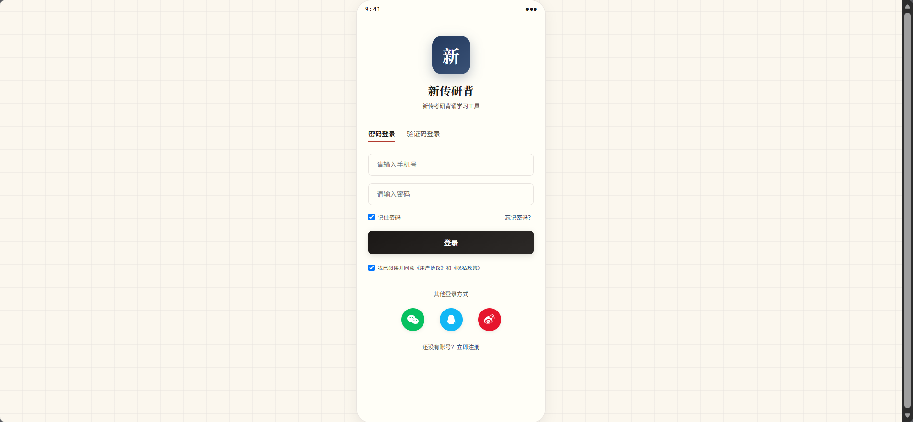

### 5. 登录页 · 验证码登录

同一登录页切换到验证码 tab：手机号输入框 +「获取验证码」按钮，其余协议勾选与三方登录布局不变。

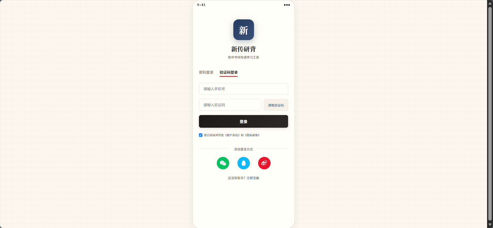

### 6. 注册功能说明弹窗

点「立即注册」弹出说明：注册功能暂未开放，当前可使用微信 / QQ / 微博三方账号登录。该弹窗在 V1.0/V2.0 中均不存在（旧版无登录页）。

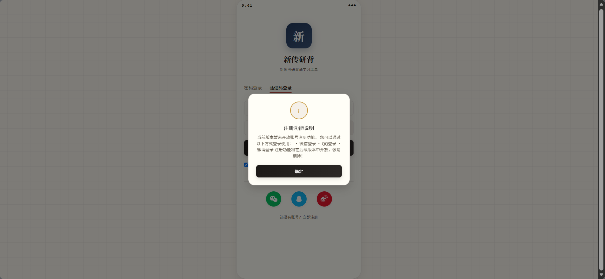

### 7. 学习模式切换弹窗（V3.0 新增）

个人中心点「学习模式」弹出二选一：**背诵学习模式**（名词解释、简答题背诵复习，即 V1.0/V2.0 的主路径）与**考试训练模式**（实务题答题框架训练）。这正是「背诵模块与考试模块独立」在交互上的落地——V1.0/V2.0 没有模式概念，首页只按题型分入口。

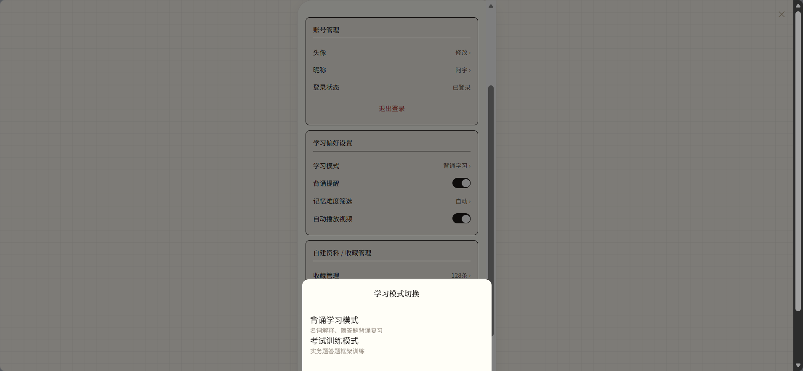

---

## 二、个人中心与系统设置（图 8–16）

### 8. 记忆难度筛选弹窗（开发中）与 AI 管理区

点「记忆难度筛选」弹出灰色「开发中」提示（V1.0 个人中心该项标注「自动」、V2.0 无此弹窗截图）。半透明背景后是个人中心 AI 管理区：默认模型 DeepSeek、API 密钥 2 个已配置——注意「生成画质」「文字详细程度」两项此时显示为「功能预留」，与 V2.0 的三档可选状态不同（详见图 11、12）。

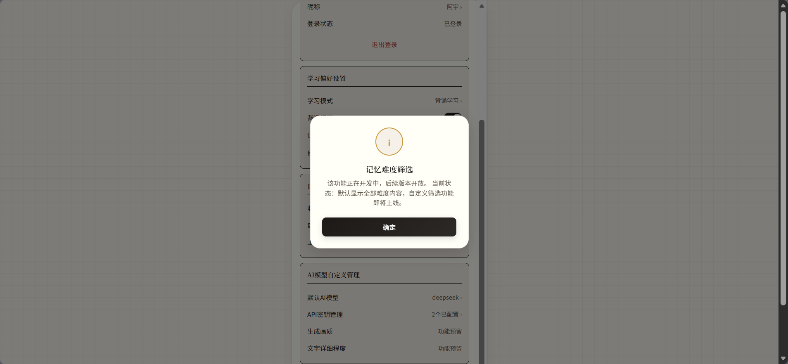

### 9. 我的资料库弹窗（V3.0 新增）

V1.0 个人中心只有「上传资料库 4 份」一个数字、V2.0 学生端没有资料库管理界面（资料管理在管理后台，入库 3 份）。V3.0 新增「我的资料库」弹窗，每份资料可**查看 / 下载 / 删除**，共 5 份：《传播学教程（郭庆光）》32.0 万字、《新闻学概论（李良荣）》28.0 万字、《网络传播概论（彭兰）》24.0 万字、《2025 真题汇总》Word 1.2 万字，以及一份 6.7 万字的 PDF 资料。

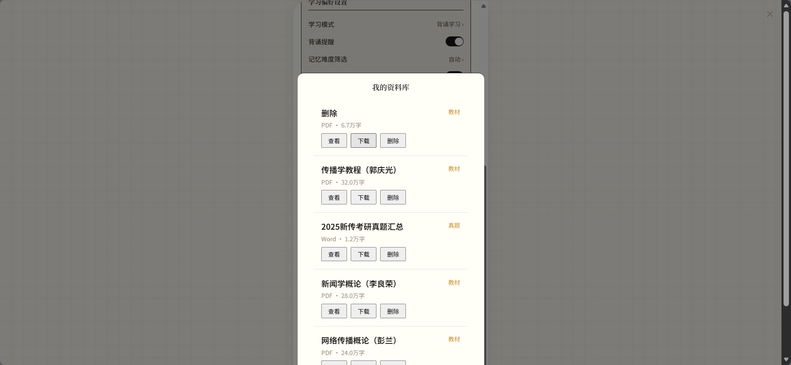

### 10. API 密钥管理弹窗（V2.0 的「开发中」已落地）

V2.0 点「API 密钥管理」只弹出「独立密钥管理界面正在开发中」的提示，密钥只能去词条详情页配置；V3.0 该功能正式可用：弹窗内填写 DeepSeek 密钥，附 platform.deepseek.com 三步获取指引，保存即生效。背景可见收藏 128 条、自建笔记 1 条、资料库 5 份（V1.0/V2.0 截图时自建笔记为 36 条）。

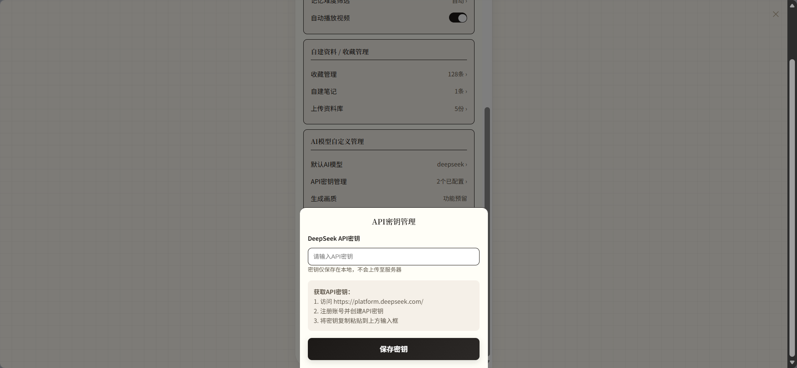

### 11. 生成画质 · 功能预留弹窗

V2.0 的生成画质是标准 / 高清 / 超清三档实可选下拉；V3.0 改为「功能预留」弹窗，提示该能力待 AI 接入后开放，当前不可选。

### 12. 文字详细程度 · 功能预留弹窗

与上一项同理：V2.0 为简洁 / 标准 / 详细三档可选，V3.0 暂改为功能预留提示。两项参数在 AI 模型弹窗内仍有下拉值（见图 18）。

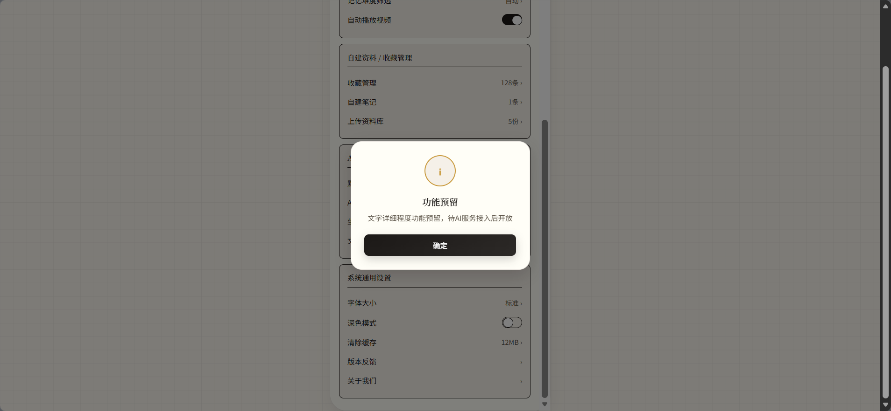

### 13. 字体大小设置

提供小号 / 标准 / 大号 / 特大四档圆点单选项。字体大小设置项在 V1.0/V2.0 个人中心就已存在（旧版相册未截弹窗），V3.0 弹窗样式与整套白色卡片 UI 统一。

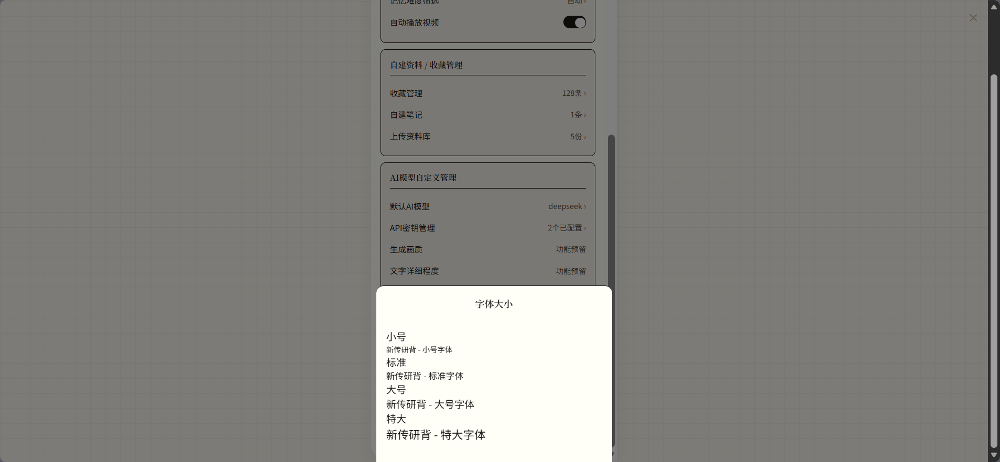

### 14. 深色模式下的清除缓存确认（深色模式真实生效）

V1.0/V2.0 全部截图均为浅色界面，V3.0 深色模式已真实生效：背景为黑色网格纸感。清缓存弹窗比 V2.0 的二次确认更详细——列明将清理临时数据 / 缓存 / AI 缓存，同时保留用户数据 / 收藏 / 学习记录。

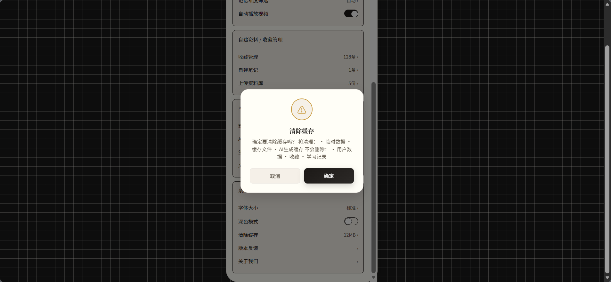

### 15. 版本反馈表单（V2.0 的「开发中」已落地）

同样在深色模式下。V2.0 的版本反馈只是一个提示弹窗（给邮箱和 QQ 群），V3.0 变为完整表单：反馈类型下拉（图中为「Bug 反馈」）、反馈内容输入、联系方式（选填）、提交按钮。

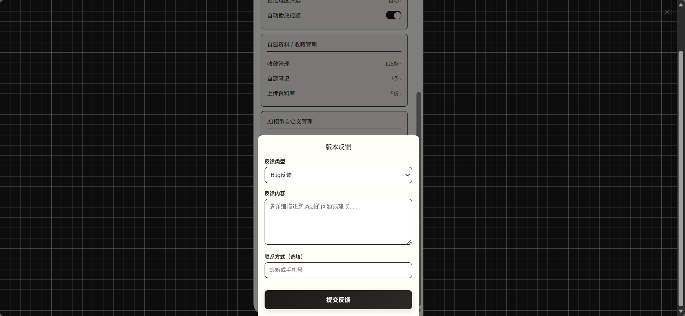

### 16. 关于我们

深色模式下的关于页：应用名「新传研背」、版本 **V3.0**、客服邮箱 support@xinchuan.app（与 V2.0 反馈提示中的邮箱一致）、官方 QQ 群 123456789、版本号 v3.0.0。该页在 V1.0/V2.0 相册中没有截图。

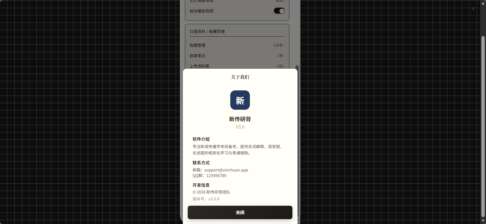

---

## 三、名词解释模块（以高频词条「新闻价值」为例，图 17–22）

### 17. 词条详情 · 视频模式

‹ 传播学基础 / 新闻价值，四标签（视频 / 知识框架 / 分层串记 / AI 助记）、双路视频来源、上一个 / 下一个翻词条、「不会 / 模糊 / 认识」三级自评、右下悬浮「切换 AI 模型」，布局与 V1.0/V2.0 完全相同；唯一可见差异是播放器字幕显示「视频资源待上传」，不再像 V2.0 那样带 00:00/00:05 的占位进度条。

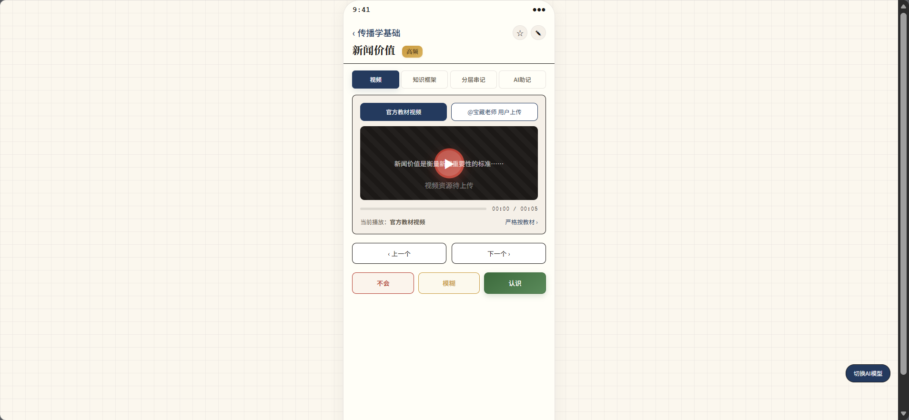

### 18. AI 模型弹窗 · 四个模型（V1.0/V2.0 为两个）

点悬浮按钮弹出模型抽屉：V1.0、V2.0 只能在 DeepSeek / ChatGPT（GPT）之间二选一，V3.0 扩为 **DeepSeek（当前勾选）/ GPT / Claude / Gemini 四个**；下方生成画质（标准）、文字详细程度（简洁）仍以下拉形式呈现，密钥仅保存在本地的约定不变。

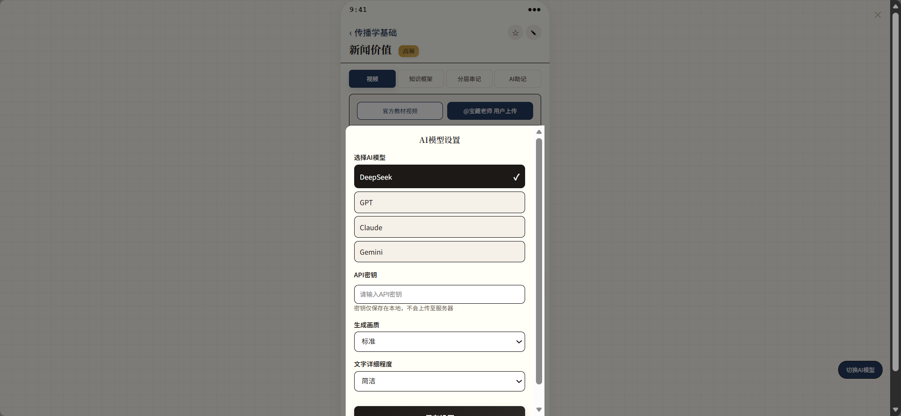

### 19. 知识框架

AI 结构化卡片仍是定义 / 范畴 / 特征等模块（时新性、重要性、显著性、接近性、趣味性），内容组织与 V1.0 第 6–7 张、V2.0 第 11 张一致；样式上卡片左侧加了金色竖线，整体仍是米白卡片纸感。

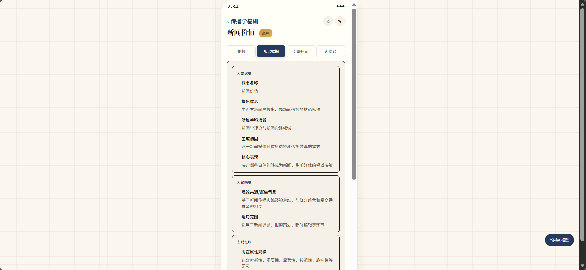

### 20. 分层串记

1 级核心定义 → 2 级关键词与关联概念 → 3 级真题应用的分层内容与旧版相同；细微交互变化是底部绿色确认按钮文案由 V1.0/V2.0 的「认识」改为「**已认识，下一个**」，动作指向更明确。

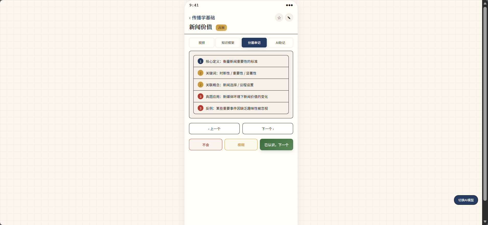

### 21. AI 助记 · 考生口诀社区

「新闻学子」五字口诀（24 赞）与「记忆达人」五要素总结（18 赞）两条帖子与 V1.0 第 9 张相同；V2.0 此页还夹有当前账号自己发的「住豪宅」等测试帖，V3.0 这张截图中信息流里没有测试帖。

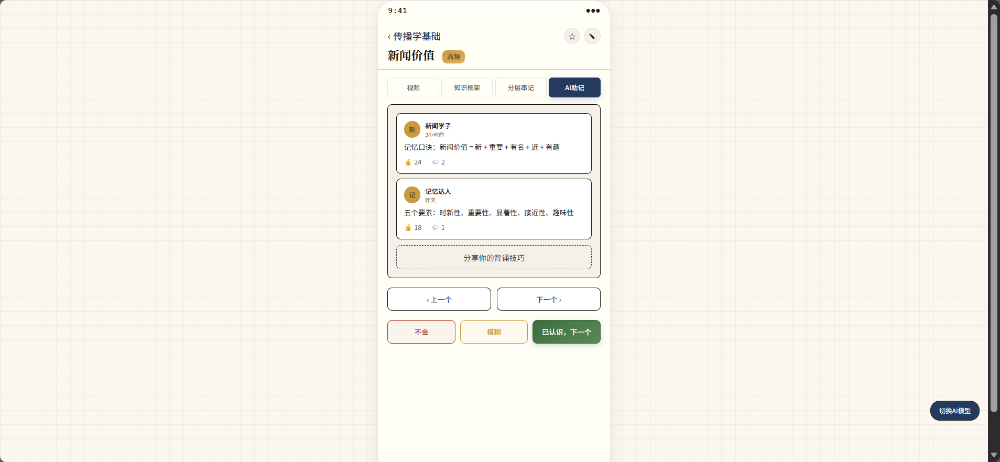

### 22. 分享背诵技巧 · 发布弹窗

点底部虚线框「分享背诵技巧」后弹出的发布弹窗，可直接编写要分享的记忆口诀。V1.0/V2.0 相册只拍到虚线框入口，V3.0 补全了发布动作的弹窗形态。

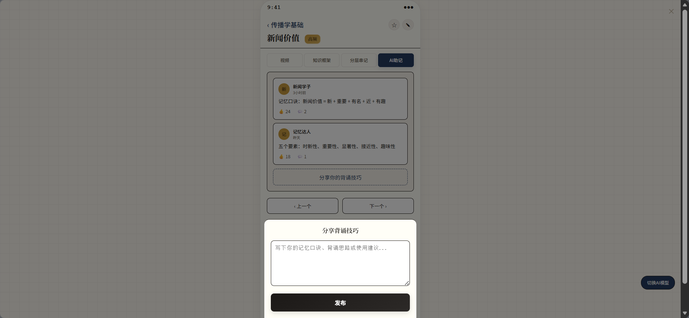

---

## 四、简答题模块（以「霍尔编码解码模型」为例，图 23–27）

### 23. 简答详情 · 答题框架（V2.0 的空白加载问题已不复现）

四标签（答题框架 / 真题设问变式 / 答案内容 / 辅助记忆）与 V1.0 一致，框架完整渲染为「总（编码解码定义 + 受众观前提）→ 偏好式解读 → 妥协式解读 → 对抗式解读 → 总结」五段。**V2.0 相册第 16 张记录过此页只有骨架占位条的空白加载瞬间，V3.0 截图中框架内容正常显示，该问题已不复现**；本页底部仍是「不会 / 模糊 / 认识」三级自评按钮。

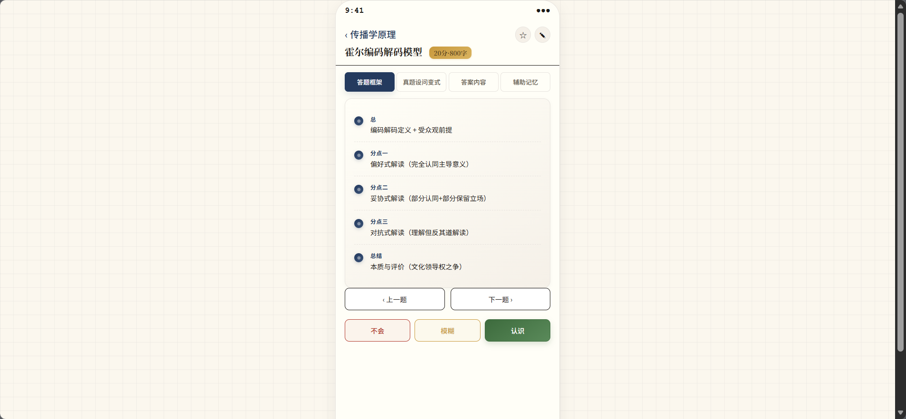

### 24. 真题设问变式

由母题「简述霍尔的编码解码理论」派生 4 种变式问法，与 V1.0 第 11 张一致（V2.0 未拍此页），无变化。

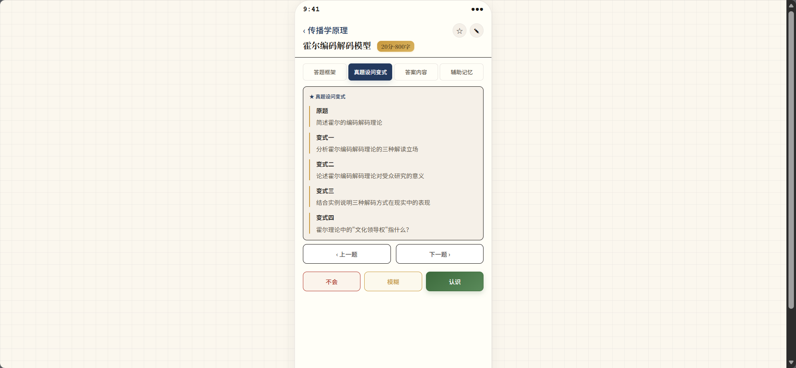

### 25. 答案内容（V2.0 的 HTML 标签明文问题已修复）

五部分长文答案正常排版，「一、编码解码定义」「二、偏好式解读」等**加粗标题渲染正常**。V2.0 相册第 20 张如实记录过答案区把 `<b></b>`、` ` 当作文字原样显示的富文本缺陷，V3.0 答案页已按加粗 / 换行正常渲染。

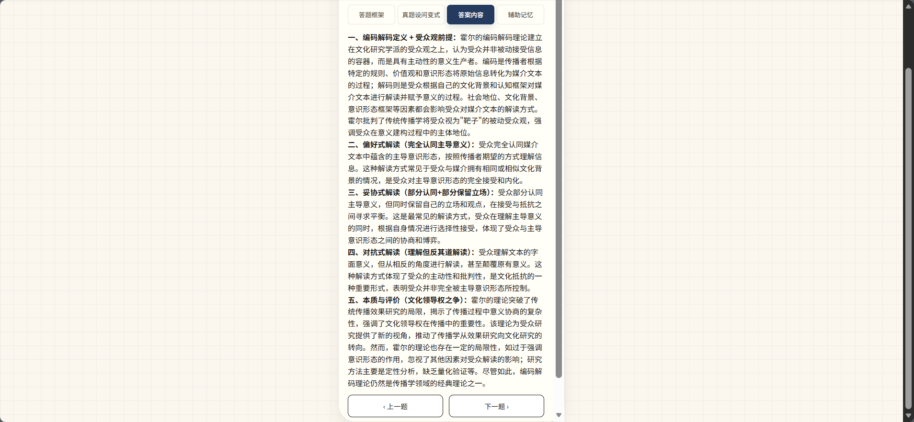

### 26. 辅助记忆 · 拖拽还原

五种自测模式 tab（拖拽还原 / 填空 / 默写 / 红膜 / 闪卡）、朗读播放条、按认同度排序的妥协 / 对抗 / 偏好三张卡片（带横向滚动条）、官方记忆思路帖 128 赞，均与 V1.0 第 13 张一致；V2.0 把五模式全部做了交互，V3.0 直接沿用这套成熟交互。

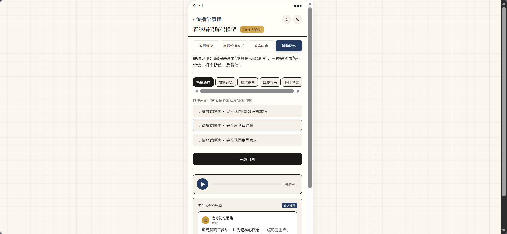

### 27. 朗读播放与考生分享

朗读条处于播放中状态；下方考生分享三条：官方记忆思路 128 赞 12 评论（与 V1.0 同帖）、「考研小李」的「偏妥对」谐音记忆法 45 赞、「背诵达人」76 赞，底部保留「发布我的记忆方法」入口，UGC 形态与 V2.0 一致。

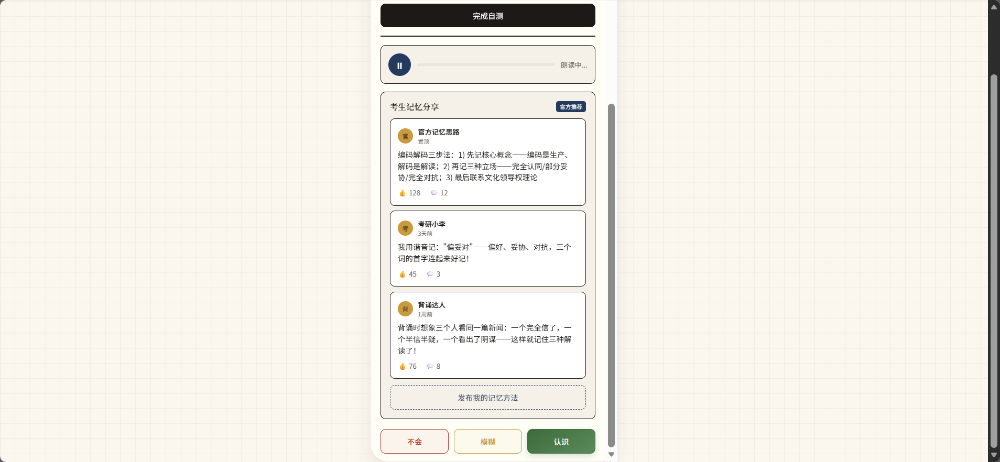

---

## 五、论述题 · 答题框架模板库（图 28–31）

### 28. 答题框架模板库（V2.0 的一个入口升级为完整模板库）

V2.0 论述题框架底部只有「答题框架模板库」一个文字入口、没有库内截图；V3.0 点进去是完整的模板网格，共 **8 套框架**：递进框架、并列框架、5W 传播要素框架（图中金色描边选中）、PETCSI 社会六维框架、多主体框架、BMR 动因框架、治理三维框架、理论辨析框架，另有「保存自定义模板」与「完整范文」入口。

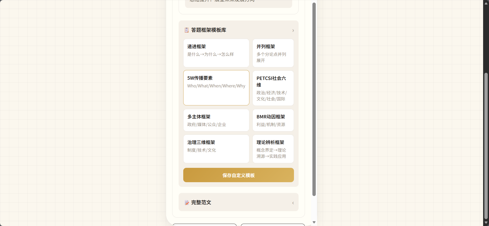

### 29. 应用递进框架 · 成功提示

选中递进框架后页面顶部弹出 toast「模板应用成功：已应用递进框架」。V2.0 没有模板应用动作，自然也没有这类操作反馈。

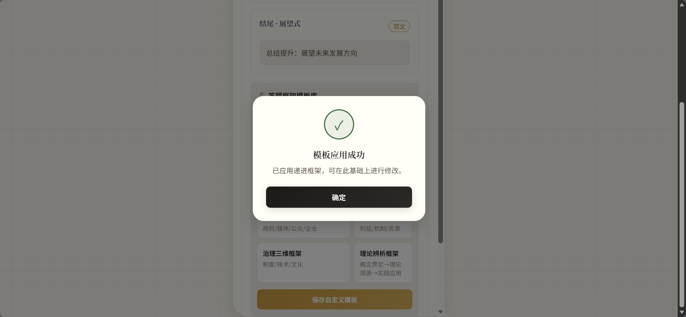

### 30. 应用并列框架 · 成功提示

再切换并列框架，toast 提示「已应用并列框架」，证明模板可反复替换、即时生效。

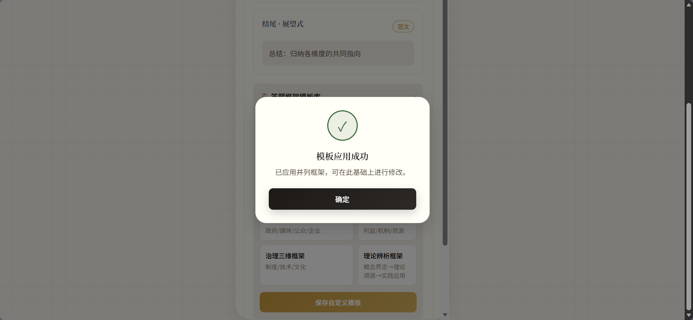

### 31. 应用并列框架后的论述题框架（以「媒介素养」为例）

同一道「媒介素养的内涵与演变」，应用并列模板后，框架结构变为「开头总起 → 维度一 / 二 / 三 → 结尾」，每个维度统一拆成**核心论点 / 可用论据（相关数据 · 典型案例 · 理论支撑）/ 论证思路**三层。对比 V2.0 相册第 17–18 张的同题框架（引言式开头 + 三个分论点卡 + 展望式结尾，按内容本身组织），V3.0 的框架是套用通用模板后生成的标准化结构。

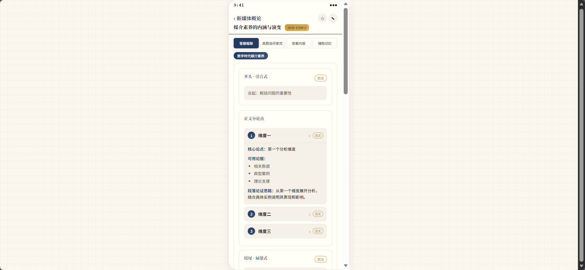

---

## 六、实务题训练（背诵学习模式下，图 32–34）

### 32. 消息写作 · 写作框架

背诵侧实务题沿用 V2.0 已落地的「写作框架 → 答案内容 → 社群笔记」三段式：材料 + 标题 / 导语 / 主体 / 背景 / 结尾五张结构卡、每卡带「范例」，一屏完整呈现，与 V2.0 相册第 28–29 张相同。注意它与考试训练里的消息题（第三阶段）是两个独立入口，互不干扰。

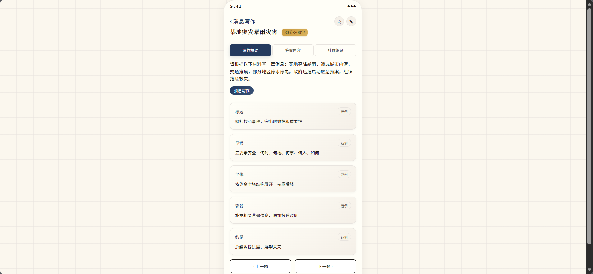

### 33. 消息写作 · 可编辑范文

答案区仍是可编辑文本框 + 金色「保存修改」按钮，交互与 V2.0 一致；范文内容比 V2.0 更完整，出现长江下游、市委书记 XXX 等具体行文细节，仍以 XX 作占位符。

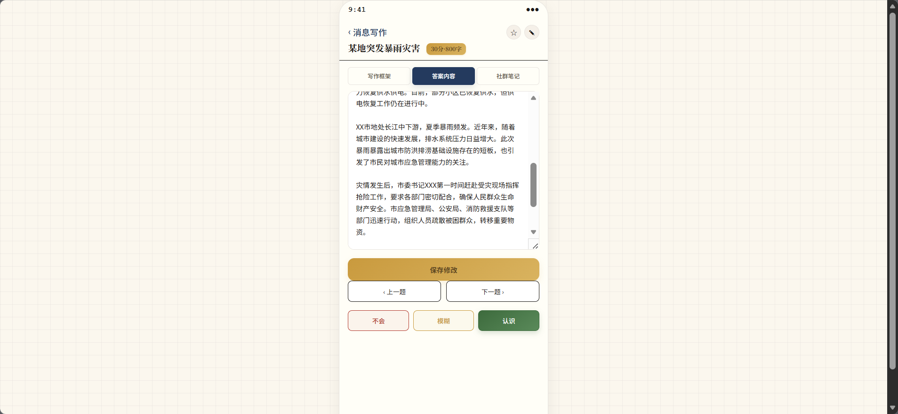

### 34. 消息写作 · 社群笔记

三条实务经验帖与 V2.0 相同（导语五要素、倒金字塔结构、背景要简洁）；底部「发布笔记」按钮在未输入内容时为灰色禁用态。

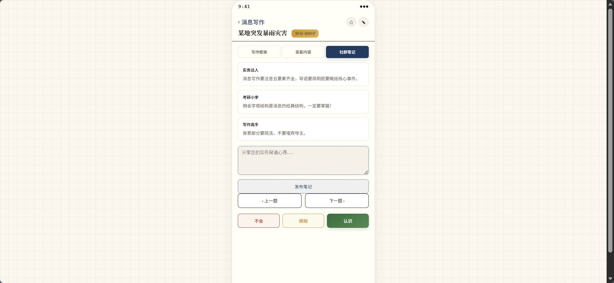

---

## 七、考试训练模块（V3.0 全新主线，图 35–51）

### 35. 考试训练首页 · 专项训练

V1.0/V2.0 完全没有的全新页面。顶部「‹ 返回 / 历史训练 ›」，深蓝色大图写着「专项训练 · 新传考研考试模拟系统」，下方三个 tab：**实务题 / 理论题 / 模拟考试**。实务题 tab 下按复习阶段排列题卡：新闻采访题（第一阶段）、新闻评论题（第二阶段 · 短评 / 述评 / 编者按）、新闻消息题（第三阶段 · 倒金字塔结构），以及带金色「深大专属」标的健康传播策划。与 V2.0 实务题的区别是：V2.0 实务题是背诵体系内的题库（框架 + 范文 + 社群笔记），V3.0 这里是考场化的分阶段专项训练，二者入口独立。

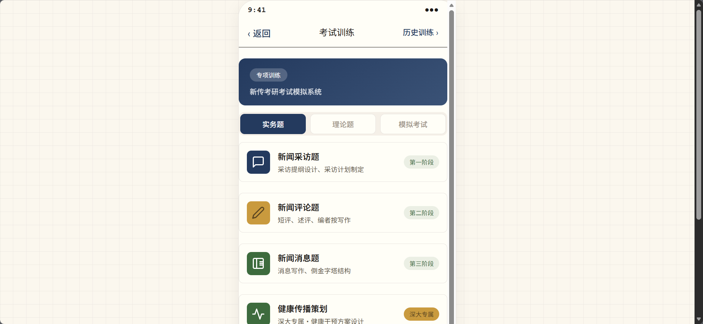

### 36. 新闻采访题 · 答题框架（第 1/3 题）

题目要求为「某地突发公共卫生事件」设计采访提纲。详情页是全新的三 tab：**答题框架 / 考生作答 / 用户分析**。框架不再是背诵侧的卡片，而是表格——「新闻采访的方式 · 按形式划分（10 种）」，按采访形式 / 核心内涵 / 适用场景三列列出个别访问、开座谈会、现场观察等；左下角固定「上一题 / 下一题」。

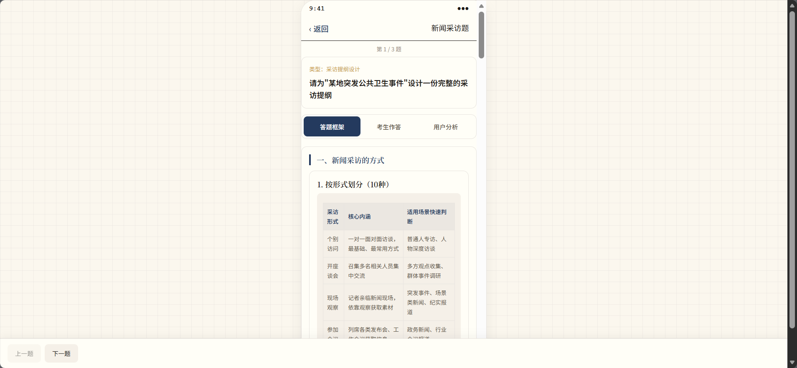

### 37. 新闻采访题 · 考生作答

「考生作答」tab 把参考答案拆成「一、采访任务目的」「二、人员安排」等分段填空卡，每段带灯泡形「AI 思路」提示，由考生逐段动笔；底部两个金色按钮「查看我的答案汇总」「查看完整答案」。这种分段作答 + AI 思路的考练形式在 V1.0/V2.0 中不存在。

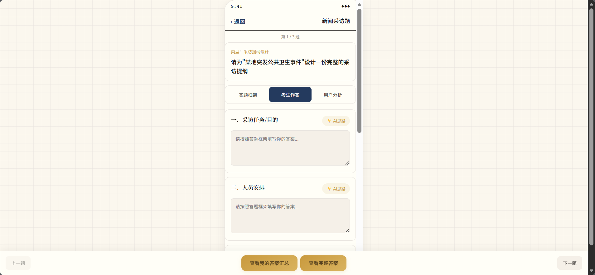

### 38. 新闻采访题 · 用户分析

「用户分析」tab 是考试模块专属的 UGC 区：深蓝色「发布我的分析」按钮，下方「小张同学」按政府 / 医院 / 专家 / 民众四个层面拆解采访对象，「小李同学」用「人、事、时、地、物」五字记忆采访提纲要素。背诵侧的社群笔记只在实务题内，这里的分析体系随考试题独立存在。

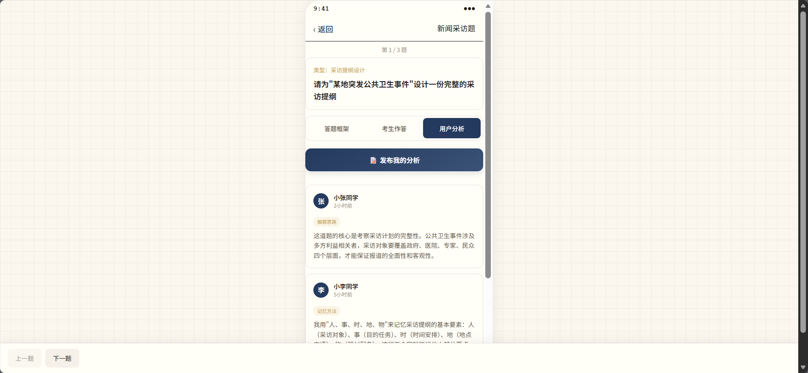

### 39. 新闻评论题 · 答题框架（第 1/3 题）

第二阶段题型。材料为某网红奶茶品牌使用过期原料、篡改保质期，要求写 300 字短评。框架表为「新闻评论根本三大特征」：论题新闻性、论理思想性、论说公众性，每行附标准答题话术。对比 V2.0 相册第 32 张背诵侧评论题（标题 / 引论 / 本论卡片式框架），考试侧框架是更适合速记速查的表格。

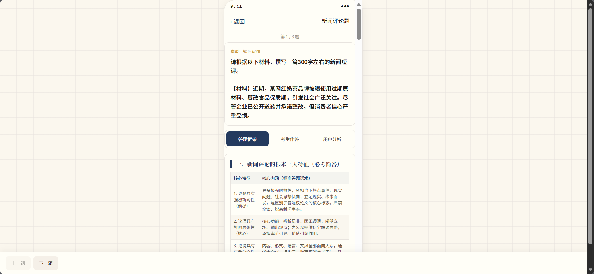

### 40. 新闻评论题 · 考生作答（标题与引论）

分段作答卡：标题段的 AI 思路提示「负面话题可用『别 / 莫 / 不』字头」；下一段为引论。考生需自己填标题与开头，而不是像背诵侧那样直接给可编辑范文。

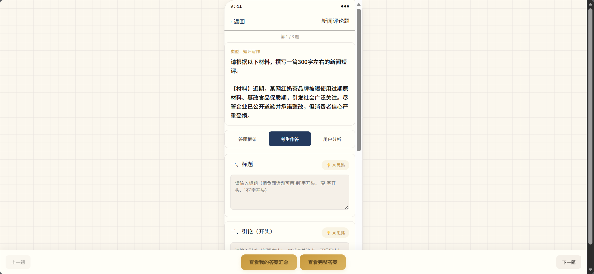

### 41. 新闻评论题 · 考生作答（引论与正论）

向下滚动：引论卡提示「新闻由头 + 亮论点」，正论部分按「是什么 / 为什么 / 怎么办」分段（末段在屏幕下方露出），与上一张共同构成完整的评论作答引导。

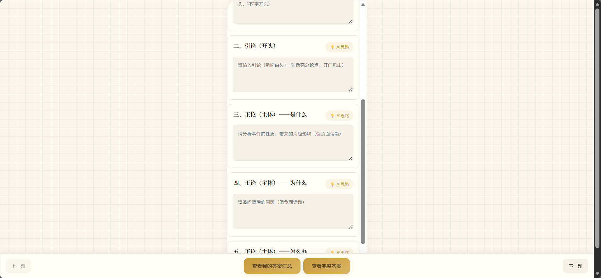

### 42. 我的答案汇总 · 空状态

点「查看我的答案汇总」弹出空态弹窗「还没填写答案」。答案汇总是考试训练独有的进度归集概念（V1.0/V2.0 无），未作答时给出空态而非报错。

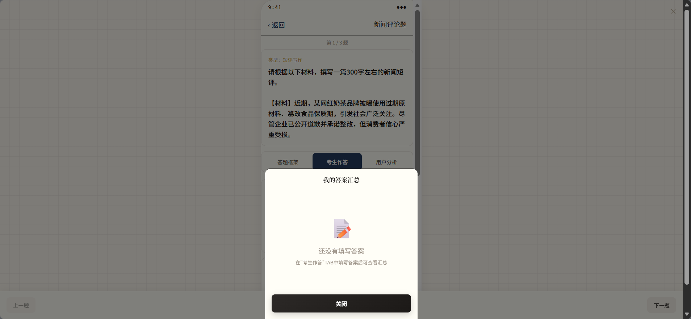

### 43. 完整参考答案弹窗

点「查看完整答案」弹出整屏参考答案：标题示范「别让『网红』光环遮住食品安全底线」，引论（新闻由头 + 亮明论点）、正论「是什么」（企业诚信缺失与对消费者健康的漠视）、正论「为什么」（下一段露出）。与背诵侧「答案内容」整页长文不同，考试侧答案以弹窗形式供作答后对照。

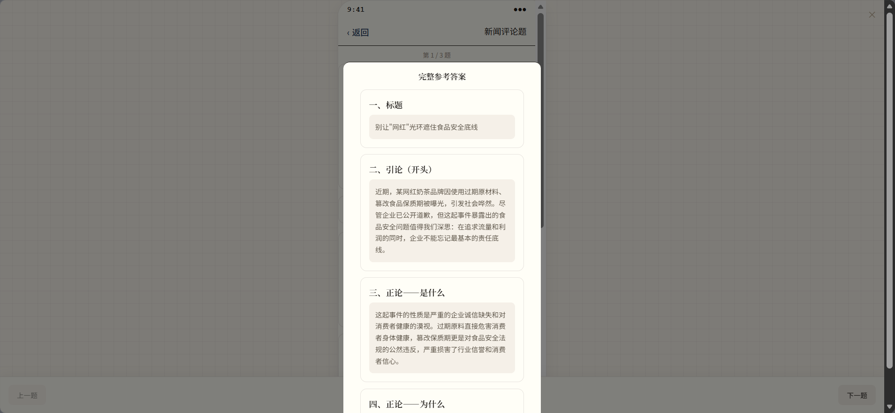

### 44. 新闻评论题 · 用户分析

评论题的用户分析流：小张同学（解题思路，2 小时前）、小李同学（记忆方法，5 小时前）之外，比采访题截图多出第三条「小王同学」（案例分析标签，1 天前，正文未展开）；分析内容目前与采访题下的示例文案相同，属于演示数据。

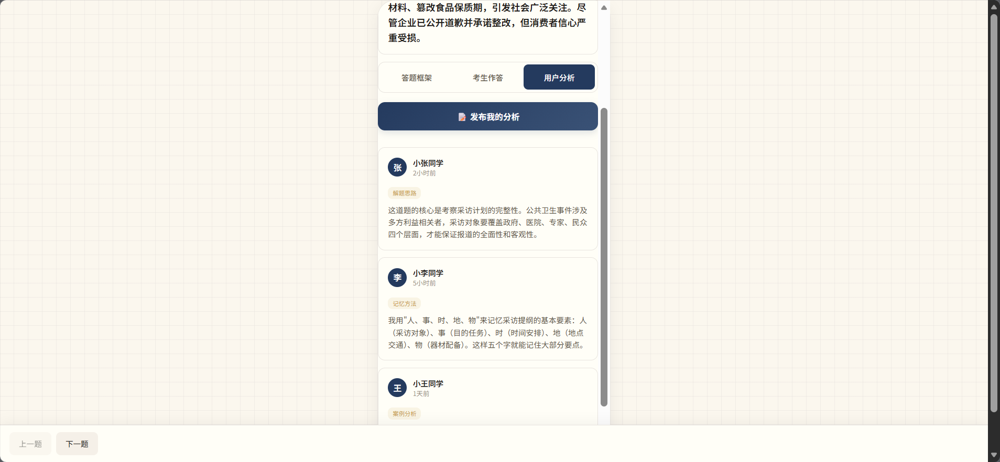

### 45. 发布我的分析弹窗

点「发布我的分析」弹出表单：先选分析类型——解题思路（当前选中）/ 记忆方法 / 案例分析 / 答题技巧四个胶囊标签，再在「我的分析内容」文本框填写，底部黑色「发布分析」按钮。四类标签与信息流中的标签一一对应。

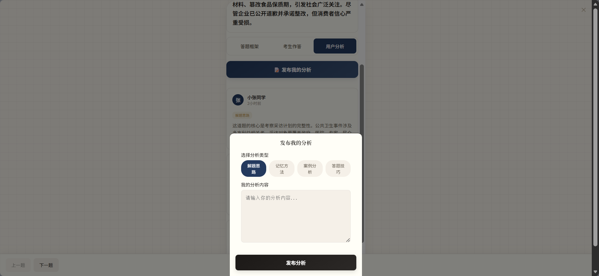

### 46. 广告小实务文案 · 答题框架

同为实务题 tab 下的题型（V2.0 实务题六大分类中没有广告文案题）。顶部标注类型「广告文案写作」，题为「请为『瑞幸咖啡生椰拿铁』撰写一则系列广告文案创意设计」。框架卡按广告文案结构组织：一、标题（直击受众核心利益点，简洁抓眼球）；二、正文（理性路线：产品参数 / 实测数据 / 竞品对比，或感性路线：生活化场景 / 情感共鸣叙事，二选一）；三、Slogan（提炼差异化卖点，简短易传播）；四、随文（品牌名称、购买渠道、限时活动信息）。

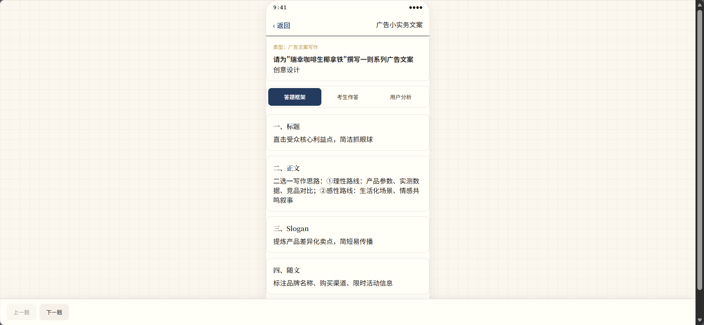

### 47. 广告小实务文案 · 考生作答

「考生作答」tab 把四段框架变成四个可编辑文本域，框内浅灰占位文字即各段写作要点（图中为标题段、正文段，Slogan 段在下方露出）；底部同样是「查看我的答案汇总」「查看完整答案」两个金色按钮，作答交互与采访题、评论题保持统一。

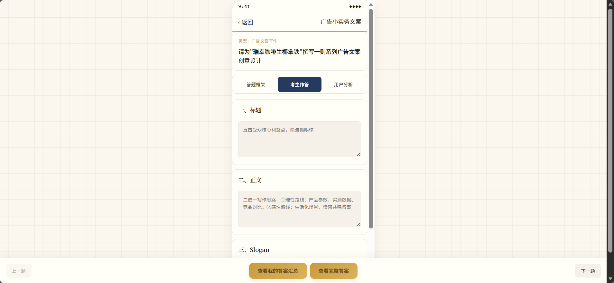

### 48. 广告小实务文案 · 用户分析

该题的「用户分析」tab 同样置顶「发布我的分析」，信息流可见小张同学、小李同学两条示例（演示文案与前两题一致），构成三种题型共用一套 UGC 机制。

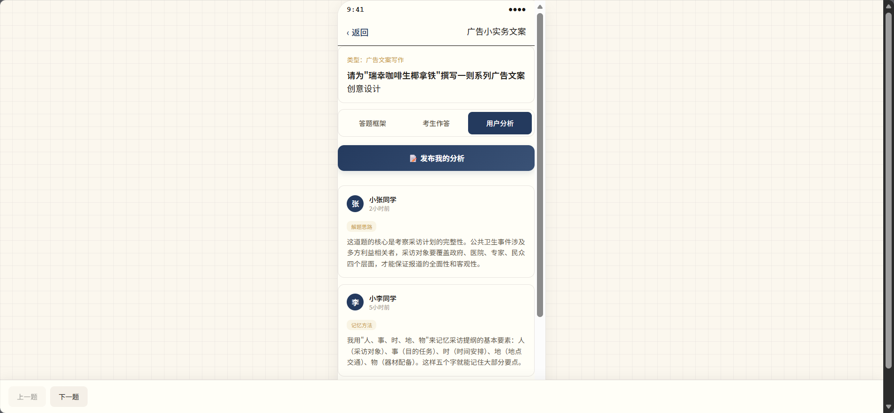

### 49. 历史训练

点首页右上「历史训练 ›」进入：新闻采访题、新闻评论题、新闻消息题各一张历史卡，均标注「第 1 题 · 刚刚」，右侧深蓝色「继续」按钮可断点续训。错题 / 进度续做在 V1.0/V2.0 中没有对应功能。

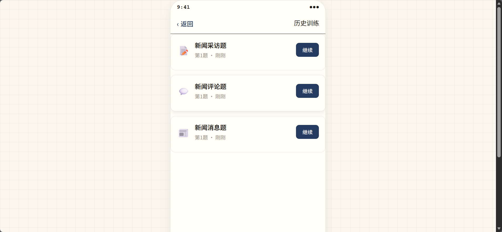

### 50. 理论题 tab（开发中）

切到「理论题」tab：名词解释（核心概念深度解析）、简答题（知识点框架梳理）、论述题（综合分析能力训练）三张灰色卡片，右侧均标「开发中」。这三个名称与背诵侧三大题型一一对应，预示理论题考试化训练的接入位置；当前版本只有实务题 tab 可用。

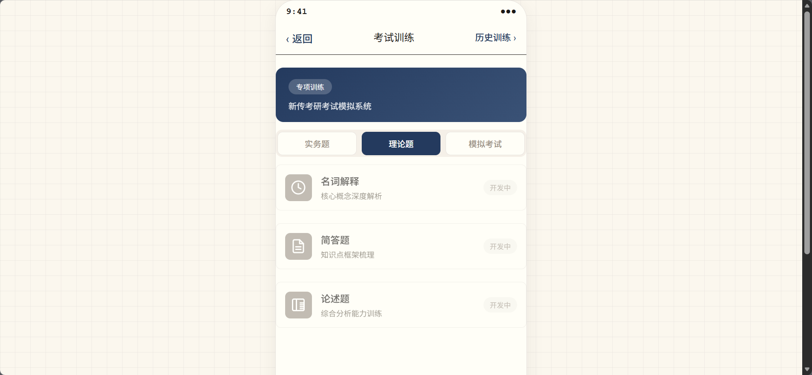

### 51. 模拟考试 tab（后续开发）

「模拟考试」tab 下只有一张「全真模拟」卡（完整考试流程模拟），标注「后续开发」。至此 V3.0 考试训练的边界清晰：实务专项已可用，理论专项与整卷全真模拟留待后续版本。

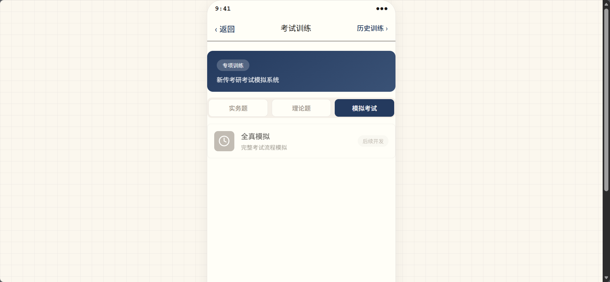

---

## 版本小结

V3.0 以「考试训练」独立成模块为核心：背诵侧延续 V1.0/V2.0 成熟的视频 → 框架 → 分层记忆 → 自测自评闭环并修复了 V2.0 的两处显示瑕疵，考试侧新建了「框架表 + 分段作答 + AI 思路 + 用户分析 + 答案汇总 + 历史续训」的考场化训练链路；登录注册体系、账号资料管理与深色模式等基础能力在本版本补齐，理论题与全真模拟为下一阶段预留了入口。
