# V4.0 架构标准化版（学生端 APP 实机截图）

V4.0 在 V3.0「背诵学习 + 考试训练」双主线的基础上完成**架构标准化**：代码层重构成 Monorepo（`apps/mobile` 学生端 + `apps/admin` 管理后台 + `packages/content` 题库数据包）；
产品层则把两条主线在导航上进一步固化——底部导航由首页 / 知识库 / 收藏三栏扩为**首页 / 知识库 / 收藏 / 考试 / 我的五栏**，「考试训练」不再是首页第五张卡片，而是常驻底部 tab；
个人中心从 V3.0 的弹窗堆叠改为**「我的」页 + 设置中心分区**（账号管理 / 学习偏好设置 / 自建资料收藏 / AI 模型自定义管理 / 系统通用设置 / 意见反馈·关于 App）；
V3.0 相册中标注「功能预留」的生成画质、文字详略，以及 API 模型管理，在 V4.0 已配齐可用（设置中心显示 GPT-4 已配置 + 自定义提示词模板，词条页可切换 DeepSeek / GPT / Claude / Gemini 并选画质与详略）。

> 截图说明：以下共 **57 张**，均为 2026-09-12 对 V4.0 学生端 APP 真实运行界面的手工截图，无重复文件，
> 已按用户实际操作路径（首页 → 个人中心与设置 → 收藏 → 名词解释「新闻价值 / 传播 / 受众」→ 简答题「霍尔编码解码模型」→
> 论述题「媒介素养」→ 实务题「消息写作」→ 考试训练采访题 / 评论题 / 模拟考试）排列，平铺于 `screenshots/`。
> 本版本无新的管理后台截图，后台沿用 V2.0 相册（V4.0 仅将其代码迁入 `apps/admin`，界面与功能未变）；
> 每张图的说明中直接注明与 V1.0 / V2.0 / V3.0 的异同，不再另设区别专节。

---

## 一、首页与个人中心（图 1–3）

### 1. 学习首页 · 四大核心入口 + 五栏导航

登录后默认页。当前用户为「林同学 · 已登录 · 连续背诵 42 天」——V1.0 首页用户是「阿宇」、V2.0 是「张扬」、V3.0 是「猪猪侠 · 5 天」，四版昵称各不相同；「继续学习」仍直达名词解释「新闻价值」，与前三版一致。**最大变化是 V3.0 新增的「考试训练」卡片从首页撤下**，核心入口回到 4 个（名词解释 328、简答题 142、论述题 96、实务题，数量沿用旧版）；同时底部导航由首页 / 知识库 / 收藏三栏扩为**首页 / 知识库 / 收藏 / 考试 / 我的五栏**——「考试训练」降为常驻底部 tab，与背诵模块彻底分开。

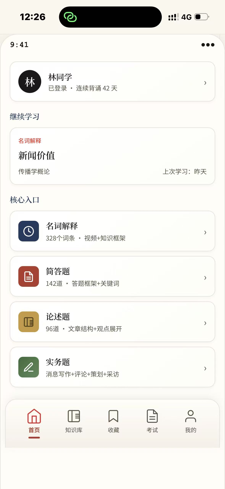

### 2. 个人中心 ·「我的」页

头像「林」+「林同学 · 2027 届新传考研 · 已坚持 42 天」，统计栏显示已背词条 386、我的收藏 57、我的笔记 12。下方是六个设置入口：账号管理 / 学习偏好设置 / 自建资料收藏 / AI 模型自定义管理 / 系统通用设置 / 意见反馈·关于 App。对比 V3.0：旧版个人中心是把头像、昵称、资料库、API 密钥、深色模式、字体等全部以弹窗形式堆在一页，V4.0 改为「我的 + 设置中心」两级结构，弹窗只保留头像、昵称等轻操作。

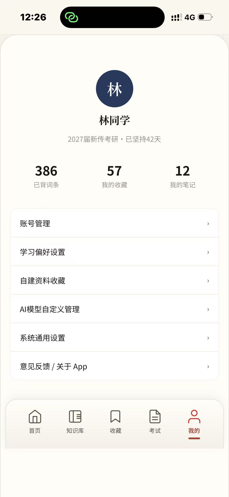

### 3. 设置头像弹窗

点头像弹出「设置头像」：上传自定义头像（从本地图库选择）+ 8 个纯色圆形头像，与 V3.0 相册第 2 张一致；V1.0 只有固定文字头像、无此弹窗，本版无变化。

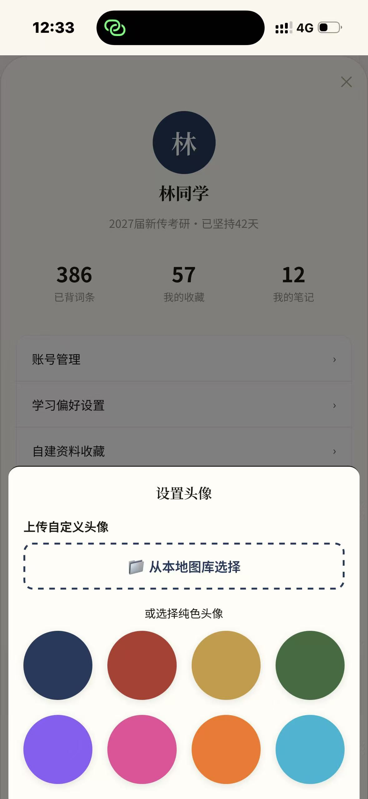

---

## 二、设置中心与收藏页（图 4–9）

### 4. 设置 · 账号管理

修改密码、绑定手机（138****8888）、绑定邮箱（未绑定）、退出登录四项。V3.0 相册首次拍到登录 / 注册页，V4.0 将账号资产管理收进设置中心独立分区，是登录体系落地后的延续。

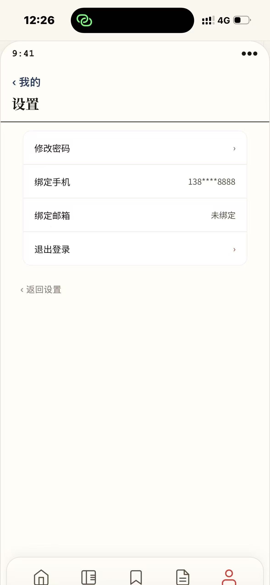

### 5. 设置 · 学习偏好设置

每日学习目标（20 个）、复习提醒（每天 19:00）、背诵速度（标准）、自动播放视频（关闭）四项。V3.0 的学习模式切换（背诵 / 考试二选一）在 V4.0 不再以模式开关呈现——两条主线已由底部导航固定，偏好设置只管节奏类参数。

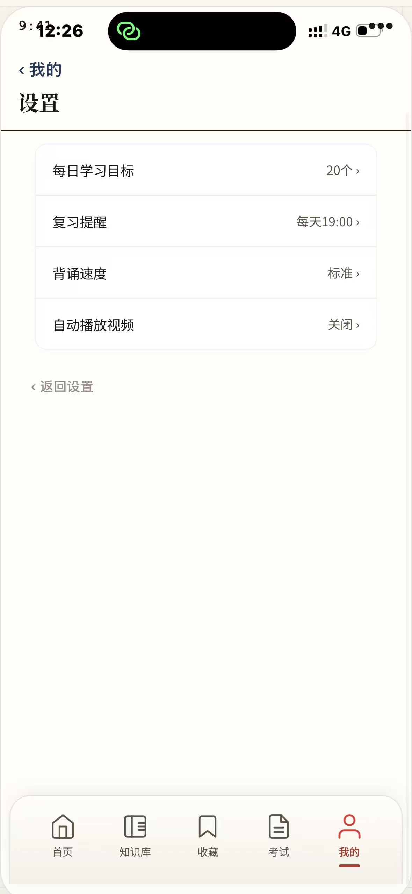

### 6. 收藏页 · 分值标签

底部「收藏」tab 独立页：顶部搜索收藏内容 +「全部 / 名词解释 / 简答题 / 论述题」类型筛选，列表按题型分组——名词 3 条（沉默的螺旋·高频、编码解码模型·高频、议程设置·重点）、简答 2 条（霍尔编码解码模型·20 分、知沟理论的内涵·15 分）、论述 2 条（媒介素养的内涵与演变·30 分、网络舆论的形成机制·25 分）。V1.0–V3.0 相册都没有拍过收藏页内容，V4.0 首次展示，且每条收藏带高频 / 重点 / 分值标签，直接服务应试。

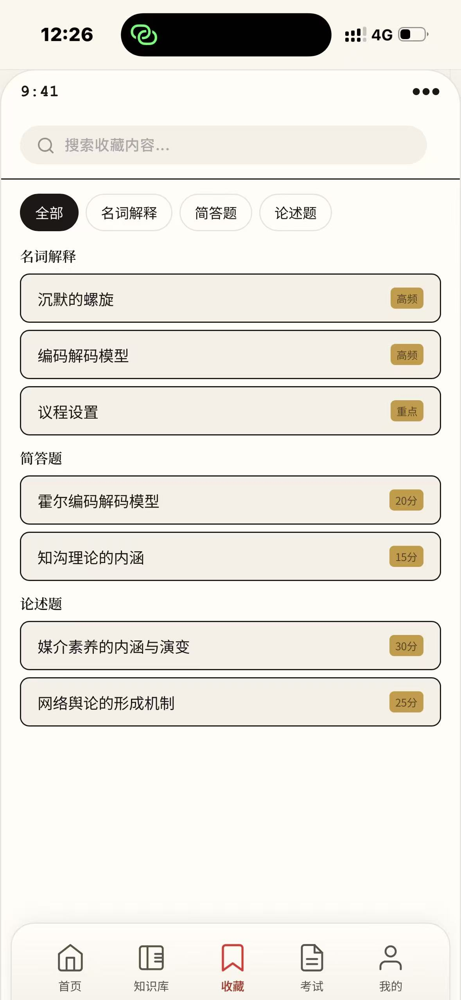

### 7. 设置 · AI 模型自定义管理

AI 模型（GPT-4 ›）、API Key（已配置 ›）、自定义提示词模板三项。V3.0 的 API 密钥管理弹窗（DeepSeek 获取指引）已升级为常设分区，且默认模型从 DeepSeek 换成 GPT-4、新增「自定义提示词模板」——AI 配置从「能用」走向「可自定义」。

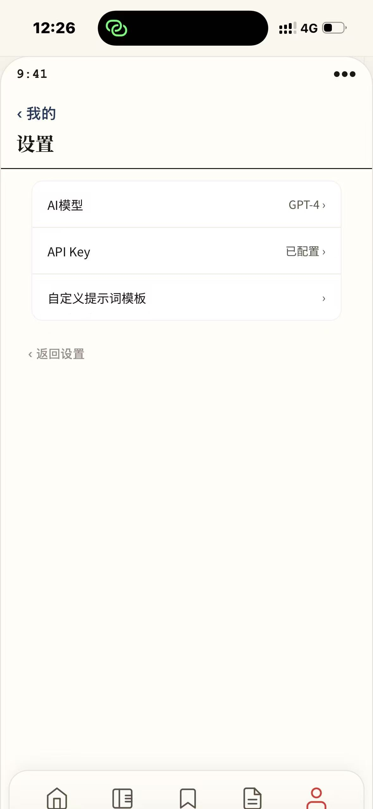

### 8. 设置 · 系统通用设置

字体大小（标准）、深色模式（跟随系统）、通知推送（开启）、缓存清理（23.5MB）、离线下载（Wi-Fi 下）、数据同步（自动）六项。V3.0 深色模式是真实生效的黑底界面，V4.0 收进系统分区并改为「跟随系统」档位；缓存 / 离线 / 同步三项是本版新增的管理能力。

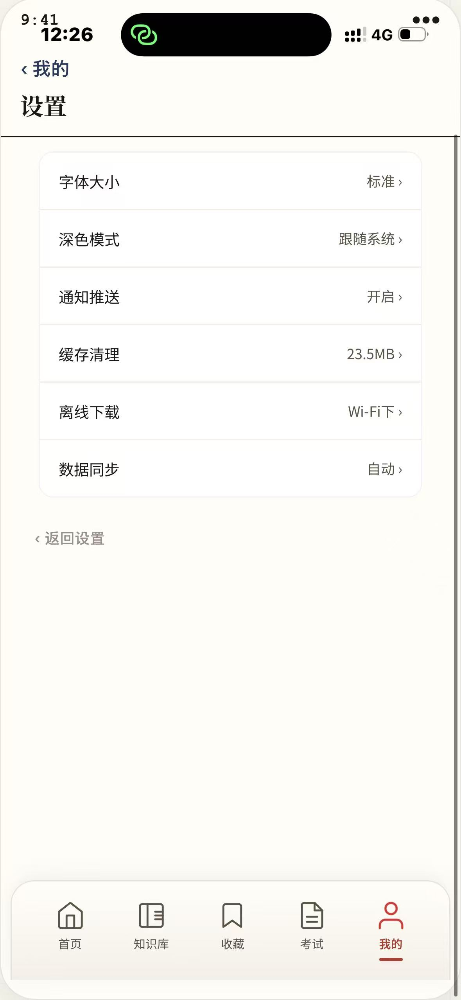

### 9. 设置 · 意见反馈 / 关于 App

意见反馈、给个好评、版本号 **v4.0.0**、关于新传研背四项。V3.0 的版本反馈是完整表单（类型 / 内容 / 联系方式），V4.0 简化为入口项；关于页版本号由 v3.0.0 更新为 v4.0.0，是相册中最直观的版本标识。

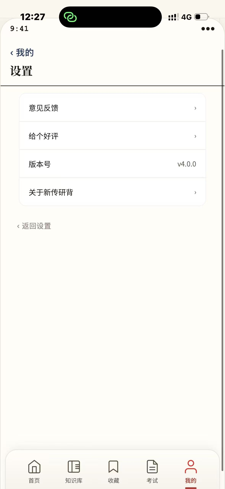

---

## 三、名词解释模块（图 10–21）

### 10. 词条详情 · 视频模式（新闻价值）

‹ 传播学基础 / 新闻价值（高频），四标签（视频 / 知识框架 / 分层串记 / 研友分享）、双路视频来源（官方教材视频 / @宝藏老师 用户上传）、上一个 / 下一个翻词条、「不会 / 模糊 / 认识」三级自评、左下「AI助记」+ 右下「更换AI设置」双悬浮按钮——整体布局与 V1.0–V3.0 一致。播放器字幕显示「视频资源待上传」（此词条视频尚未入库），与 V3.0 相同。

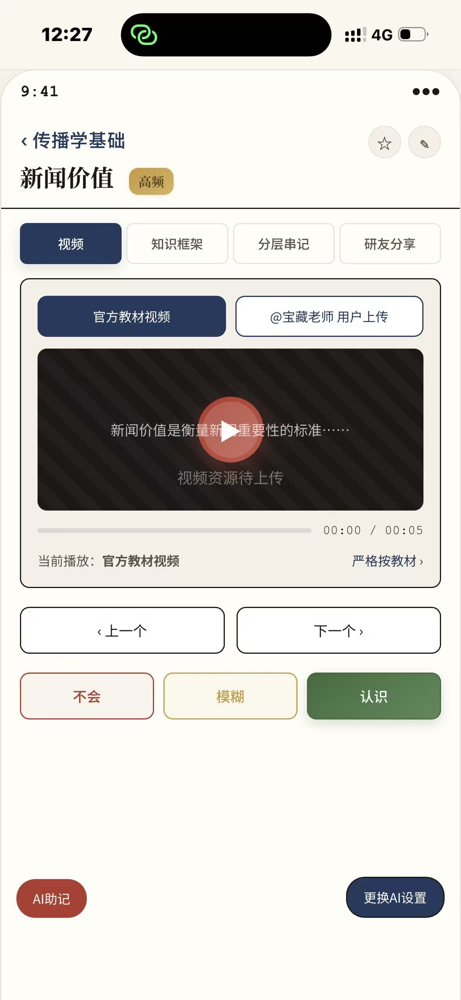

### 11. AI 助记弹窗 · 四个提问模板

点「AI助记」悬浮钮弹出：记忆方法推荐 / 现实案例 / 对比分析 / 考试重点四个模板卡，底部「生成AI记忆视频」与自由输入框。V1.0/V2.0 相册只有社区帖子列表，V3.0 也未拍到该弹窗，V4.0 补全了 AI 助记的完整入口形态。

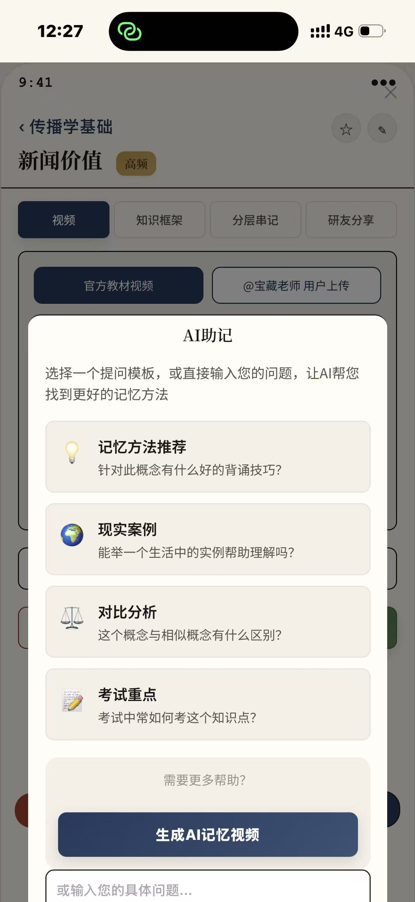

### 12. AI 助记 · 输入自定义问题

向下滚动：输入框中已填「能举一个现实生活中的实例来帮助理解"沉默的螺旋"吗?」，黑色「发送给AI」按钮待命。模板之外支持自由提问，是 V4.0 AI 能力配齐后的实际用法。

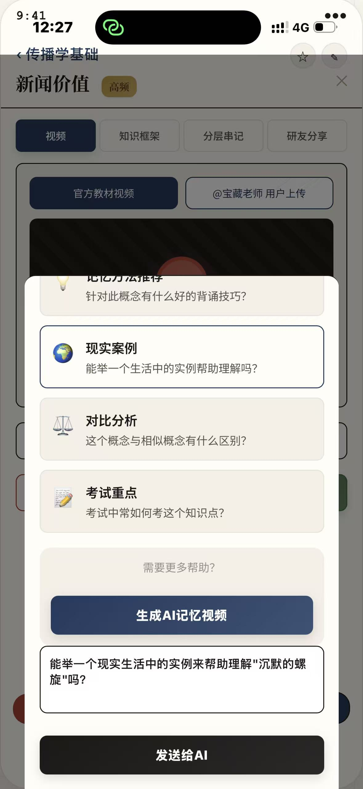

### 13. AI 助记 · 回答弹窗

AI 以「现实案例」作答：用网络舆论中的沉默螺旋效应、诺依曼「孤立恐惧」理论与公司会议「一边倒」三个例子解释概念。回答以居中弹窗呈现 + 确定关闭，说明 AI 问答链路在本版本真实可用（V3.0 相册无此环节）。

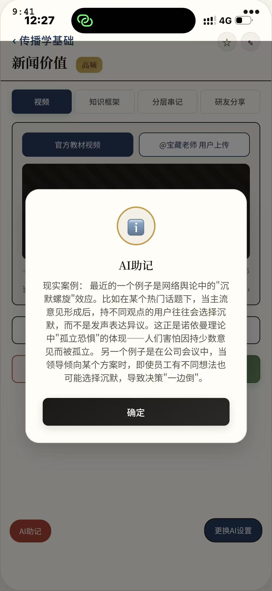

### 14. 更换 AI 设置弹窗 · 四模型 + 画质详略

点「更换AI设置」弹出：**DeepSeek（当前勾选）/ GPT / Claude / Gemini 四个模型**、API 密钥（仅保存在本地）、生成画质（标准）、文字详细程度（简洁）、保存设置。V3.0 相册第 8、11、12 张中「生成画质」「文字详细程度」均为「功能预留」，V4.0 该弹窗内两项已是可用下拉——功能预留正式落地。

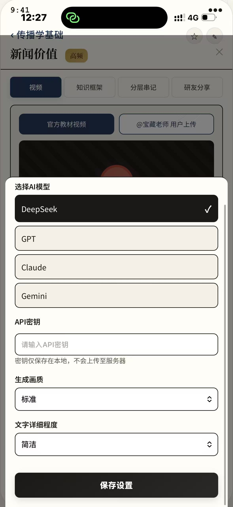

### 15. 词条「传播」· 视频真实播放中

翻到下一个词条「传播」（基础）：字幕显示「传播是人类社会信息传递的基本行为……」，进度条走到 **00:02 / 00:05**。V3.0 相册词条视频全部是「待上传」占位，V4.0 首次拍到视频真实播放的画面，占位进度条变成了实际进度。

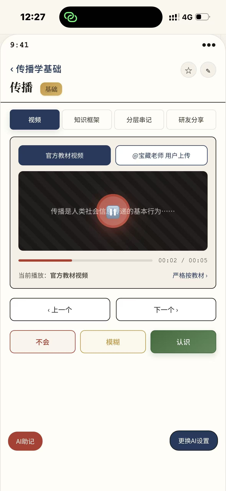

### 16. 视频来源弹窗 · 用户上传源

切到「@宝藏老师 用户上传」源并点「严格按教材 ›」弹出「视频来源」：@宝藏老师 / @传播学小王子 / @新传考研君 三个用户上传源可选，「当前播放：用户上传视频」。双路来源机制 V1.0–V3.0 一直存在，本张是相册中首次拍到来源切换弹窗的完整形态。

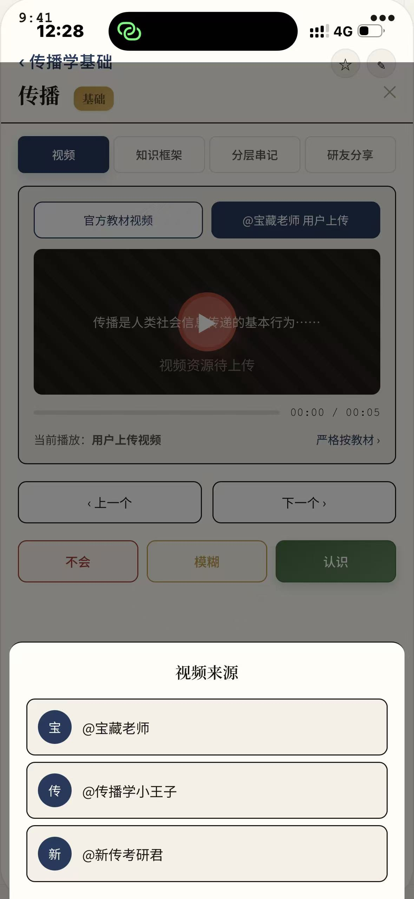

### 17. 知识框架（上半）

「传播」词条的知识框架：①定义块（概念名称 / 提出信息 / 所属学科场景 / 生成诱因 / 核心表现）②范畴块（理论来源·诞生背景 / 适用范围）③特征块（内在属性规律 / 相似概念区分）。结构化模块与 V1.0–V3.0 一脉相承，卡片左侧金色竖线的样式也延续下来。

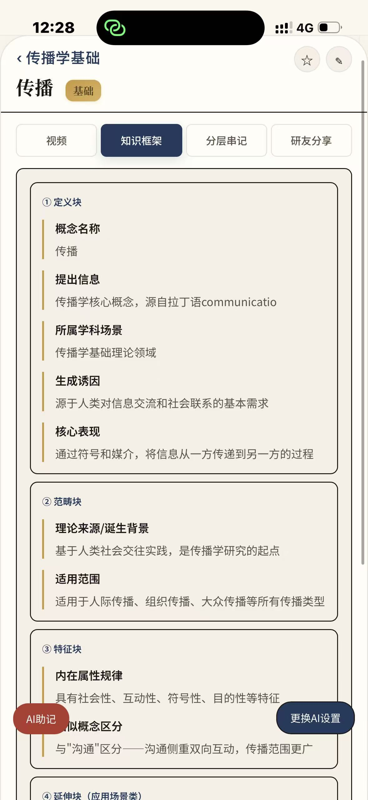

### 18. 知识框架（下半）

继续下滑露出 ④延伸块（应用场景类：传播是社会运行的基本机制）⑤评价块（研究参考价值 / 行业·平台化解对策）。上下两张共同展示五模块完整结构，比 V3.0 单张框架截图覆盖更全。

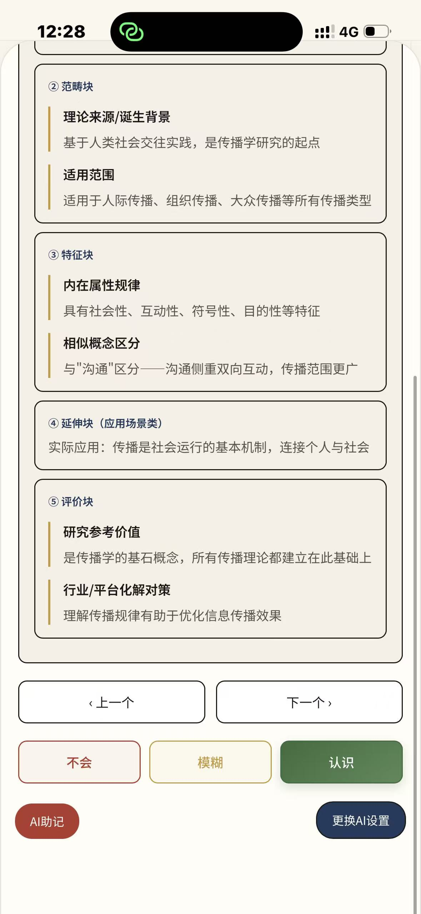

### 19. 分层串记 · 思维导图展开（上半）

V4.0 的分层串记从 V1.0–V3.0 的「1 级定义 → 2 级关键词 → 3 级应用」层级列表改为**思维导图**：顶部「点击展开/收起思维导图」根节点，展开后定义块 / 范畴块 / 特征块分支逐一铺开。注意根节点气泡显示的是上一个词条「沉默的螺旋」，与当前词条「传播」不一致，属于数据联动的显示瑕疵，如实记录。

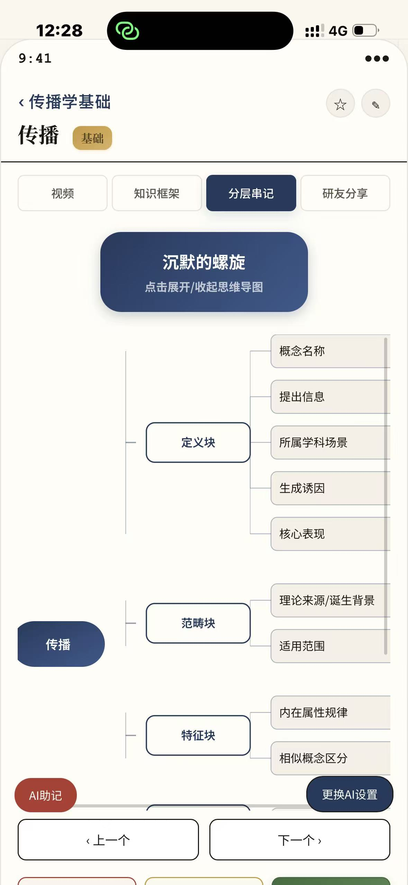

### 20. 分层串记 · 思维导图展开（下半）

导图下半：范畴块 / 特征块 / 延伸块（应用场景类）/ 评价块四组分支完整展开，与上方知识框架的五模块一一对应——「框架正文」与「导图速记」在 V4.0 形成了同构互查关系，这是旧版层级列表没有的组织方式。

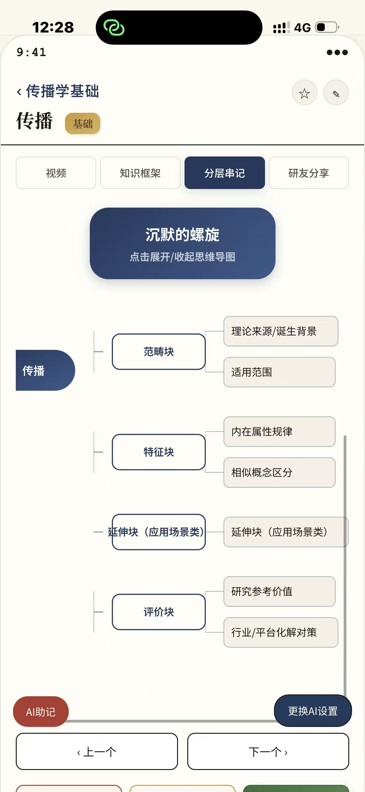

### 21. 研友分享（传播词条）

「基础概念」记忆口诀帖（传播 = 谁 → 通过什么渠道 → 对谁说 → 说了什么 → 产生什么效果，31 赞 4 评）与「要素记忆」拉斯韦尔五 W 帖（26 赞 3 评），底部虚线框「分享你的背诵技巧」。社区帖子形态与 V3.0 的 AI 助记社区一致，V4.0 将该 tab 定名「研友分享」并保持每词条独立信息流。

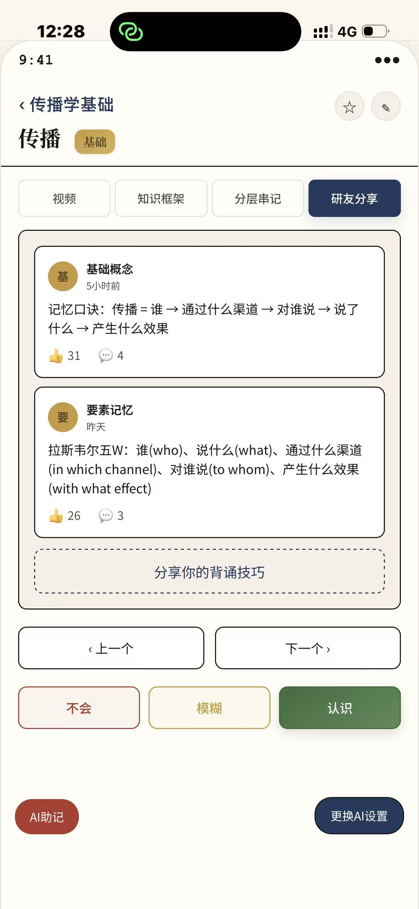

---

## 四、词条互动：发布、笔记与收藏（图 22–24）

### 22. 分享背诵技巧 · 发布弹窗

点虚线框后弹出的发布弹窗：文本框占位「写下你的记忆口诀、背诵思路或使用建议...」+ 黑色「发布」按钮。V3.0 相册第 22 张已拍到同款弹窗，V4.0 沿用，交互无变化。

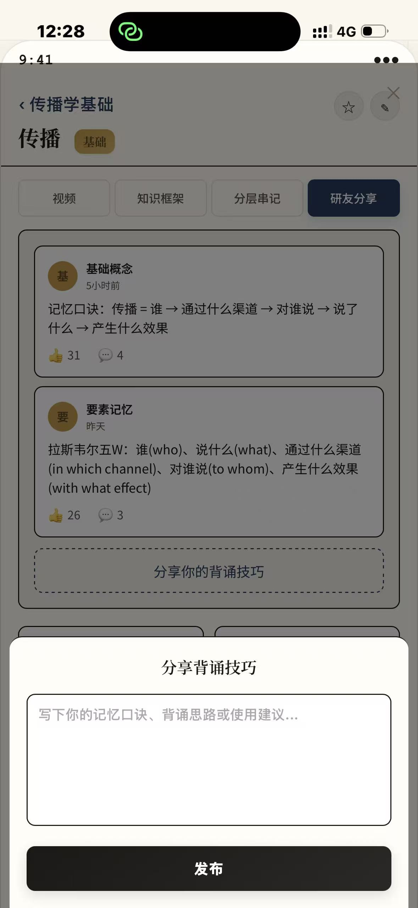

### 23. 记笔记弹窗（受众词条）

「受众」词条研友分享页（受众研究帖 22 赞、选择性理论「三个选择性」帖 17 赞）之上叠加「记笔记」弹窗：记录您的学习笔记 + 保存笔记。自建笔记是个人中心的统计项之一（我的笔记 12），该弹窗在 V1.0–V3.0 相册中均未出现，V4.0 补全了笔记动作的入口形态。

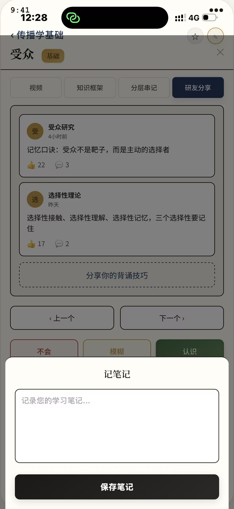

### 24. 收藏成功反馈

点右上星标后的确认弹窗：「✓ 收藏 · 已收藏该内容」，星标同步点亮（金色）。前三版相册都只拍到星标按钮本身，V4.0 把收藏成功的即时反馈也留了档，收藏总数（57 条）即由该动作累积。

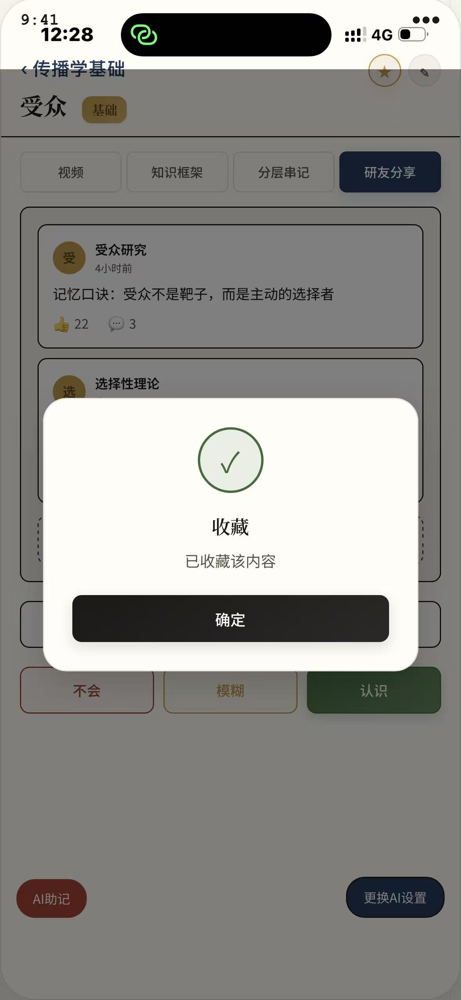

---

## 五、简答题模块（图 25–31）

### 25. 简答详情 · 答题框架（霍尔编码解码模型）

‹ 传播学原理 / 霍尔编码解码模型（**20分·800字** 分值标注），四标签（答题框架 / 真题设问变式 / 答案内容 / 辅助记忆）与 V3.0 一致。框架完整渲染「总（编码解码定义 + 受众观前提）→ 分点一 偏好式解读 → 分点二 妥协式解读 → 分点三 对抗式解读 → 总结（文化领导权之争）」五段；标题右侧新增分值·字数徽标是 V4.0 的应试化细节。

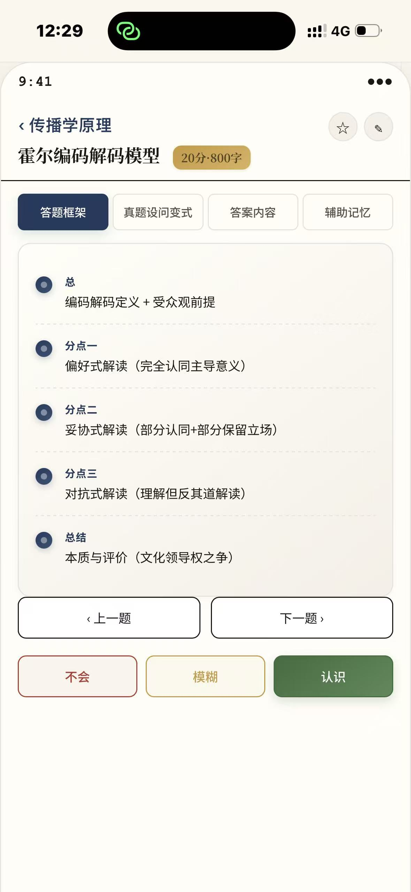

### 26. 真题设问变式

由母题「简述霍尔的编码解码理论」派生 4 种变式（三种解读立场 / 受众研究的意义 / 三种解码方式的现实表现 / 文化领导权），与 V1.0、V3.0 相同（V2.0 未拍此页），内容无变化。

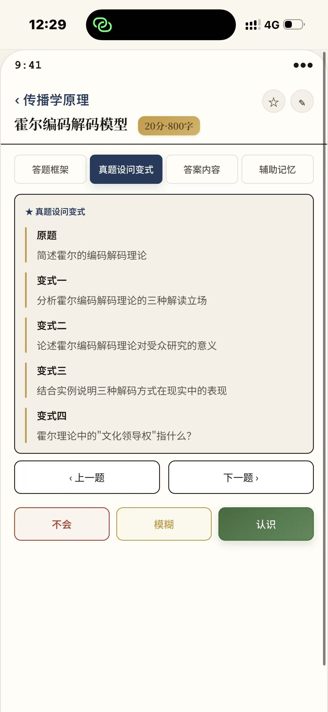

### 27. 答案内容

五部分长文答案正常排版，「一、编码解码定义 + 受众观前提」「二、偏好式解读」等加粗标题渲染正常。V2.0 相册记录过 `<b>` 标签明文显示的缺陷、V3.0 修复，V4.0 保持正常，并延续「上一题 / 下一题 + 不会 / 模糊 / 认识」的翻题与自评结构。

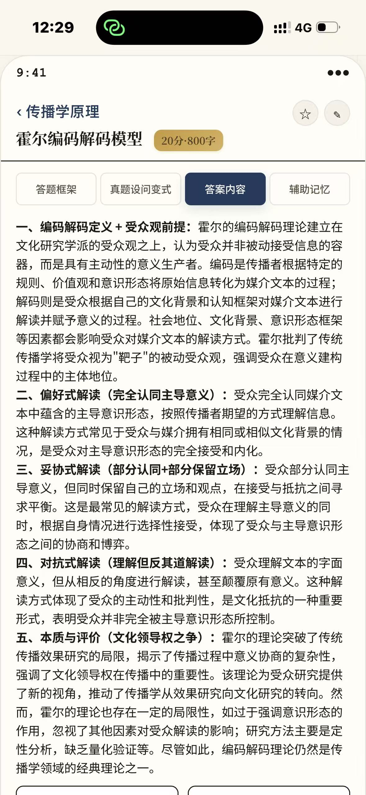

### 28. 辅助记忆 · 口诀与完整答案

辅助记忆 tab 顶部：「辅助记忆口诀」（联想记法：编码解码像"发送信和读短信息"，三种解读像"完全信、打个折信、反着信"）+ 完整答案内容回显。口诀区在 V1.0/V3.0 相册中未单独出现，是辅助记忆页的新组织方式。

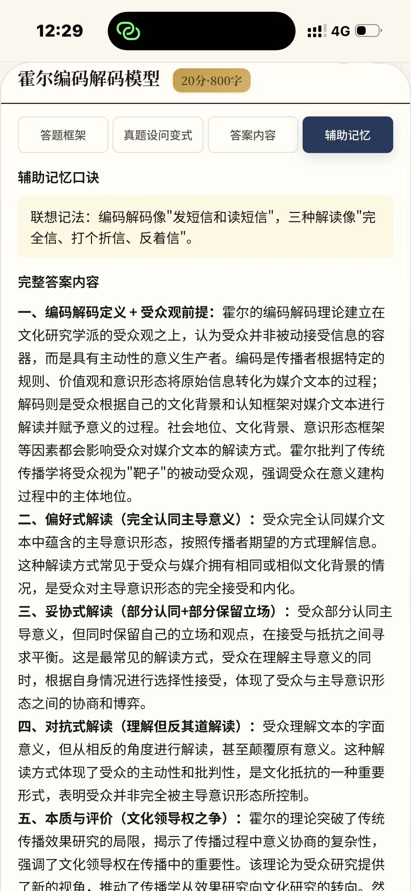

### 29. 辅助记忆 · 拖拽还原自测

五种自测模式 tab（拖拽还原 / 填空记忆 / 框架默写 / 红膜背书 / 闪卡模式），拖拽还原进行中：妥协式 / 偏好式 / 对抗式三张卡片待按「认同程度从高到低」重排，下方「完成自测」与朗读播放条（朗读中…）。这套交互自 V2.0 做全五模式后一直沿用，V4.0 无变化。

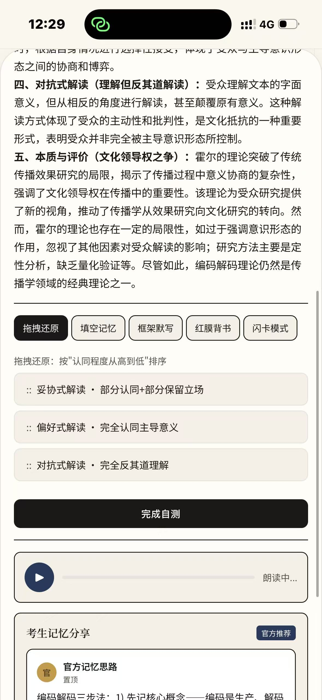

### 30. 朗读播放与考生记忆分享

考生记忆分享区：官方记忆思路（编码解码三步法，置顶，128 赞 12 评）、考研小李谐音记法「偏爱对抗」（45 赞 3 评）、背诵达人「三个人看同一篇新闻」（76 赞 8 评），底部「发布我的记忆方法」入口。三条帖子与 V3.0 相册完全同源，UGC 数据沿用。

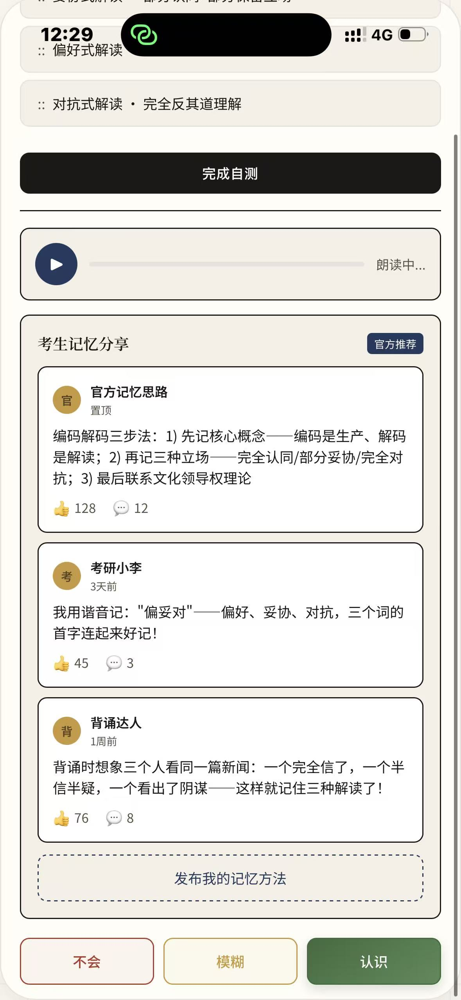

### 31. 自测完成弹窗 · 掌握度联动

点「完成自测」后弹出 🎉「自测完成」：请标记您的掌握程度（不会 / 模糊 / 认识），**数据将联动到学习进度**。V1.0–V3.0 相册都没拍到自测收尾的这一步，V4.0 补全了「作答 → 提交 → 掌握度 → 学习进度」闭环的最后一环，个人中心的「已背词条 386」正是由该联动累积。

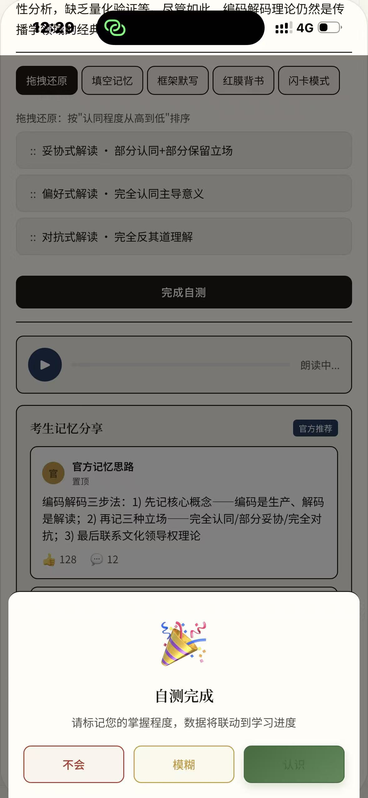

---

## 六、论述题模块（图 32–40）

### 32. 论述详情 · 答题框架（媒介素养）

‹ 新媒体概论 / 媒介素养的内涵与演变（**30分·1200字**），框架按「数字时代媒介素养」组织：开头·引言式（背景引入：数字素养上升为国家战略）→ 正文分论点三个（媒介素养的定义与内涵 / 研究三阶段 / 新媒体时代三维度，每点带「范文」标签）→ 结尾·展望式。分论点卡比 V2.0/V3.0 的同题框架多了「范文」入口。

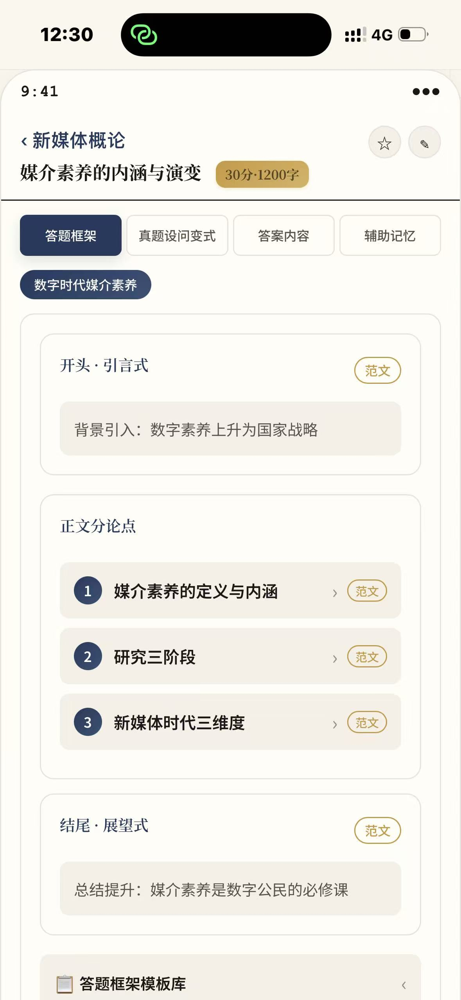

### 33. 答题框架模板库

页面底部「答题框架模板库」展开 8 套框架：递进框架、并列框架、5W 传播要素、PETCSI 社会六维、多主体框架、BMR 动因框架、治理三维框架、理论辨析框架 + 金色「保存自定义模板」+「完整范文」入口。与 V3.0 相册第 28 张的模板库一致，8 套模板沿用。

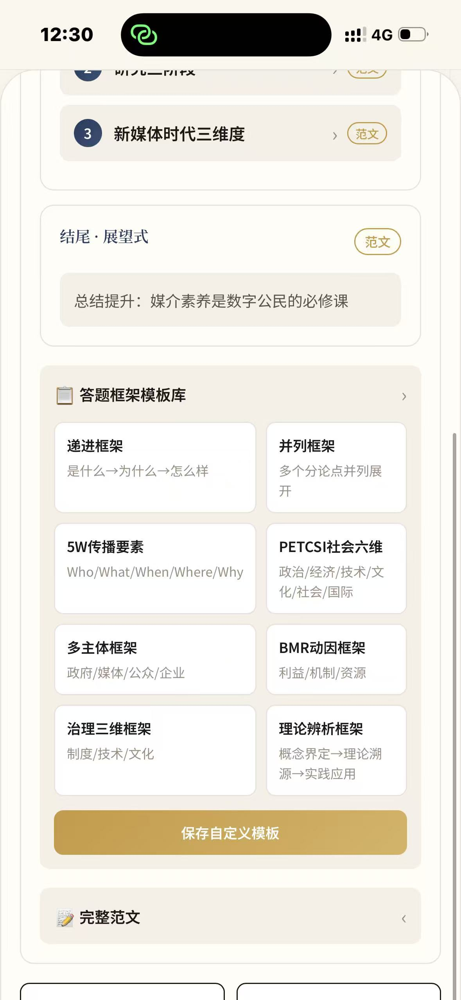

### 34. 完整范文（整页）

点「完整范文」展开整页范文：从《国家信息化发展战略纲要》《全民数字素养与技能提升行动纲要》的宏观背景，到利维斯 1930 年代提出概念、1992 年美国媒体素养研究中心定义，再到三阶段演变与新媒体三维度。V3.0 相册只有「完整范文」入口没有内容截图，V4.0 首次展示全文形态——论述题从「背框架」升级为「框架 + 成文」双料。

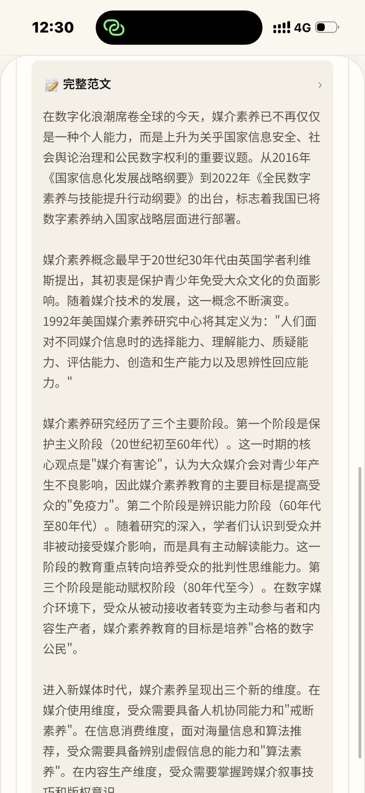

### 35. 应用递进框架 · 成功反馈

点递进框架后弹出「✓ 模板应用成功：已应用递进框架，可在此基础上进行修改」。V3.0 是顶部 toast 轻提示，V4.0 改为确认式弹窗，反馈更重。

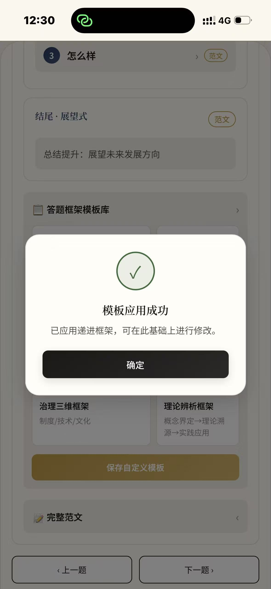

### 36. 应用并列框架 · 成功反馈

再切换并列框架，弹窗提示「已应用并列框架」，背景框架正文已变为「维度三」等并列结构。证明模板可反复替换、即时生效，与 V3.0 行为一致、反馈形式升级。

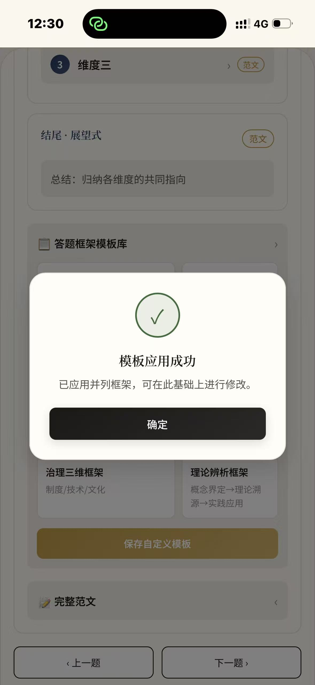

### 37. 应用 5W 框架后的实际效果

应用 5W 传播要素框架后：正文分论点被重构为 **Who（谁）/ What（什么）/ When·Where（何时何地）/ Why（为什么）** 四点，每点仍带「范文」。V3.0 只拍了应用后的并列框架，V4.0 这张展示了第三套模板套用后的真实重构效果。

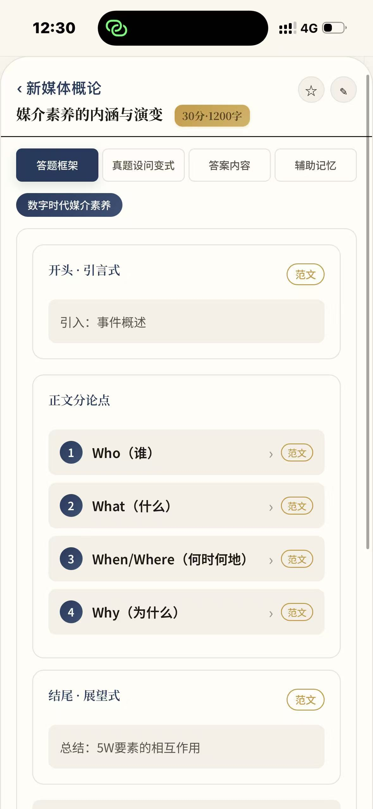

### 38. 真题设问变式

原题「论述媒介素养的内涵与演变」+ 变式一~四（新媒体时代内涵理解 / 三阶段案例分析 / 智媒时代素养要求 / 教育必要性与路径）。结构同简答题的变式 tab，与 V1.0/V3.0 一致。

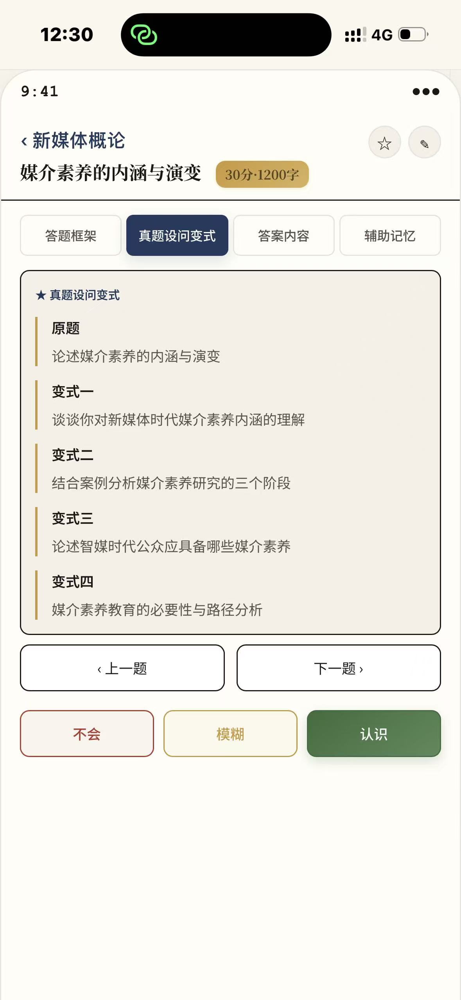

### 39. 答案内容

完整答案四部分：定义与内涵（利维斯 / 1992 定义 / 「四能力」模型）、研究三阶段演变、新媒体时代三维度（媒介使用 / 信息消费 / 内容生产）、教育的必要性与路径。长文排版与加粗渲染正常，延续 V3.0 修复后的状态。

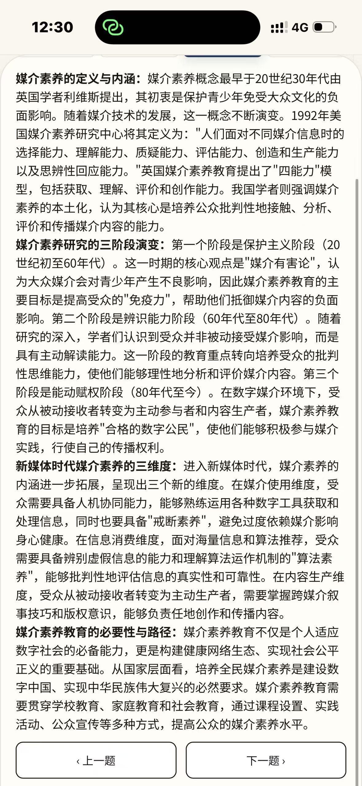

### 40. 辅助记忆 · 双组拖拽

辅助记忆 tab：顶部口诀「三阶段像"保护自己→识别真假→主动参与"，三个阶段层层递进」；拖拽还原设**两组**——「研究三阶段按时间先后排序」与「三维度按环节排序」，一次自测覆盖两条时间线 / 逻辑线，最后「完成自测」+ 朗读条。双组拖拽是 V4.0 论述题辅助记忆比简答题更复杂的地方。

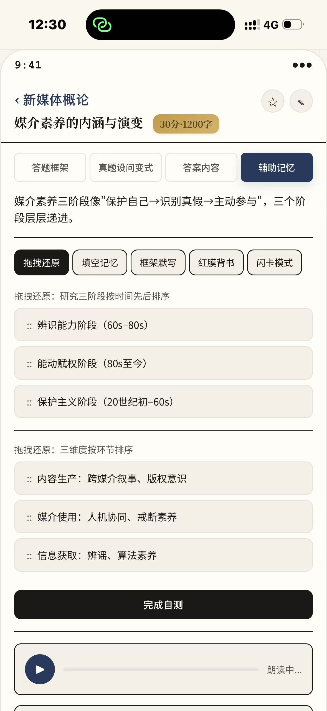

---

## 七、实务题训练（背诵侧，图 41–43）

### 41. 消息写作 · 写作框架

‹ 消息写作 / 某地突发暴雨灾害（30分·800字）：材料题干（暴雨内涝、交通瘫痪、停水停电、启动应急预案）+「消息写作」框架五卡——标题（概括核心事件，突出时效性和重要性）/ 导语（五要素齐全：何时何地何事何人如何）/ 主体（倒金字塔，先重后轻）/ 背景（补充相关信息）/ 结尾（总结救援进展），每卡带「范例」。三段式「写作框架 → 答案内容 → 社群笔记」与 V2.0/V3.0 相同；注意它与考试训练里的「新闻消息题」仍是两个独立入口。

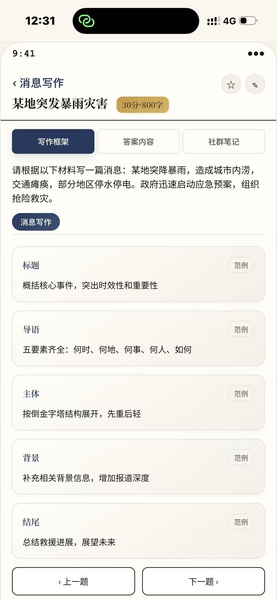

### 42. 消息写作 · 可编辑范文

答案区为可编辑文本框（标题 + 正文两段，XX 作占位符）+ 金色「保存修改」按钮，交互与 V2.0/V3.0 一致；底部同样保留「上一题 / 下一题 + 不会 / 模糊 / 认识」。

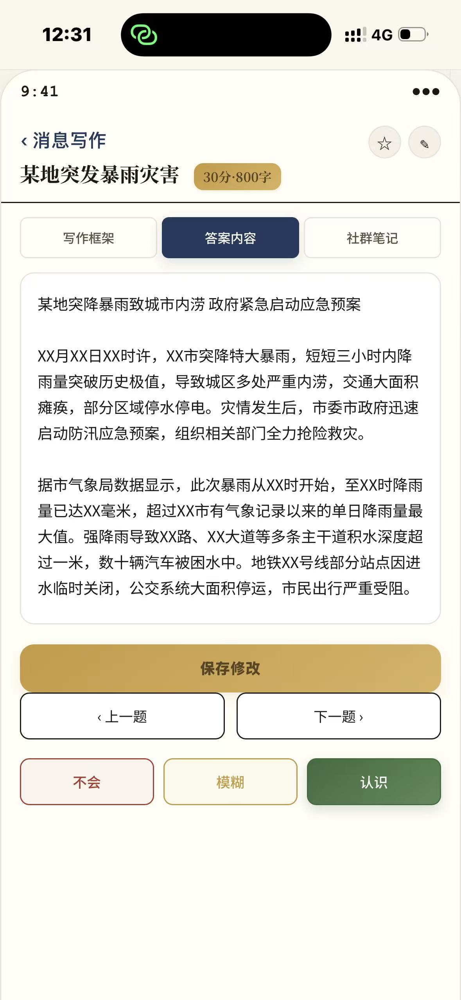

### 43. 消息写作 · 社群笔记

三条实务经验帖（实务达人：导语五要素齐全；考研小李：倒金字塔是经典结构；写作高手：背景要简洁不喧宾夺主）+「分享您的实务背诵心得...」输入框 +「发布笔记」按钮。三条帖子与 V2.0/V3.0 同源，UGC 沿用。

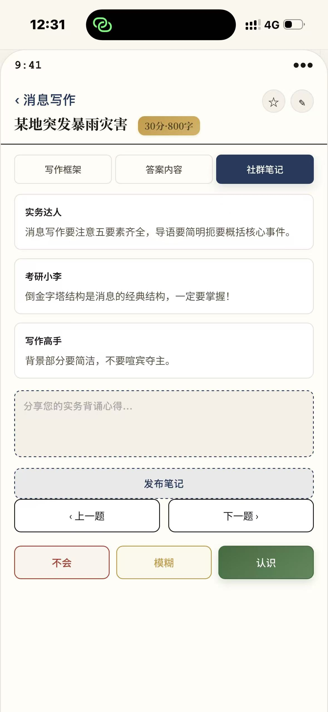

---

## 八、考试训练模块（图 44–57）

### 44. 考试训练首页 · 专项训练（上半）

底部「考试」tab 直达。顶部深蓝大图「专项训练 · 新传考研考试模拟系统」，下方实务题 / 理论题 / 模拟考试三个 tab。与 V3.0 的区别：V3.0 从首页卡片进入、顶部有「‹ 返回 / 历史训练 ›」，V4.0 由底部导航直达、顶部不再有历史训练入口。

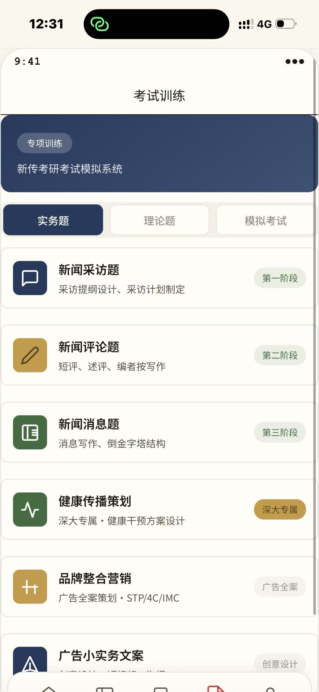

### 45. 考试训练首页 · 六张题卡全览（下半）

实务题 tab 完整六卡：新闻采访题（第一阶段）、新闻评论题（第二阶段）、新闻消息题（第三阶段）、健康传播策划（**深大专属**金色标）、品牌整合营销（广告全案 · STP/4C/IMC）、广告小实务文案（创意设计）；底部新增「训练提示」三条（先学框架 → 独立作答 → 对照完整答案）。对比 V3.0 相册只拍到前四张卡，V4.0 六卡齐整，「品牌整合营销」卡是新露出的题型入口。

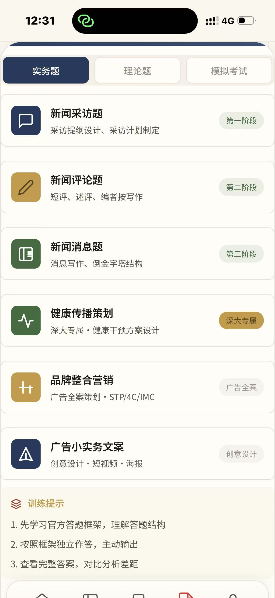

### 46. 新闻采访题 · 答题框架（第 1/3 题）

题为「请为"某地突发公共卫生事件"设计一份完整的采访提纲」（采访提纲设计），三 tab：答题框架 / 考生作答 / 用户分析。框架为表格体「一、新闻采访的方式 · 按形式划分（10 种）」，按采访形式 / 核心内涵 / 适用场景三列列出个别访问、开座谈会、现场观察等。表格化框架与 V3.0 一致，V4.0 内容量大幅扩充（见图 47、48）。

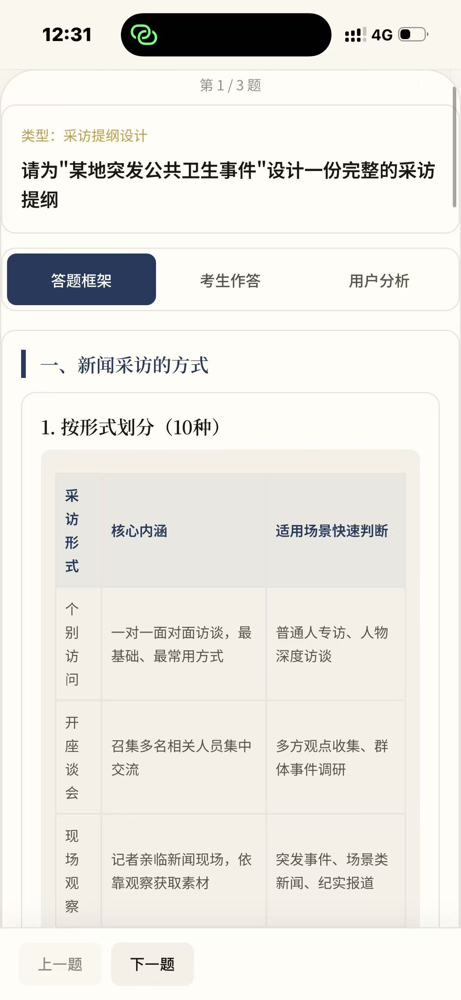

### 47. 新闻采访题 · 答题框架（按性质划分 7 种）

继续下滑：10 种形式表之后新增**「2. 按性质划分（7 种）」**——常驻 / 突击 / 交叉 / 巡回 / 隐性（暗访）/ 体验式 / 异地采访，同样三列表格；再往下进入「二、采访周全准备（采访计划考题核心板块）」。这一整段在 V3.0 相册中没有出现，是 V4.0 框架内容扩容的部分。

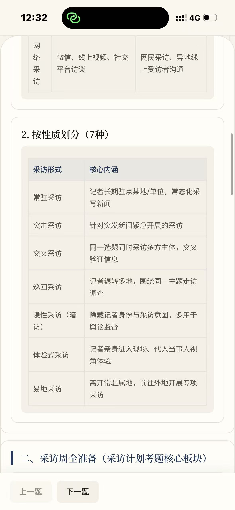

### 48. 新闻采访题 · 完整采访计划模板

框架第三章：延伸感悟板块（问题 1–3）+ **模板三：完整采访计划模板（大题专用）**——采访目的/任务、采访人员（2–3 名全媒体记者分工）、前期采访准备（资料 + 工具）、具体采访安排（对象 / 时间地点 / 方式 / 提纲）、采访预案（拒访、信息不实、突发状况应对）。V3.0 的框架只到采访方式表为止，V4.0 把「一份完整采访计划长什么样」直接给了模板，大题训练的落地性明显增强。

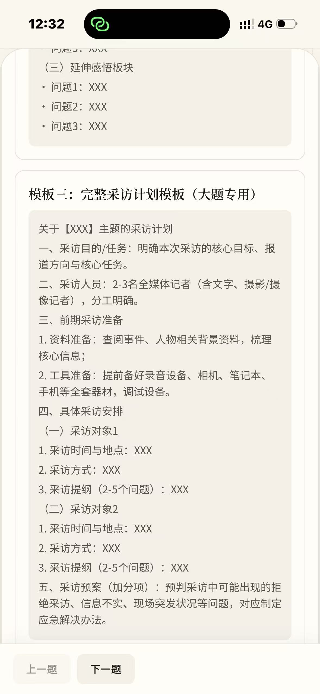

### 49. 新闻采访题 · 考生作答

「考生作答」tab 把答案拆成「一、采访任务/目的」「二、人员安排」等分段填空卡，每段带灯泡「AI 思路」提示；底部「查看我的答案汇总」「查看完整答案」双金色按钮。分段作答 + AI 思路的考练形式自 V3.0 建立，V4.0 沿用。

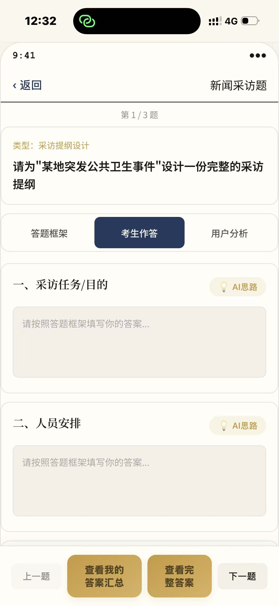

### 50. 我的答案汇总 · 空状态

点「查看我的答案汇总」弹出空态：「还没有填写答案，在"考生作答"TAB中填写答案后可查看汇总」+ 关闭。与 V3.0 相册第 42 张同款空态，未作答时给引导而非报错。

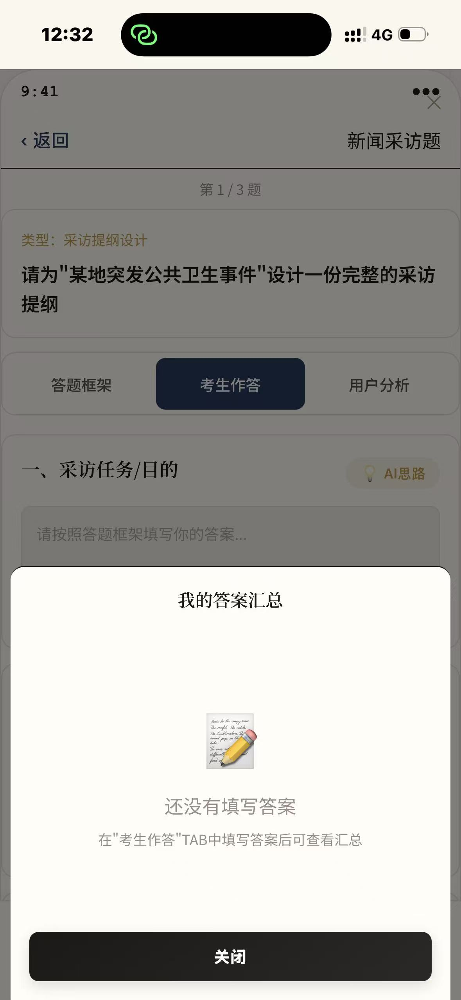

### 51. 完整参考答案弹窗

点「查看完整答案」弹出整屏参考答案：一、采访任务/目的（核心任务 / 延伸任务 / 报道方向）、二、人员安排（文字 2 / 摄影 1 / 摄像 1 / 新媒体编辑 1）、三、采访时间（下方露出）。与 V3.0 评论题的答案弹窗形态一致——考试侧答案以弹窗供对照，区别于背诵侧的整页长文。

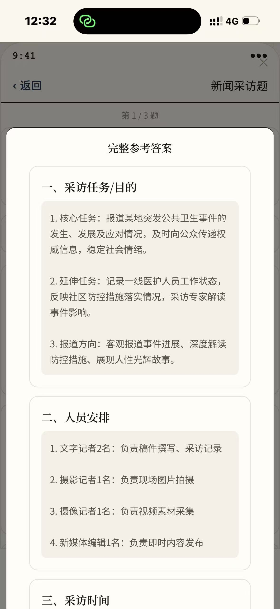

### 52. 新闻采访题 · 用户分析

「用户分析」tab：深蓝「发布我的分析」按钮置顶，信息流中小张同学（解题思路：采访对象覆盖政府 / 医院 / 专家 / 民众四层面）、小李同学（记忆方法：「人、事、时、地、物」五字记提纲要素）、小王同学（下方露出）。考试模块专属的 UGC 分析体系与 V3.0 相同，演示数据沿用。

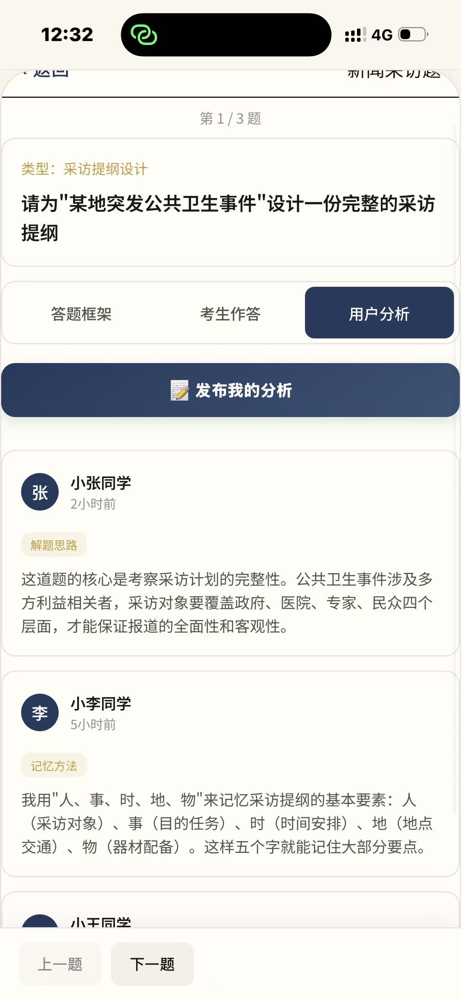

### 53. 新闻评论题 · 答题框架（第 1/3 题）

第二阶段题型：材料为某网红奶茶品牌使用过期原料、篡改保质期，要求写 300 字短评。框架表「一、新闻评论的根本三大特征（必考简答）」——论题新闻性（前提）/ 论理思想性（核心）/ 论说公众性，每行附标准答题话术。与 V3.0 相册第 39 张同源，表格速记速查的定位不变。

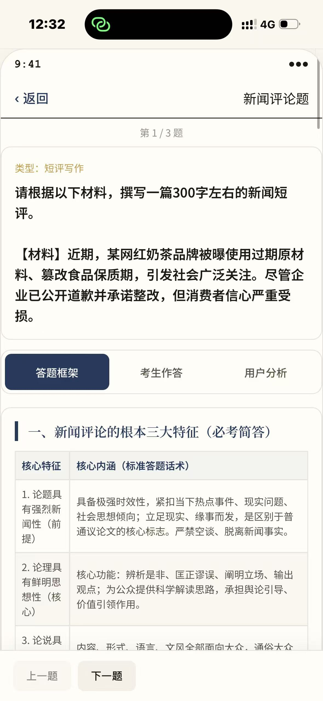

### 54. 新闻评论题 · 考生作答（标题与引论）

「考生作答」tab：一、标题（AI 思路提示「偏负面话题可用"别"字开头、"莫"字开头、"不"字开头」）、二、引论·开头（新闻由头 + 一句话亮总论点，开门见山）。考生自己动笔填空，而不是背诵侧的直接给范文，形态与 V3.0 第 40 张一致。

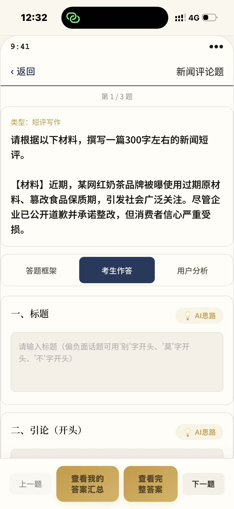

### 55. 新闻评论题 · AI 思路展开态

点标题段的「AI 思路」灯泡后，段落下方展开「思考方向」：1. 偏负面话题："别"字开头、"莫"字开头、"不"字开头；2. 观点要鲜明，直接亮出态度；3. 标题句式固定，让/把/别/莫。**AI 思路的展开内容在 V3.0 相册中从未展示**，V4.0 这张补上了提示的具体粒度。

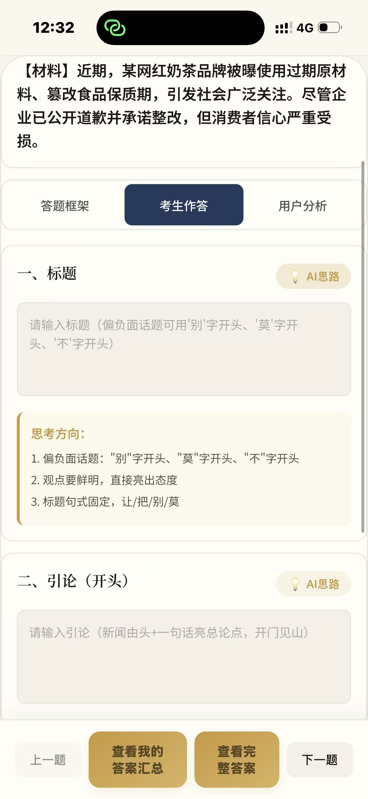

### 56. 发布我的分析弹窗（评论题）

「用户分析」tab 点「发布我的分析」弹出表单：选择分析类型——解题思路（选中）/ 记忆方法 / 案例分析 / 答题技巧四个胶囊 +「我的分析内容」文本框 + 黑色「发布分析」按钮。与 V3.0 相册第 45 张同款，四类标签与信息流标签一一对应。

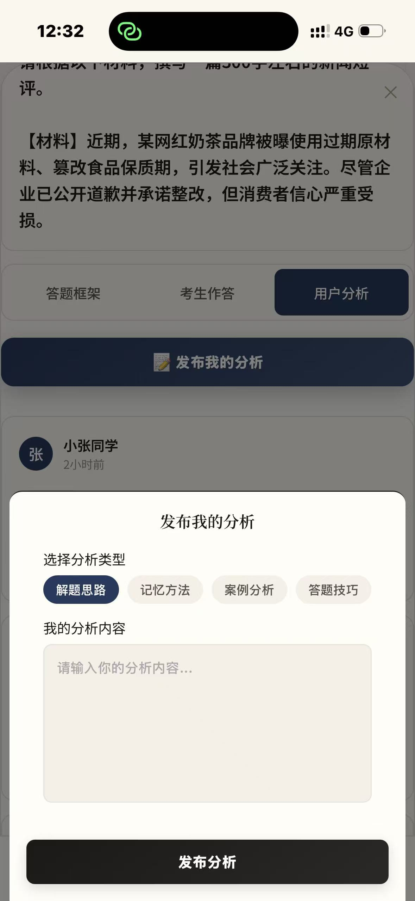

### 57. 模拟考试 tab（后续开发）

「模拟考试」tab 下只有一张灰色「全真模拟 · 完整考试流程模拟」卡，标注「后续开发」，底部同样保留训练提示。与 V3.0 第 51 张状态一致——实务专项可用、理论专项与整卷模拟仍为下一阶段预留。

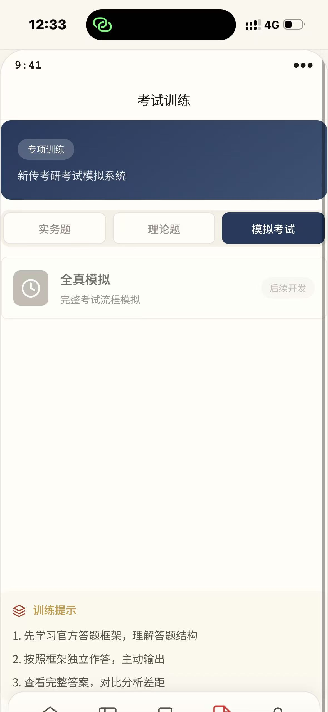

---

## 版本小结

V4.0 以「架构标准化」为主题：代码层完成 Monorepo 拆分（apps/mobile + apps/admin + packages/content），产品层用五栏底部导航把背诵与考试两条主线彻底固定——考试训练从首页卡片降为常驻 tab，个人中心升级为「我的 + 设置中心」分区结构；V3.0 的「功能预留」项（生成画质 / 文字详略 / AI 模型管理）全部落地并支持 GPT-4 与自定义提示词，词条视频开始真实可播，自测完成与学习进度形成闭环，收藏页首次以分值标签形式示人，简答 / 论述题新增分值字数徽标与完整范文，考试侧采访题框架扩充至「两种分类 + 周全准备 + 完整计划模板」三段。背诵闭环（视频 → 框架 → 导图 → 自测 → 进度）与考试链路（框架 → 分段作答 → AI 思路 → 汇总 → 用户分析）在本版本双双成型。
